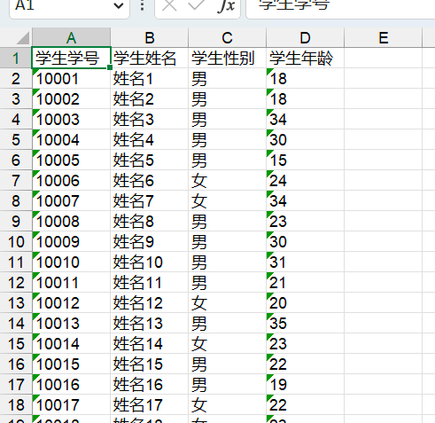
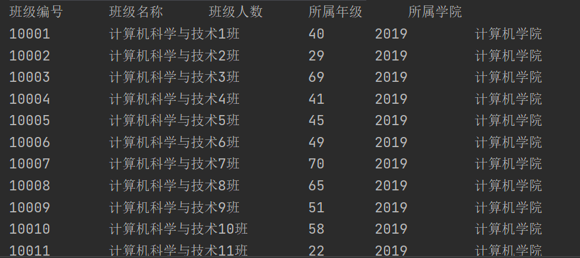
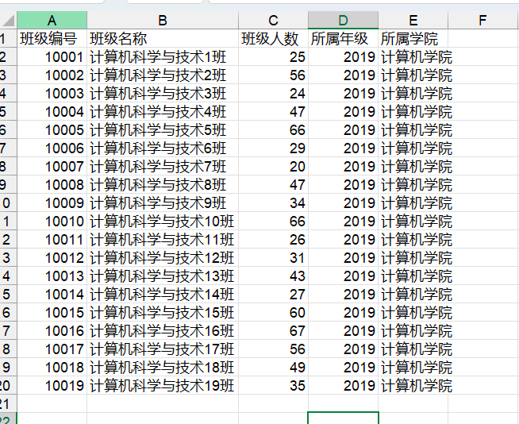
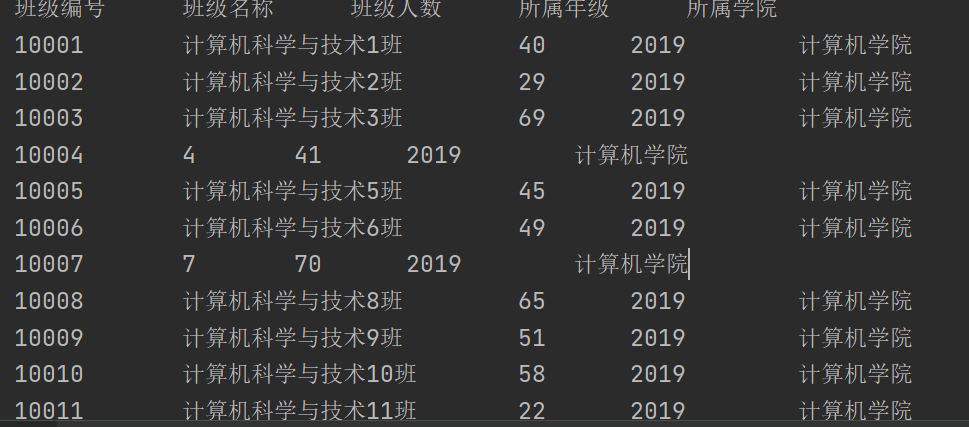
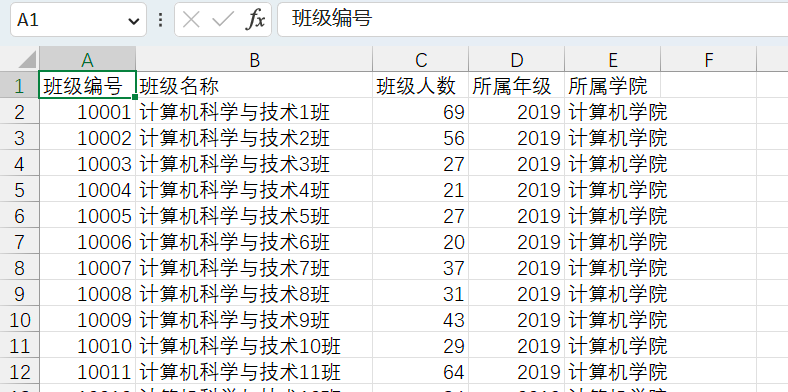
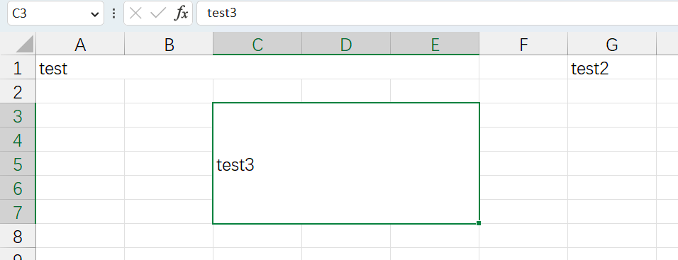
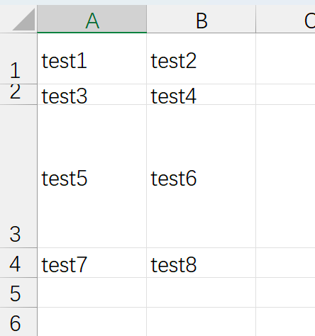

[TOC]

----


# Excel

## 概述

在企业级应用开发中，Excel报表是一种最常见的报表需求。Excel报表开发一般分为两种形式：

* 为了方便操作，基于Excel的报表批量上传数据，也就是把Excel中的数据导入到系统中
* 通过java代码生成Excel报表。也就是把系统中的数据导出到Excel中，方便查阅


## 版本

Excel分为两个大的版本Excel2003和Excel2007及以上两个版本

* Excel2003 是一个特有的二进制格式，其核心结构是复合文档类型的结构，存储数据量较小，后缀名为xls
* Excel2007 的核心结构是 XML 类型的结构，采用的是基于 XML 的压缩方式，使其占用的空间更小，操作效率更高，后缀名为xlsx


## Excel操作工具

Java中常见的用来操作Excel的方式一般有2种：

* JXL
* POI


### JXL

JXL只能对Excel进行操作,属于比较老的框架，它只支持到Excel 95-2000的版本。现在已经停止更新和维护


### POI

POI是apache的项目，可对微软的Word,Excel、PPT进行操作，包括office2003和2007、Excle2003和2007。

poi现在一直有更新。所以现在主流使用POI

Apache POI是Apache软件基金会的开源项目，由Java编写的免费开源的跨平台的 Java API，Apache POI提供API给Java语言操作Microsoft Office的功能


* 工作簿 ：WorkBook
  * 2003版本：HSSFWordBook 
  * 2007级以上：XSSFWorkBook 
* 工作表 ：Sheet
  * 2003版本：HSSFSheet
  * 2007级以上：XSSFSheet
* 行 ：Row
  * 2003版本：HSSFRow
  * 2007级以上：XSSFRow
* 单元格 ： Cell
  * 2003版本：HSSFCell
  * 2007级以上：XSSFCell


## JXL导出excel

### API

通过WritableWorkbook，WritableSheet，Label这三个对象我们就可以实现Excel文件的导出工作。


1、 创建可写入的Excel工作薄

```java
WritableWorkbook workbook= Workbook.createWorkbook(输出流);
```


2、创建工作表

```java
WritableSheet sheet= workbook.createSheet(工作表的名称, 工作表的索引值);
```


3、创建单元格

添加文本类单元格

```java
Label labelC = new Label(列索引值, 行索引值, "单元格中的内容");

sheet.addCell(labelC);
```


4、写入到文件

```java
workbook.write();// 写入数据
```


5、释放资源：

```java
workbook.close();// 关闭文件
```


### 使用

#### 第一步：导入依赖

```xml
        <dependency>
            <groupId>net.sourceforge.jexcelapi</groupId>
            <artifactId>jxl</artifactId>
            <version>2.6.12</version>
        </dependency>
```


#### 第二步：使用API

```java
package mao;

import jxl.Workbook;
import jxl.write.Label;
import jxl.write.WritableSheet;
import jxl.write.WritableWorkbook;
import jxl.write.WriteException;

import java.io.FileNotFoundException;
import java.io.FileOutputStream;
import java.io.IOException;

/**
 * Project name(项目名称)：java报表_JXL导出excel
 * Package(包名): mao
 * Class(类名): Test1
 * Author(作者）: mao
 * Author QQ：1296193245
 * GitHub：https://github.com/maomao124/
 * Date(创建日期)： 2023/6/1
 * Time(创建时间)： 14:14
 * Version(版本): 1.0
 * Description(描述)： JXL导出excel
 */

public class Test1
{
    /**
     * 得到int随机
     *
     * @param min 最小值
     * @param max 最大值
     * @return int
     */
    public static int getIntRandom(int min, int max)
    {
        if (min > max)
        {
            min = max;
        }
        return min + (int) (Math.random() * (max - min + 1));
    }

    public static void main(String[] args) throws IOException, WriteException
    {
        //创建工作簿
        WritableWorkbook writableWorkbook = Workbook.createWorkbook(new FileOutputStream("./student.xls"));
        //创建工作表
        WritableSheet sheet = writableWorkbook.createSheet("学生信息", 0);
        //创建单元格,（列索引值，行索引值，内容）
        sheet.addCell(new Label(0, 0, "学生学号"));
        sheet.addCell(new Label(1, 0, "学生姓名"));
        sheet.addCell(new Label(2, 0, "学生性别"));
        sheet.addCell(new Label(3, 0, "学生年龄"));

        for (int i = 1; i < 201; i++)
        {
            //创建单元格
            sheet.addCell(new Label(0, i, 10000 + i + ""));
            sheet.addCell(new Label(1, i, "姓名" + i));
            sheet.addCell(new Label(2, i, getIntRandom(0, 1) == 1 ? "男" : "女"));
            sheet.addCell(new Label(3, i, String.valueOf(getIntRandom(15, 35))));
        }
        //写入
        writableWorkbook.write();
        //关闭
        writableWorkbook.close();
    }
}
```


#### 第三步：运行




## POI操作excel

### 依赖

```xml
<dependency>
    <groupId>org.apache.poi</groupId>
    <artifactId>poi</artifactId>
    <version>5.2.2</version>
</dependency>

<dependency>
    <groupId>org.apache.poi</groupId>
    <artifactId>poi-ooxml</artifactId>
    <version>5.2.2</version>
</dependency>

<dependency>
    <groupId>org.apache.poi</groupId>
    <artifactId>poi-ooxml-schemas</artifactId>
    <version>4.1.2</version>
</dependency>
```


### 版本区别

在POI包中有如下几个主要对象和excel的几个对象对应：

| 对应excel名称 | 低版本中的类名 | 高版本中的类名 |
| :-----------: | :------------: | :------------: |
|    工作簿     |  HSSFWorkbook  |  XSSFWorkbook  |
|    工作表     |   HSSFSheet    |   XSSFSheet    |
|      行       |    HSSFRow     |    XSSFRow     |
|    单元格     |    HSSFCell    |    XSSFCell    |
|  单元格样式   | HSSFCellStyle  | XSSFCellStyle  |


### 导出excel

低版本：

```java
package mao;

import org.apache.poi.hssf.usermodel.HSSFWorkbook;
import org.apache.poi.ss.usermodel.Cell;
import org.apache.poi.ss.usermodel.Row;
import org.apache.poi.ss.usermodel.Sheet;
import org.apache.poi.ss.usermodel.Workbook;

import java.io.FileNotFoundException;
import java.io.FileOutputStream;
import java.io.IOException;

/**
 * Project name(项目名称)：java报表_POI导出excel
 * Package(包名): mao
 * Class(类名): Test1
 * Author(作者）: mao
 * Author QQ：1296193245
 * GitHub：https://github.com/maomao124/
 * Date(创建日期)： 2023/6/1
 * Time(创建时间)： 14:44
 * Version(版本): 1.0
 * Description(描述)： POI导出-低版本
 */

public class Test1
{

    /**
     * 得到int随机
     *
     * @param min 最小值
     * @param max 最大值
     * @return int
     */
    public static int getIntRandom(int min, int max)
    {
        if (min > max)
        {
            min = max;
        }
        return min + (int) (Math.random() * (max - min + 1));
    }

    public static void main(String[] args) throws IOException
    {
        //创建工作簿
        Workbook workbook = new HSSFWorkbook();
        //创建工作表
        Sheet sheet = workbook.createSheet("班级信息");
        //创建行，第0行
        Row row = sheet.createRow(0);
        //创建单元格
        Cell cell = row.createCell(0);
        //填充数据
        cell.setCellValue("班级编号");
        //创建单元格
        cell = row.createCell(1);
        //填充数据
        cell.setCellValue("班级名称");
        //创建单元格
        cell = row.createCell(2);
        //填充数据
        cell.setCellValue("班级人数");
        //创建单元格
        cell = row.createCell(3);
        //填充数据
        cell.setCellValue("所属年级");
        //创建单元格
        cell = row.createCell(4);
        //填充数据
        cell.setCellValue("所属学院");


        for (int i = 1; i < 20; i++)
        {
            //创建行，第i行
            row = sheet.createRow(i);
            //创建单元格
            cell = row.createCell(0);
            cell.setCellValue(10000 + i);

            cell = row.createCell(1);
            cell.setCellValue("计算机科学与技术" + i + "班");

            cell = row.createCell(2);
            cell.setCellValue(getIntRandom(20, 70));

            cell = row.createCell(3);
            cell.setCellValue(2019);

            cell = row.createCell(4);
            cell.setCellValue("计算机学院");
        }

        //关闭
        try (FileOutputStream fileOutputStream = new FileOutputStream("class.xls"))
        {
            //写入
            workbook.write(fileOutputStream);
            //关闭
            workbook.close();
        }
    }
}
```


高版本：

```java
package mao;

import org.apache.poi.hssf.usermodel.HSSFWorkbook;
import org.apache.poi.ss.usermodel.Cell;
import org.apache.poi.ss.usermodel.Row;
import org.apache.poi.ss.usermodel.Sheet;
import org.apache.poi.ss.usermodel.Workbook;
import org.apache.poi.xssf.usermodel.XSSFWorkbook;

import java.io.FileOutputStream;
import java.io.IOException;

/**
 * Project name(项目名称)：java报表_POI导出excel
 * Package(包名): mao
 * Class(类名): Test2
 * Author(作者）: mao
 * Author QQ：1296193245
 * GitHub：https://github.com/maomao124/
 * Date(创建日期)： 2023/6/1
 * Time(创建时间)： 15:07
 * Version(版本): 1.0
 * Description(描述)： POI导出-高版本
 */

public class Test2
{
    /**
     * 得到int随机
     *
     * @param min 最小值
     * @param max 最大值
     * @return int
     */
    public static int getIntRandom(int min, int max)
    {
        if (min > max)
        {
            min = max;
        }
        return min + (int) (Math.random() * (max - min + 1));
    }

    public static void main(String[] args) throws IOException
    {
        //创建工作簿
        Workbook workbook = new XSSFWorkbook();
        //创建工作表
        Sheet sheet = workbook.createSheet("班级信息");
        //创建行，第0行
        Row row = sheet.createRow(0);
        //创建单元格
        Cell cell = row.createCell(0);
        //填充数据
        cell.setCellValue("班级编号");
        //创建单元格
        cell = row.createCell(1);
        //填充数据
        cell.setCellValue("班级名称");
        //创建单元格
        cell = row.createCell(2);
        //填充数据
        cell.setCellValue("班级人数");
        //创建单元格
        cell = row.createCell(3);
        //填充数据
        cell.setCellValue("所属年级");
        //创建单元格
        cell = row.createCell(4);
        //填充数据
        cell.setCellValue("所属学院");


        for (int i = 1; i < 20; i++)
        {
            //创建行，第i行
            row = sheet.createRow(i);
            //创建单元格
            cell = row.createCell(0);
            cell.setCellValue(10000 + i);

            cell = row.createCell(1);
            cell.setCellValue("计算机科学与技术" + i + "班");

            cell = row.createCell(2);
            cell.setCellValue(getIntRandom(20, 70));

            cell = row.createCell(3);
            cell.setCellValue(2019);

            cell = row.createCell(4);
            cell.setCellValue("计算机学院");
        }

        //关闭
        try (FileOutputStream fileOutputStream = new FileOutputStream("class.xlsx"))
        {
            //写入
            workbook.write(fileOutputStream);
            //关闭
            workbook.close();
        }
    }
}
```


### 导入excel

导入上述生成的低版本的xls文件：

```java
package mao;

import org.apache.poi.hssf.usermodel.HSSFWorkbook;
import org.apache.poi.ss.usermodel.Row;
import org.apache.poi.ss.usermodel.Sheet;
import org.apache.poi.ss.usermodel.Workbook;

import java.io.FileInputStream;

/**
 * Project name(项目名称)：java报表_POI导入excel
 * Package(包名): mao
 * Class(类名): Test1
 * Author(作者）: mao
 * Author QQ：1296193245
 * GitHub：https://github.com/maomao124/
 * Date(创建日期)： 2023/6/1
 * Time(创建时间)： 21:30
 * Version(版本): 1.0
 * Description(描述)： poi 导入excel 低版本
 */

public class Test1
{
    public static void main(String[] args)
    {
        try (final FileInputStream fileInputStream = new FileInputStream("./class.xls"))
        {
            //加载工作簿
            Workbook workbook = new HSSFWorkbook(fileInputStream);
            //读取第一个工作表
            Sheet sheet = workbook.getSheetAt(0);
            //得到最后一行
            int lastRowNum = sheet.getLastRowNum();
            //得到第0行
            Row row = sheet.getRow(0);
            //校验表头
            String stringCellValue = row.getCell(0).getStringCellValue();
            if (!"班级编号".equals(stringCellValue))
            {
                throw new UnsupportedOperationException("表格格式不支持");
            }

            stringCellValue = row.getCell(1).getStringCellValue();
            if (!"班级名称".equals(stringCellValue))
            {
                throw new UnsupportedOperationException("表格格式不支持");
            }

            stringCellValue = row.getCell(2).getStringCellValue();
            if (!"班级人数".equals(stringCellValue))
            {
                throw new UnsupportedOperationException("表格格式不支持");
            }

            stringCellValue = row.getCell(3).getStringCellValue();
            if (!"所属年级".equals(stringCellValue))
            {
                throw new UnsupportedOperationException("表格格式不支持");
            }

            stringCellValue = row.getCell(4).getStringCellValue();
            if (!"所属学院".equals(stringCellValue))
            {
                throw new UnsupportedOperationException("表格格式不支持");
            }

            System.out.println("班级编号\t\t班级名称\t\t班级人数\t\t所属年级\t\t所属学院");

            //遍历读取数据
            for (int i = 1; i <= lastRowNum; i++)
            {
                //读取第i行
                row = sheet.getRow(i);
                //读取班级编号
                int classNo = ((Double) row.getCell(0).getNumericCellValue()).intValue();
                //读取班级名称
                String className = row.getCell(1).getStringCellValue();
                //读取班级人数
                int classCount = ((Double) row.getCell(2).getNumericCellValue()).intValue();
                //读取所属年级
                int grade = ((Double) row.getCell(3).getNumericCellValue()).intValue();;
                //读取所属学院
                String academy = row.getCell(4).getStringCellValue();
                System.out.println(classNo + "\t\t" + className + "\t\t" + classCount + "\t\t" + grade + "\t\t" + academy);
            }
        }
        catch (Exception e)
        {
            e.printStackTrace();
        }

    }
}
```


导入上述生成的高版本的xlsx文件：

```java
package mao;

import org.apache.poi.hssf.usermodel.HSSFWorkbook;
import org.apache.poi.ss.usermodel.Row;
import org.apache.poi.ss.usermodel.Sheet;
import org.apache.poi.ss.usermodel.Workbook;
import org.apache.poi.xssf.usermodel.XSSFWorkbook;

import java.io.FileInputStream;

/**
 * Project name(项目名称)：java报表_POI导入excel
 * Package(包名): mao
 * Class(类名): Test2
 * Author(作者）: mao
 * Author QQ：1296193245
 * GitHub：https://github.com/maomao124/
 * Date(创建日期)： 2023/6/1
 * Time(创建时间)： 21:54
 * Version(版本): 1.0
 * Description(描述)： 无
 */

public class Test2
{
    public static void main(String[] args)
    {
        try (final FileInputStream fileInputStream = new FileInputStream("./class.xlsx"))
        {
            //加载工作簿
            Workbook workbook = new XSSFWorkbook(fileInputStream);
            //读取第一个工作表
            Sheet sheet = workbook.getSheetAt(0);
            //得到最后一行
            int lastRowNum = sheet.getLastRowNum();
            //得到第0行
            Row row = sheet.getRow(0);
            //校验表头
            String stringCellValue = row.getCell(0).getStringCellValue();
            if (!"班级编号".equals(stringCellValue))
            {
                throw new UnsupportedOperationException("表格格式不支持");
            }

            stringCellValue = row.getCell(1).getStringCellValue();
            if (!"班级名称".equals(stringCellValue))
            {
                throw new UnsupportedOperationException("表格格式不支持");
            }

            stringCellValue = row.getCell(2).getStringCellValue();
            if (!"班级人数".equals(stringCellValue))
            {
                throw new UnsupportedOperationException("表格格式不支持");
            }

            stringCellValue = row.getCell(3).getStringCellValue();
            if (!"所属年级".equals(stringCellValue))
            {
                throw new UnsupportedOperationException("表格格式不支持");
            }

            stringCellValue = row.getCell(4).getStringCellValue();
            if (!"所属学院".equals(stringCellValue))
            {
                throw new UnsupportedOperationException("表格格式不支持");
            }

            System.out.println("班级编号\t\t班级名称\t\t班级人数\t\t所属年级\t\t所属学院");

            //遍历读取数据
            for (int i = 1; i <= lastRowNum; i++)
            {
                //读取第i行
                row = sheet.getRow(i);
                //读取班级编号
                int classNo = ((Double) row.getCell(0).getNumericCellValue()).intValue();
                //读取班级名称
                String className = row.getCell(1).getStringCellValue();
                //读取班级人数
                int classCount = ((Double) row.getCell(2).getNumericCellValue()).intValue();
                //读取所属年级
                int grade = ((Double) row.getCell(3).getNumericCellValue()).intValue();;
                //读取所属学院
                String academy = row.getCell(4).getStringCellValue();
                System.out.println(classNo + "\t\t" + className + "\t\t" + classCount + "\t\t" + grade + "\t\t" + academy);
            }
        }
        catch (Exception e)
        {
            e.printStackTrace();
        }

    }
}
```





### 导入数据类型问题




靠右的单元格为数值类型，靠左的单元格为字符串类型，比如班级编号和班级人数为数值类型，班级名称为字符串类型，如果使用poi导入时数据类型不正确，将会抛出异常


比如以下数据：


可以在抛出异常时处理：

```java
package mao;

import org.apache.poi.ss.usermodel.Row;
import org.apache.poi.ss.usermodel.Sheet;
import org.apache.poi.ss.usermodel.Workbook;
import org.apache.poi.xssf.usermodel.XSSFWorkbook;

import java.io.FileInputStream;

/**
 * Project name(项目名称)：java报表_POI导入excel
 * Package(包名): mao
 * Class(类名): Test3
 * Author(作者）: mao
 * Author QQ：1296193245
 * GitHub：https://github.com/maomao124/
 * Date(创建日期)： 2023/6/1
 * Time(创建时间)： 22:22
 * Version(版本): 1.0
 * Description(描述)： 无
 */

public class Test3
{

    public static void main(String[] args)
    {
        try (final FileInputStream fileInputStream = new FileInputStream("./class2.xlsx"))
        {
            //加载工作簿
            Workbook workbook = new XSSFWorkbook(fileInputStream);
            //读取第一个工作表
            Sheet sheet = workbook.getSheetAt(0);
            //得到最后一行
            int lastRowNum = sheet.getLastRowNum();
            //得到第0行
            Row row = sheet.getRow(0);
            //校验表头
            String stringCellValue = row.getCell(0).getStringCellValue();
            if (!"班级编号".equals(stringCellValue))
            {
                throw new UnsupportedOperationException("表格格式不支持");
            }

            stringCellValue = row.getCell(1).getStringCellValue();
            if (!"班级名称".equals(stringCellValue))
            {
                throw new UnsupportedOperationException("表格格式不支持");
            }

            stringCellValue = row.getCell(2).getStringCellValue();
            if (!"班级人数".equals(stringCellValue))
            {
                throw new UnsupportedOperationException("表格格式不支持");
            }

            stringCellValue = row.getCell(3).getStringCellValue();
            if (!"所属年级".equals(stringCellValue))
            {
                throw new UnsupportedOperationException("表格格式不支持");
            }

            stringCellValue = row.getCell(4).getStringCellValue();
            if (!"所属学院".equals(stringCellValue))
            {
                throw new UnsupportedOperationException("表格格式不支持");
            }

            System.out.println("班级编号\t\t班级名称\t\t班级人数\t\t所属年级\t\t所属学院");

            //遍历读取数据
            for (int i = 1; i <= lastRowNum; i++)
            {
                //读取第i行
                row = sheet.getRow(i);
                //读取班级编号
                int classNo = ((Double) row.getCell(0).getNumericCellValue()).intValue();
                String className = null;
                try
                {
                    //读取班级名称
                    className = String.valueOf(((Double) row.getCell(1).getNumericCellValue()).intValue());
                }
                catch (IllegalStateException e)
                {
                    className = row.getCell(1).getStringCellValue();
                }
                //读取班级人数
                int classCount = 0;
                try
                {
                    classCount = ((Double) row.getCell(2).getNumericCellValue()).intValue();
                }
                catch (IllegalStateException e)
                {
                    classCount = Integer.parseInt(row.getCell(2).getStringCellValue());
                }
                //读取所属年级
                int grade = ((Double) row.getCell(3).getNumericCellValue()).intValue();
                //读取所属学院
                String academy = row.getCell(4).getStringCellValue();
                System.out.println(classNo + "\t\t" + className + "\t\t" + classCount + "\t\t" + grade + "\t\t" + academy);
            }
        }
        catch (Exception e)
        {
            e.printStackTrace();
        }

    }
}

```





### web实现导出excel

创建spring boot 程序，pom文件依赖如下：

```xml
 <dependency>
            <groupId>org.springframework.boot</groupId>
            <artifactId>spring-boot-starter-web</artifactId>
        </dependency>

        <dependency>
            <groupId>org.projectlombok</groupId>
            <artifactId>lombok</artifactId>
            <optional>true</optional>
        </dependency>

        <dependency>
            <groupId>org.springframework.boot</groupId>
            <artifactId>spring-boot-starter-test</artifactId>
            <scope>test</scope>
        </dependency>

        <!--POI 操作excel 依赖-->
        <dependency>
            <groupId>org.apache.poi</groupId>
            <artifactId>poi</artifactId>
            <version>4.0.1</version>
        </dependency>

        <dependency>
            <groupId>org.apache.poi</groupId>
            <artifactId>poi-ooxml</artifactId>
            <version>4.0.1</version>
        </dependency>

        <dependency>
            <groupId>org.apache.poi</groupId>
            <artifactId>poi-ooxml-schemas</artifactId>
            <version>4.0.1</version>
        </dependency>
```


创建service接口

```java
package mao.java_report_web_poi_import_and_export_excel.service;

import org.springframework.web.multipart.MultipartFile;

import javax.servlet.http.HttpServletRequest;
import javax.servlet.http.HttpServletResponse;

/**
 * Project name(项目名称)：java_report_web_POI_import_and_export_excel
 * Package(包名): mao.java_report_web_poi_import_and_export_excel.service
 * Interface(接口名): ExcelService
 * Author(作者）: mao
 * Author QQ：1296193245
 * GitHub：https://github.com/maomao124/
 * Date(创建日期)： 2023/6/2
 * Time(创建时间)： 14:25
 * Version(版本): 1.0
 * Description(描述)： 无
 */

public interface ExcelService
{
    /**
     * 导出excel
     *
     * @param httpServletRequest  http servlet请求
     * @param httpServletResponse http servlet响应
     * @param highVersion         是否为高版本
     */
    void export(HttpServletRequest httpServletRequest, HttpServletResponse httpServletResponse, boolean highVersion);


    /**
     * 上传excel
     *
     * @param httpServletRequest  http servlet请求
     * @param httpServletResponse http servlet响应
     * @param multipartFile       多部分文件
     */
    void upload(MultipartFile multipartFile, HttpServletRequest httpServletRequest, HttpServletResponse httpServletResponse);
}
```


实现类：

```java
package mao.java_report_web_poi_import_and_export_excel.service.impl;

import lombok.SneakyThrows;
import lombok.extern.slf4j.Slf4j;
import mao.java_report_web_poi_import_and_export_excel.service.ExcelService;
import org.apache.poi.hssf.usermodel.HSSFWorkbook;
import org.apache.poi.ss.usermodel.Cell;
import org.apache.poi.ss.usermodel.Row;
import org.apache.poi.ss.usermodel.Sheet;
import org.apache.poi.ss.usermodel.Workbook;
import org.apache.poi.xssf.usermodel.XSSFWorkbook;
import org.springframework.stereotype.Service;
import org.springframework.web.multipart.MultipartFile;

import javax.servlet.http.HttpServletRequest;
import javax.servlet.http.HttpServletResponse;
import java.io.FileOutputStream;

/**
 * Project name(项目名称)：java_report_web_POI_import_and_export_excel
 * Package(包名): mao.java_report_web_poi_import_and_export_excel.service.impl
 * Class(类名): ExcelServiceImpl
 * Author(作者）: mao
 * Author QQ：1296193245
 * GitHub：https://github.com/maomao124/
 * Date(创建日期)： 2023/6/2
 * Time(创建时间)： 14:26
 * Version(版本): 1.0
 * Description(描述)： 无
 */

@Slf4j
@Service
public class ExcelServiceImpl implements ExcelService
{

    /**
     * 得到int随机
     *
     * @param min 最小值
     * @param max 最大值
     * @return int
     */
    public static int getIntRandom(int min, int max)
    {
        if (min > max)
        {
            min = max;
        }
        return min + (int) (Math.random() * (max - min + 1));
    }

    @SneakyThrows
    @Override
    public void export(HttpServletRequest httpServletRequest, HttpServletResponse httpServletResponse, boolean highVersion)
    {
        log.info("开始导出excel");

        //创建工作簿
        Workbook workbook = null;
        String fileName = null;
        //判断是否为高版本
        if (highVersion)
        {
            //高版本
            workbook = new XSSFWorkbook();
            fileName = "xxx学校班级信息表.xlsx";
        }
        else
        {
            //低版本
            workbook = new HSSFWorkbook();
            fileName = "xxx学校班级信息表.xls";
        }
        //创建工作表
        Sheet sheet = workbook.createSheet("班级信息");
        //创建行，第0行
        Row row = sheet.createRow(0);
        //创建单元格
        Cell cell = row.createCell(0);
        //填充数据
        cell.setCellValue("班级编号");
        //创建单元格
        cell = row.createCell(1);
        //填充数据
        cell.setCellValue("班级名称");
        //创建单元格
        cell = row.createCell(2);
        //填充数据
        cell.setCellValue("班级人数");
        //创建单元格
        cell = row.createCell(3);
        //填充数据
        cell.setCellValue("所属年级");
        //创建单元格
        cell = row.createCell(4);
        //填充数据
        cell.setCellValue("所属学院");

        //500行
        for (int i = 1; i < 500; i++)
        {
            //创建行，第i行
            row = sheet.createRow(i);
            //创建单元格
            cell = row.createCell(0);
            cell.setCellValue(10000 + i);

            cell = row.createCell(1);
            cell.setCellValue("计算机科学与技术" + i + "班");

            cell = row.createCell(2);
            cell.setCellValue(getIntRandom(20, 70));

            cell = row.createCell(3);
            cell.setCellValue(2019);

            cell = row.createCell(4);
            cell.setCellValue("计算机学院");
        }

        //请求头，设置附件（attachment）形式，设置文件名，并转换编码
        httpServletResponse.setHeader("Content-Disposition", "attachment;filename=" + new String(fileName.getBytes(), "ISO8859-1"));
        //设置请求类型，表格
        httpServletResponse.setContentType("application/vnd.openxmlformats-officedocument.spreadsheetml.sheet");
        //写入
        workbook.write(httpServletResponse.getOutputStream());
        //关闭
        workbook.close();
        log.info("导出完成");
    }

    @Override
    public void upload(MultipartFile multipartFile, HttpServletRequest httpServletRequest, HttpServletResponse httpServletResponse)
    {
        log.info("开始导入excel");
        //todo
    }
}
```


controller

```java
package mao.java_report_web_poi_import_and_export_excel.controller;

import lombok.extern.slf4j.Slf4j;
import mao.java_report_web_poi_import_and_export_excel.service.ExcelService;
import org.springframework.web.bind.annotation.GetMapping;
import org.springframework.web.bind.annotation.RequestMapping;
import org.springframework.web.bind.annotation.RequestParam;
import org.springframework.web.bind.annotation.RestController;
import org.springframework.web.multipart.MultipartFile;

import javax.annotation.Resource;
import javax.servlet.http.HttpServletRequest;
import javax.servlet.http.HttpServletResponse;

/**
 * Project name(项目名称)：java_report_web_POI_import_and_export_excel
 * Package(包名): mao.java_report_web_poi_import_and_export_excel.controller
 * Class(类名): ExcelController
 * Author(作者）: mao
 * Author QQ：1296193245
 * GitHub：https://github.com/maomao124/
 * Date(创建日期)： 2023/6/2
 * Time(创建时间)： 14:25
 * Version(版本): 1.0
 * Description(描述)： 无
 */


@Slf4j
@RestController
@RequestMapping("/excel")
public class ExcelController
{

    @Resource
    private ExcelService excelService;

    /**
     * 导出低版本excel
     */
    @RequestMapping("/export/low")
    public void exportLow(HttpServletRequest httpServletRequest, HttpServletResponse httpServletResponse)
    {
        excelService.export(httpServletRequest, httpServletResponse, false);
    }

    /**
     * 导出高版本excel
     */
    @RequestMapping("/export/high")
    public void exportHigh(HttpServletRequest httpServletRequest, HttpServletResponse httpServletResponse)
    {
        excelService.export(httpServletRequest, httpServletResponse, true);
    }

    /**
     * 上传excel
     */
    @RequestMapping("/upload")
    public void upload(@RequestParam("file") MultipartFile multipartFile, HttpServletRequest httpServletRequest, HttpServletResponse httpServletResponse)
    {
        excelService.upload(multipartFile, httpServletRequest, httpServletResponse);
    }
}

```


访问低版本下载地址：

http://localhost:8080/excel/export/low


访问高版本下载地址：

http://localhost:8080/excel/export/high





### web实现导入excel

实现upload方法

```java
package mao.java_report_web_poi_import_and_export_excel.service.impl;

import lombok.SneakyThrows;
import lombok.extern.slf4j.Slf4j;
import mao.java_report_web_poi_import_and_export_excel.service.ExcelService;
import org.apache.poi.hssf.usermodel.HSSFWorkbook;
import org.apache.poi.ss.usermodel.Cell;
import org.apache.poi.ss.usermodel.Row;
import org.apache.poi.ss.usermodel.Sheet;
import org.apache.poi.ss.usermodel.Workbook;
import org.apache.poi.xssf.usermodel.XSSFWorkbook;
import org.springframework.stereotype.Service;
import org.springframework.web.multipart.MultipartFile;

import javax.servlet.http.HttpServletRequest;
import javax.servlet.http.HttpServletResponse;
import java.io.FileOutputStream;

/**
 * Project name(项目名称)：java_report_web_POI_import_and_export_excel
 * Package(包名): mao.java_report_web_poi_import_and_export_excel.service.impl
 * Class(类名): ExcelServiceImpl
 * Author(作者）: mao
 * Author QQ：1296193245
 * GitHub：https://github.com/maomao124/
 * Date(创建日期)： 2023/6/2
 * Time(创建时间)： 14:26
 * Version(版本): 1.0
 * Description(描述)： 无
 */

@Slf4j
@Service
public class ExcelServiceImpl implements ExcelService
{

    /**
     * 得到int随机
     *
     * @param min 最小值
     * @param max 最大值
     * @return int
     */
    public static int getIntRandom(int min, int max)
    {
        if (min > max)
        {
            min = max;
        }
        return min + (int) (Math.random() * (max - min + 1));
    }

    @SneakyThrows
    @Override
    public void export(HttpServletRequest httpServletRequest, HttpServletResponse httpServletResponse, boolean highVersion)
    {
        log.info("开始导出excel");

        //创建工作簿
        Workbook workbook = null;
        String fileName = null;
        //判断是否为高版本
        if (highVersion)
        {
            //高版本
            workbook = new XSSFWorkbook();
            fileName = "xxx学校班级信息表.xlsx";
        }
        else
        {
            //低版本
            workbook = new HSSFWorkbook();
            fileName = "xxx学校班级信息表.xls";
        }
        //创建工作表
        Sheet sheet = workbook.createSheet("班级信息");
        //创建行，第0行
        Row row = sheet.createRow(0);
        //创建单元格
        Cell cell = row.createCell(0);
        //填充数据
        cell.setCellValue("班级编号");
        //创建单元格
        cell = row.createCell(1);
        //填充数据
        cell.setCellValue("班级名称");
        //创建单元格
        cell = row.createCell(2);
        //填充数据
        cell.setCellValue("班级人数");
        //创建单元格
        cell = row.createCell(3);
        //填充数据
        cell.setCellValue("所属年级");
        //创建单元格
        cell = row.createCell(4);
        //填充数据
        cell.setCellValue("所属学院");

        //500行
        for (int i = 1; i < 500; i++)
        {
            //创建行，第i行
            row = sheet.createRow(i);
            //创建单元格
            cell = row.createCell(0);
            cell.setCellValue(10000 + i);

            cell = row.createCell(1);
            cell.setCellValue("计算机科学与技术" + i + "班");

            cell = row.createCell(2);
            cell.setCellValue(getIntRandom(20, 70));

            cell = row.createCell(3);
            cell.setCellValue(2019);

            cell = row.createCell(4);
            cell.setCellValue("计算机学院");
        }

        //请求头，设置附件（attachment）形式，设置文件名，并转换编码
        httpServletResponse.setHeader("Content-Disposition", "attachment;filename=" + new String(fileName.getBytes(), "ISO8859-1"));
        //设置请求类型，表格
        httpServletResponse.setContentType("application/vnd.openxmlformats-officedocument.spreadsheetml.sheet");
        //写入
        workbook.write(httpServletResponse.getOutputStream());
        //关闭
        workbook.close();
        log.info("导出完成");
    }

    @SneakyThrows
    @Override
    public void upload(MultipartFile multipartFile, HttpServletRequest httpServletRequest, HttpServletResponse httpServletResponse)
    {
        //todo：全局异常处理

        if (multipartFile == null)
        {
            throw new RuntimeException("请上传文件");
        }

        log.info("开始导入excel");

        boolean highVersion;
        //得到文件名
        String filename = multipartFile.getOriginalFilename();
        log.info("文件名：" + filename);
        if (filename == null || filename.length() < 1)
        {
            throw new UnsupportedOperationException("无法读取文件名");
        }
        if (filename.endsWith(".xlsx"))
        {
            highVersion = true;
        }
        else if (filename.endsWith(".xls"))
        {
            highVersion = false;
        }
        else
        {
            throw new UnsupportedOperationException("文件后缀名不支持");
        }

        log.info("高版本？ " + highVersion);

        //加载工作簿
        Workbook workbook = null;
        if (highVersion)
        {
            workbook = new XSSFWorkbook(multipartFile.getInputStream());
        }
        else
        {
            workbook = new HSSFWorkbook(multipartFile.getInputStream());
        }
        //读取第一个工作表
        Sheet sheet = workbook.getSheetAt(0);
        //得到最后一行
        int lastRowNum = sheet.getLastRowNum();
        //得到第0行
        Row row = sheet.getRow(0);
        //校验表头
        String stringCellValue = row.getCell(0).getStringCellValue();
        if (!"班级编号".equals(stringCellValue))
        {
            throw new UnsupportedOperationException("表格格式不支持");
        }

        stringCellValue = row.getCell(1).getStringCellValue();
        if (!"班级名称".equals(stringCellValue))
        {
            throw new UnsupportedOperationException("表格格式不支持");
        }

        stringCellValue = row.getCell(2).getStringCellValue();
        if (!"班级人数".equals(stringCellValue))
        {
            throw new UnsupportedOperationException("表格格式不支持");
        }

        stringCellValue = row.getCell(3).getStringCellValue();
        if (!"所属年级".equals(stringCellValue))
        {
            throw new UnsupportedOperationException("表格格式不支持");
        }

        stringCellValue = row.getCell(4).getStringCellValue();
        if (!"所属学院".equals(stringCellValue))
        {
            throw new UnsupportedOperationException("表格格式不支持");
        }

        StringBuilder stringBuilder = new StringBuilder();

        stringBuilder.append("班级编号\t\t班级名称\t\t班级人数\t\t所属年级\t\t所属学院\n");

        //遍历读取数据
        for (int i = 1; i <= lastRowNum; i++)
        {
            //读取第i行
            row = sheet.getRow(i);
            //读取班级编号
            int classNo = ((Double) row.getCell(0).getNumericCellValue()).intValue();
            String className = null;
            try
            {
                //读取班级名称
                className = String.valueOf(((Double) row.getCell(1).getNumericCellValue()).intValue());
            }
            catch (IllegalStateException e)
            {
                className = row.getCell(1).getStringCellValue();
            }
            //读取班级人数
            int classCount = 0;
            try
            {
                classCount = ((Double) row.getCell(2).getNumericCellValue()).intValue();
            }
            catch (IllegalStateException e)
            {
                classCount = Integer.parseInt(row.getCell(2).getStringCellValue());
            }
            //读取所属年级
            int grade = ((Double) row.getCell(3).getNumericCellValue()).intValue();
            //读取所属学院
            String academy = row.getCell(4).getStringCellValue();
            stringBuilder.append(classNo).append("\t\t")
                    .append(className).append("\t\t")
                    .append(classCount).append("\t\t")
                    .append(grade).append("\t\t")
                    .append(academy)
                    .append('\n');
        }

        log.info("\n\n" + stringBuilder + "\t\t");

        log.info("导入完成");
    }
}

```


upload.html

```html
<!DOCTYPE html>
<html lang="en">
<head>
    <meta charset="UTF-8">
    <title>Title</title></head>
<body>
<form action="/excel/upload" method="post" enctype="multipart/form-data">
    <input type="file" name="file" value="请选择文件">
    <input type="submit" value="上传">
</form>
</body>
</html>
```


访问

http://localhost:8080/upload.html


上传低版本：


上传高版本：


### 格式设置

#### 框线

```java
package mao;

import org.apache.poi.hssf.usermodel.HSSFCellStyle;
import org.apache.poi.ss.usermodel.*;
import org.apache.poi.xssf.usermodel.XSSFWorkbook;

import java.io.FileOutputStream;

/**
 * Project name(项目名称)：java报表_POI格式设置
 * Package(包名): mao
 * Class(类名): Test1
 * Author(作者）: mao
 * Author QQ：1296193245
 * GitHub：https://github.com/maomao124/
 * Date(创建日期)： 2023/6/2
 * Time(创建时间)： 22:12
 * Version(版本): 1.0
 * Description(描述)： 无
 */

public class Test1
{
    public static void main(String[] args)
    {
        Workbook workbook = new XSSFWorkbook();
        CellStyle cellStyle = workbook.createCellStyle();
        cellStyle.setBorderBottom(BorderStyle.DOUBLE);//底线
        cellStyle.setBorderTop(BorderStyle.DOUBLE);//顶部线
        cellStyle.setBorderLeft(BorderStyle.HAIR);//左侧线
        cellStyle.setBorderRight(BorderStyle.NONE);//右侧线
        Sheet sheet = workbook.createSheet("test");
        Row row = sheet.createRow(0);
        Cell cell = row.createCell(0);
        cell.setCellValue("hello");
        cell.setCellStyle(cellStyle);
        row = sheet.createRow(1);
        cell = row.createCell(1);
        cell.setCellValue("world");
        cell.setCellStyle(cellStyle);
        try (FileOutputStream fileOutputStream = new FileOutputStream("./out.xlsx"))
        {
            workbook.write(fileOutputStream);
            workbook.close();
        }
        catch (Exception e)
        {
            e.printStackTrace();
        }
    }
}
```


#### 合并单元格

```java
package mao;

import org.apache.poi.ss.usermodel.Cell;
import org.apache.poi.ss.usermodel.Row;
import org.apache.poi.ss.usermodel.Sheet;
import org.apache.poi.ss.usermodel.Workbook;
import org.apache.poi.ss.util.CellRangeAddress;
import org.apache.poi.xssf.usermodel.XSSFWorkbook;

import java.io.FileOutputStream;

/**
 * Project name(项目名称)：java报表_POI格式设置
 * Package(包名): mao
 * Class(类名): Test2
 * Author(作者）: mao
 * Author QQ：1296193245
 * GitHub：https://github.com/maomao124/
 * Date(创建日期)： 2023/6/3
 * Time(创建时间)： 12:31
 * Version(版本): 1.0
 * Description(描述)： 无
 */

public class Test2
{
    public static void main(String[] args)
    {
        Workbook workbook = new XSSFWorkbook();
        Sheet sheet = workbook.createSheet("test");
        //合并单元格，参数为 起始行, 结束行, 起始列, 结束列    
        sheet.addMergedRegion(new CellRangeAddress(0, 0, 0, 4));
        Row row = sheet.createRow(0);
        Cell cell = row.createCell(0);
        cell.setCellValue("test");
        cell = row.createCell(6);
        cell.setCellValue("test2");
        sheet.addMergedRegion(new CellRangeAddress(2, 6, 2, 4));
        row = sheet.createRow(2);
        cell = row.createCell(2);
        cell.setCellValue("test3");
        try (FileOutputStream fileOutputStream = new FileOutputStream("./out2.xlsx"))
        {
            workbook.write(fileOutputStream);
            workbook.close();
        }
        catch (Exception e)
        {
            e.printStackTrace();
        }
    }
}
```





#### 行高

```java
package mao;

import org.apache.poi.ss.usermodel.Cell;
import org.apache.poi.ss.usermodel.Row;
import org.apache.poi.ss.usermodel.Sheet;
import org.apache.poi.ss.usermodel.Workbook;
import org.apache.poi.ss.util.CellRangeAddress;
import org.apache.poi.xssf.usermodel.XSSFWorkbook;

import java.io.FileOutputStream;

/**
 * Project name(项目名称)：java报表_POI格式设置
 * Package(包名): mao
 * Class(类名): Test3
 * Author(作者）: mao
 * Author QQ：1296193245
 * GitHub：https://github.com/maomao124/
 * Date(创建日期)： 2023/6/3
 * Time(创建时间)： 12:49
 * Version(版本): 1.0
 * Description(描述)： 无
 */

public class Test3
{
    public static void main(String[] args)
    {
        Workbook workbook = new XSSFWorkbook();
        Sheet sheet = workbook.createSheet("test");

        Row row = sheet.createRow(0);
        row.createCell(0).setCellValue("test1");
        row.createCell(1).setCellValue("test2");
        //设置行高
        row.setHeight((short) 500);
        row = sheet.createRow(1);
        row.createCell(0).setCellValue("test3");
        row.createCell(1).setCellValue("test4");
        //设置行高
        row.setHeight((short) 200);
        row = sheet.createRow(2);
        row.createCell(0).setCellValue("test5");
        row.createCell(1).setCellValue("test6");
        //设置行高
        row.setHeight((short) 1400);
        row = sheet.createRow(3);
        row.createCell(0).setCellValue("test7");
        row.createCell(1).setCellValue("test8");


        try (FileOutputStream fileOutputStream = new FileOutputStream("./out3.xlsx"))
        {
            workbook.write(fileOutputStream);
            workbook.close();
        }
        catch (Exception e)
        {
            e.printStackTrace();
        }
    }
}
```





#### 表格的对齐方式

```java
package mao;

import org.apache.poi.hssf.usermodel.HSSFCellStyle;
import org.apache.poi.ss.usermodel.*;
import org.apache.poi.xssf.usermodel.XSSFWorkbook;

import java.io.FileOutputStream;

/**
 * Project name(项目名称)：java报表_POI格式设置
 * Package(包名): mao
 * Class(类名): Test4
 * Author(作者）: mao
 * Author QQ：1296193245
 * GitHub：https://github.com/maomao124/
 * Date(创建日期)： 2023/6/3
 * Time(创建时间)： 12:55
 * Version(版本): 1.0
 * Description(描述)： 无
 */

public class Test4
{
    public static void main(String[] args)
    {
        Workbook workbook = new XSSFWorkbook();
        Sheet sheet = workbook.createSheet("test");
        CellStyle cellStyle = workbook.createCellStyle();
        //水平居中
        cellStyle.setAlignment(HorizontalAlignment.CENTER);
        //垂直居中
        cellStyle.setVerticalAlignment(VerticalAlignment.CENTER);

        Row row = sheet.createRow(0);
        Cell cell = row.createCell(0);
        cell.setCellValue("test");
        //居中对齐
        cell.setCellStyle(cellStyle);
        cell = row.createCell(1);
        cell.setCellValue("test");
        //居中对齐
        cell.setCellStyle(cellStyle);

        cell = row.createCell(2);
        cell.setCellValue("test");
        //默认
        //cell.setCellStyle(cellStyle);

        cellStyle = workbook.createCellStyle();
        //循环填充
        cellStyle.setAlignment(HorizontalAlignment.FILL);
        //垂直居中
        cellStyle.setVerticalAlignment(VerticalAlignment.CENTER);

        cell = row.createCell(3);
        cell.setCellValue("test");
        //循环填充
        cell.setCellStyle(cellStyle);

        try (FileOutputStream fileOutputStream = new FileOutputStream("./out4.xlsx"))
        {
            workbook.write(fileOutputStream);
            workbook.close();
        }
        catch (Exception e)
        {
            e.printStackTrace();
        }
    }
}
```


#### 字体

