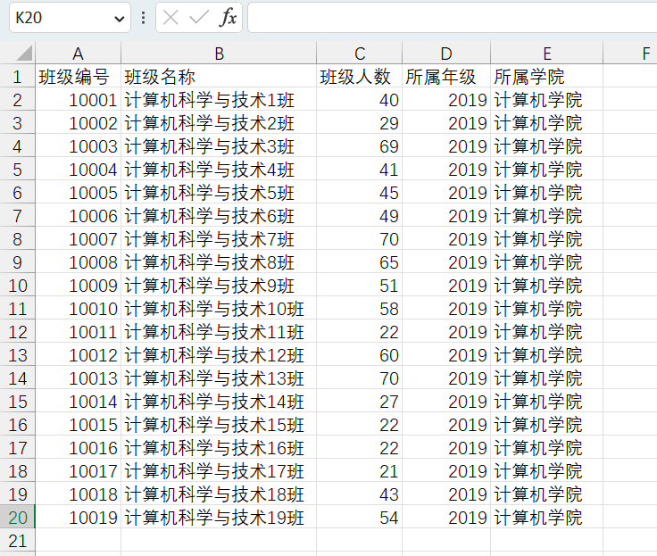

[TOC]

----


# Excel

## 概述

在企业级应用开发中，Excel报表是一种最常见的报表需求。Excel报表开发一般分为两种形式：

* 为了方便操作，基于Excel的报表批量上传数据，也就是把Excel中的数据导入到系统中
* 通过java代码生成Excel报表。也就是把系统中的数据导出到Excel中，方便查阅


## 版本

Excel分为两个大的版本Excel2003和Excel2007及以上两个版本

* Excel2003 是一个特有的二进制格式，其核心结构是复合文档类型的结构，存储数据量较小，后缀名为xls
* Excel2007 的核心结构是 XML 类型的结构，采用的是基于 XML 的压缩方式，使其占用的空间更小，操作效率更高，后缀名为xlsx


## Excel操作工具

Java中常见的用来操作Excel的方式一般有2种：

* JXL
* POI


### JXL

JXL只能对Excel进行操作,属于比较老的框架，它只支持到Excel 95-2000的版本。现在已经停止更新和维护


### POI

POI是apache的项目，可对微软的Word,Excel、PPT进行操作，包括office2003和2007、Excle2003和2007。

poi现在一直有更新。所以现在主流使用POI

Apache POI是Apache软件基金会的开源项目，由Java编写的免费开源的跨平台的 Java API，Apache POI提供API给Java语言操作Microsoft Office的功能


* 工作簿 ：WorkBook
  * 2003版本：HSSFWordBook 
  * 2007级以上：XSSFWorkBook 
* 工作表 ：Sheet
  * 2003版本：HSSFSheet
  * 2007级以上：XSSFSheet
* 行 ：Row
  * 2003版本：HSSFRow
  * 2007级以上：XSSFRow
* 单元格 ： Cell
  * 2003版本：HSSFCell
  * 2007级以上：XSSFCell


## JXL导出excel

### API

通过WritableWorkbook，WritableSheet，Label这三个对象我们就可以实现Excel文件的导出工作。


1、 创建可写入的Excel工作薄

```java
WritableWorkbook workbook= Workbook.createWorkbook(输出流);
```


2、创建工作表

```java
WritableSheet sheet= workbook.createSheet(工作表的名称, 工作表的索引值);
```


3、创建单元格

添加文本类单元格

```java
Label labelC = new Label(列索引值, 行索引值, "单元格中的内容");

sheet.addCell(labelC);
```


4、写入到文件

```java
workbook.write();// 写入数据
```


5、释放资源：

```java
workbook.close();// 关闭文件
```


### 使用

#### 第一步：导入依赖

```xml
        <dependency>
            <groupId>net.sourceforge.jexcelapi</groupId>
            <artifactId>jxl</artifactId>
            <version>2.6.12</version>
        </dependency>
```


#### 第二步：使用API

```java
package mao;

import jxl.Workbook;
import jxl.write.Label;
import jxl.write.WritableSheet;
import jxl.write.WritableWorkbook;
import jxl.write.WriteException;

import java.io.FileNotFoundException;
import java.io.FileOutputStream;
import java.io.IOException;

/**
 * Project name(项目名称)：java报表_JXL导出excel
 * Package(包名): mao
 * Class(类名): Test1
 * Author(作者）: mao
 * Author QQ：1296193245
 * GitHub：https://github.com/maomao124/
 * Date(创建日期)： 2023/6/1
 * Time(创建时间)： 14:14
 * Version(版本): 1.0
 * Description(描述)： JXL导出excel
 */

public class Test1
{
    /**
     * 得到int随机
     *
     * @param min 最小值
     * @param max 最大值
     * @return int
     */
    public static int getIntRandom(int min, int max)
    {
        if (min > max)
        {
            min = max;
        }
        return min + (int) (Math.random() * (max - min + 1));
    }

    public static void main(String[] args) throws IOException, WriteException
    {
        //创建工作簿
        WritableWorkbook writableWorkbook = Workbook.createWorkbook(new FileOutputStream("./student.xls"));
        //创建工作表
        WritableSheet sheet = writableWorkbook.createSheet("学生信息", 0);
        //创建单元格,（列索引值，行索引值，内容）
        sheet.addCell(new Label(0, 0, "学生学号"));
        sheet.addCell(new Label(1, 0, "学生姓名"));
        sheet.addCell(new Label(2, 0, "学生性别"));
        sheet.addCell(new Label(3, 0, "学生年龄"));

        for (int i = 1; i < 201; i++)
        {
            //创建单元格
            sheet.addCell(new Label(0, i, 10000 + i + ""));
            sheet.addCell(new Label(1, i, "姓名" + i));
            sheet.addCell(new Label(2, i, getIntRandom(0, 1) == 1 ? "男" : "女"));
            sheet.addCell(new Label(3, i, String.valueOf(getIntRandom(15, 35))));
        }
        //写入
        writableWorkbook.write();
        //关闭
        writableWorkbook.close();
    }
}
```


#### 第三步：运行


## POI操作excel

### 依赖

```xml
<dependency>
    <groupId>org.apache.poi</groupId>
    <artifactId>poi</artifactId>
    <version>5.2.2</version>
</dependency>

<dependency>
    <groupId>org.apache.poi</groupId>
    <artifactId>poi-ooxml</artifactId>
    <version>5.2.2</version>
</dependency>

<dependency>
    <groupId>org.apache.poi</groupId>
    <artifactId>poi-ooxml-schemas</artifactId>
    <version>4.1.2</version>
</dependency>
```


### 版本区别

在POI包中有如下几个主要对象和excel的几个对象对应：

| 对应excel名称 | 低版本中的类名 | 高版本中的类名 |
| :-----------: | :------------: | :------------: |
|    工作簿     |  HSSFWorkbook  |  XSSFWorkbook  |
|    工作表     |   HSSFSheet    |   XSSFSheet    |
|      行       |    HSSFRow     |    XSSFRow     |
|    单元格     |    HSSFCell    |    XSSFCell    |
|  单元格样式   | HSSFCellStyle  | XSSFCellStyle  |


### 导出excel

低版本：

```java
package mao;

import org.apache.poi.hssf.usermodel.HSSFWorkbook;
import org.apache.poi.ss.usermodel.Cell;
import org.apache.poi.ss.usermodel.Row;
import org.apache.poi.ss.usermodel.Sheet;
import org.apache.poi.ss.usermodel.Workbook;

import java.io.FileNotFoundException;
import java.io.FileOutputStream;
import java.io.IOException;

/**
 * Project name(项目名称)：java报表_POI导出excel
 * Package(包名): mao
 * Class(类名): Test1
 * Author(作者）: mao
 * Author QQ：1296193245
 * GitHub：https://github.com/maomao124/
 * Date(创建日期)： 2023/6/1
 * Time(创建时间)： 14:44
 * Version(版本): 1.0
 * Description(描述)： POI导出-低版本
 */

public class Test1
{

    /**
     * 得到int随机
     *
     * @param min 最小值
     * @param max 最大值
     * @return int
     */
    public static int getIntRandom(int min, int max)
    {
        if (min > max)
        {
            min = max;
        }
        return min + (int) (Math.random() * (max - min + 1));
    }

    public static void main(String[] args) throws IOException
    {
        //创建工作簿
        Workbook workbook = new HSSFWorkbook();
        //创建工作表
        Sheet sheet = workbook.createSheet("班级信息");
        //创建行，第0行
        Row row = sheet.createRow(0);
        //创建单元格
        Cell cell = row.createCell(0);
        //填充数据
        cell.setCellValue("班级编号");
        //创建单元格
        cell = row.createCell(1);
        //填充数据
        cell.setCellValue("班级名称");
        //创建单元格
        cell = row.createCell(2);
        //填充数据
        cell.setCellValue("班级人数");
        //创建单元格
        cell = row.createCell(3);
        //填充数据
        cell.setCellValue("所属年级");
        //创建单元格
        cell = row.createCell(4);
        //填充数据
        cell.setCellValue("所属学院");


        for (int i = 1; i < 20; i++)
        {
            //创建行，第i行
            row = sheet.createRow(i);
            //创建单元格
            cell = row.createCell(0);
            cell.setCellValue(10000 + i);

            cell = row.createCell(1);
            cell.setCellValue("计算机科学与技术" + i + "班");

            cell = row.createCell(2);
            cell.setCellValue(getIntRandom(20, 70));

            cell = row.createCell(3);
            cell.setCellValue(2019);

            cell = row.createCell(4);
            cell.setCellValue("计算机学院");
        }

        //关闭
        try (FileOutputStream fileOutputStream = new FileOutputStream("class.xls"))
        {
            //写入
            workbook.write(fileOutputStream);
            //关闭
            workbook.close();
        }
    }
}
```


高版本：

```java
package mao;

import org.apache.poi.hssf.usermodel.HSSFWorkbook;
import org.apache.poi.ss.usermodel.Cell;
import org.apache.poi.ss.usermodel.Row;
import org.apache.poi.ss.usermodel.Sheet;
import org.apache.poi.ss.usermodel.Workbook;
import org.apache.poi.xssf.usermodel.XSSFWorkbook;

import java.io.FileOutputStream;
import java.io.IOException;

/**
 * Project name(项目名称)：java报表_POI导出excel
 * Package(包名): mao
 * Class(类名): Test2
 * Author(作者）: mao
 * Author QQ：1296193245
 * GitHub：https://github.com/maomao124/
 * Date(创建日期)： 2023/6/1
 * Time(创建时间)： 15:07
 * Version(版本): 1.0
 * Description(描述)： POI导出-高版本
 */

public class Test2
{
    /**
     * 得到int随机
     *
     * @param min 最小值
     * @param max 最大值
     * @return int
     */
    public static int getIntRandom(int min, int max)
    {
        if (min > max)
        {
            min = max;
        }
        return min + (int) (Math.random() * (max - min + 1));
    }

    public static void main(String[] args) throws IOException
    {
        //创建工作簿
        Workbook workbook = new XSSFWorkbook();
        //创建工作表
        Sheet sheet = workbook.createSheet("班级信息");
        //创建行，第0行
        Row row = sheet.createRow(0);
        //创建单元格
        Cell cell = row.createCell(0);
        //填充数据
        cell.setCellValue("班级编号");
        //创建单元格
        cell = row.createCell(1);
        //填充数据
        cell.setCellValue("班级名称");
        //创建单元格
        cell = row.createCell(2);
        //填充数据
        cell.setCellValue("班级人数");
        //创建单元格
        cell = row.createCell(3);
        //填充数据
        cell.setCellValue("所属年级");
        //创建单元格
        cell = row.createCell(4);
        //填充数据
        cell.setCellValue("所属学院");


        for (int i = 1; i < 20; i++)
        {
            //创建行，第i行
            row = sheet.createRow(i);
            //创建单元格
            cell = row.createCell(0);
            cell.setCellValue(10000 + i);

            cell = row.createCell(1);
            cell.setCellValue("计算机科学与技术" + i + "班");

            cell = row.createCell(2);
            cell.setCellValue(getIntRandom(20, 70));

            cell = row.createCell(3);
            cell.setCellValue(2019);

            cell = row.createCell(4);
            cell.setCellValue("计算机学院");
        }

        //关闭
        try (FileOutputStream fileOutputStream = new FileOutputStream("class.xlsx"))
        {
            //写入
            workbook.write(fileOutputStream);
            //关闭
            workbook.close();
        }
    }
}
```





### 导入excel

