[TOC]

----


# Excel

## 概述

在企业级应用开发中，Excel报表是一种最常见的报表需求。Excel报表开发一般分为两种形式：

* 为了方便操作，基于Excel的报表批量上传数据，也就是把Excel中的数据导入到系统中
* 通过java代码生成Excel报表。也就是把系统中的数据导出到Excel中，方便查阅


## 版本

Excel分为两个大的版本Excel2003和Excel2007及以上两个版本

* Excel2003 是一个特有的二进制格式，其核心结构是复合文档类型的结构，存储数据量较小，后缀名为xls
* Excel2007 的核心结构是 XML 类型的结构，采用的是基于 XML 的压缩方式，使其占用的空间更小，操作效率更高，后缀名为xlsx


## Excel操作工具

Java中常见的用来操作Excel的方式一般有2种：

* JXL
* POI


### JXL

JXL只能对Excel进行操作,属于比较老的框架，它只支持到Excel 95-2000的版本。现在已经停止更新和维护


### POI

POI是apache的项目，可对微软的Word,Excel、PPT进行操作，包括office2003和2007、Excle2003和2007。

poi现在一直有更新。所以现在主流使用POI

Apache POI是Apache软件基金会的开源项目，由Java编写的免费开源的跨平台的 Java API，Apache POI提供API给Java语言操作Microsoft Office的功能


* 工作簿 ：WorkBook
  * 2003版本：HSSFWordBook 
  * 2007级以上：XSSFWorkBook 
* 工作表 ：Sheet
  * 2003版本：HSSFSheet
  * 2007级以上：XSSFSheet
* 行 ：Row
  * 2003版本：HSSFRow
  * 2007级以上：XSSFRow
* 单元格 ： Cell
  * 2003版本：HSSFCell
  * 2007级以上：XSSFCell


## JXL导出excel

### API

通过WritableWorkbook，WritableSheet，Label这三个对象我们就可以实现Excel文件的导出工作。


1、 创建可写入的Excel工作薄

```java
WritableWorkbook workbook= Workbook.createWorkbook(输出流);
```


2、创建工作表

```java
WritableSheet sheet= workbook.createSheet(工作表的名称, 工作表的索引值);
```


3、创建单元格

添加文本类单元格

```java
Label labelC = new Label(列索引值, 行索引值, "单元格中的内容");

sheet.addCell(labelC);
```


4、写入到文件

```java
workbook.write();// 写入数据
```


5、释放资源：

```java
workbook.close();// 关闭文件
```


### 使用

#### 第一步：导入依赖

```xml
        <dependency>
            <groupId>net.sourceforge.jexcelapi</groupId>
            <artifactId>jxl</artifactId>
            <version>2.6.12</version>
        </dependency>
```


#### 第二步：使用API

```java
package mao;

import jxl.Workbook;
import jxl.write.Label;
import jxl.write.WritableSheet;
import jxl.write.WritableWorkbook;
import jxl.write.WriteException;

import java.io.FileNotFoundException;
import java.io.FileOutputStream;
import java.io.IOException;

/**
 * Project name(项目名称)：java报表_JXL导出excel
 * Package(包名): mao
 * Class(类名): Test1
 * Author(作者）: mao
 * Author QQ：1296193245
 * GitHub：https://github.com/maomao124/
 * Date(创建日期)： 2023/6/1
 * Time(创建时间)： 14:14
 * Version(版本): 1.0
 * Description(描述)： JXL导出excel
 */

public class Test1
{
    /**
     * 得到int随机
     *
     * @param min 最小值
     * @param max 最大值
     * @return int
     */
    public static int getIntRandom(int min, int max)
    {
        if (min > max)
        {
            min = max;
        }
        return min + (int) (Math.random() * (max - min + 1));
    }

    public static void main(String[] args) throws IOException, WriteException
    {
        //创建工作簿
        WritableWorkbook writableWorkbook = Workbook.createWorkbook(new FileOutputStream("./student.xls"));
        //创建工作表
        WritableSheet sheet = writableWorkbook.createSheet("学生信息", 0);
        //创建单元格,（列索引值，行索引值，内容）
        sheet.addCell(new Label(0, 0, "学生学号"));
        sheet.addCell(new Label(1, 0, "学生姓名"));
        sheet.addCell(new Label(2, 0, "学生性别"));
        sheet.addCell(new Label(3, 0, "学生年龄"));

        for (int i = 1; i < 201; i++)
        {
            //创建单元格
            sheet.addCell(new Label(0, i, 10000 + i + ""));
            sheet.addCell(new Label(1, i, "姓名" + i));
            sheet.addCell(new Label(2, i, getIntRandom(0, 1) == 1 ? "男" : "女"));
            sheet.addCell(new Label(3, i, String.valueOf(getIntRandom(15, 35))));
        }
        //写入
        writableWorkbook.write();
        //关闭
        writableWorkbook.close();
    }
}
```


#### 第三步：运行


## POI操作excel

### 依赖

```xml
<dependency>
    <groupId>org.apache.poi</groupId>
    <artifactId>poi</artifactId>
    <version>5.2.2</version>
</dependency>

<dependency>
    <groupId>org.apache.poi</groupId>
    <artifactId>poi-ooxml</artifactId>
    <version>5.2.2</version>
</dependency>

<dependency>
    <groupId>org.apache.poi</groupId>
    <artifactId>poi-ooxml-schemas</artifactId>
    <version>4.1.2</version>
</dependency>
```


### 版本区别

在POI包中有如下几个主要对象和excel的几个对象对应：

| 对应excel名称 | 低版本中的类名 | 高版本中的类名 |
| :-----------: | :------------: | :------------: |
|    工作簿     |  HSSFWorkbook  |  XSSFWorkbook  |
|    工作表     |   HSSFSheet    |   XSSFSheet    |
|      行       |    HSSFRow     |    XSSFRow     |
|    单元格     |    HSSFCell    |    XSSFCell    |
|  单元格样式   | HSSFCellStyle  | XSSFCellStyle  |


### 导出excel

低版本：

```java
package mao;

import org.apache.poi.hssf.usermodel.HSSFWorkbook;
import org.apache.poi.ss.usermodel.Cell;
import org.apache.poi.ss.usermodel.Row;
import org.apache.poi.ss.usermodel.Sheet;
import org.apache.poi.ss.usermodel.Workbook;

import java.io.FileNotFoundException;
import java.io.FileOutputStream;
import java.io.IOException;

/**
 * Project name(项目名称)：java报表_POI导出excel
 * Package(包名): mao
 * Class(类名): Test1
 * Author(作者）: mao
 * Author QQ：1296193245
 * GitHub：https://github.com/maomao124/
 * Date(创建日期)： 2023/6/1
 * Time(创建时间)： 14:44
 * Version(版本): 1.0
 * Description(描述)： POI导出-低版本
 */

public class Test1
{

    /**
     * 得到int随机
     *
     * @param min 最小值
     * @param max 最大值
     * @return int
     */
    public static int getIntRandom(int min, int max)
    {
        if (min > max)
        {
            min = max;
        }
        return min + (int) (Math.random() * (max - min + 1));
    }

    public static void main(String[] args) throws IOException
    {
        //创建工作簿
        Workbook workbook = new HSSFWorkbook();
        //创建工作表
        Sheet sheet = workbook.createSheet("班级信息");
        //创建行，第0行
        Row row = sheet.createRow(0);
        //创建单元格
        Cell cell = row.createCell(0);
        //填充数据
        cell.setCellValue("班级编号");
        //创建单元格
        cell = row.createCell(1);
        //填充数据
        cell.setCellValue("班级名称");
        //创建单元格
        cell = row.createCell(2);
        //填充数据
        cell.setCellValue("班级人数");
        //创建单元格
        cell = row.createCell(3);
        //填充数据
        cell.setCellValue("所属年级");
        //创建单元格
        cell = row.createCell(4);
        //填充数据
        cell.setCellValue("所属学院");


        for (int i = 1; i < 20; i++)
        {
            //创建行，第i行
            row = sheet.createRow(i);
            //创建单元格
            cell = row.createCell(0);
            cell.setCellValue(10000 + i);

            cell = row.createCell(1);
            cell.setCellValue("计算机科学与技术" + i + "班");

            cell = row.createCell(2);
            cell.setCellValue(getIntRandom(20, 70));

            cell = row.createCell(3);
            cell.setCellValue(2019);

            cell = row.createCell(4);
            cell.setCellValue("计算机学院");
        }

        //关闭
        try (FileOutputStream fileOutputStream = new FileOutputStream("class.xls"))
        {
            //写入
            workbook.write(fileOutputStream);
            //关闭
            workbook.close();
        }
    }
}
```


高版本：

```java
package mao;

import org.apache.poi.hssf.usermodel.HSSFWorkbook;
import org.apache.poi.ss.usermodel.Cell;
import org.apache.poi.ss.usermodel.Row;
import org.apache.poi.ss.usermodel.Sheet;
import org.apache.poi.ss.usermodel.Workbook;
import org.apache.poi.xssf.usermodel.XSSFWorkbook;

import java.io.FileOutputStream;
import java.io.IOException;

/**
 * Project name(项目名称)：java报表_POI导出excel
 * Package(包名): mao
 * Class(类名): Test2
 * Author(作者）: mao
 * Author QQ：1296193245
 * GitHub：https://github.com/maomao124/
 * Date(创建日期)： 2023/6/1
 * Time(创建时间)： 15:07
 * Version(版本): 1.0
 * Description(描述)： POI导出-高版本
 */

public class Test2
{
    /**
     * 得到int随机
     *
     * @param min 最小值
     * @param max 最大值
     * @return int
     */
    public static int getIntRandom(int min, int max)
    {
        if (min > max)
        {
            min = max;
        }
        return min + (int) (Math.random() * (max - min + 1));
    }

    public static void main(String[] args) throws IOException
    {
        //创建工作簿
        Workbook workbook = new XSSFWorkbook();
        //创建工作表
        Sheet sheet = workbook.createSheet("班级信息");
        //创建行，第0行
        Row row = sheet.createRow(0);
        //创建单元格
        Cell cell = row.createCell(0);
        //填充数据
        cell.setCellValue("班级编号");
        //创建单元格
        cell = row.createCell(1);
        //填充数据
        cell.setCellValue("班级名称");
        //创建单元格
        cell = row.createCell(2);
        //填充数据
        cell.setCellValue("班级人数");
        //创建单元格
        cell = row.createCell(3);
        //填充数据
        cell.setCellValue("所属年级");
        //创建单元格
        cell = row.createCell(4);
        //填充数据
        cell.setCellValue("所属学院");


        for (int i = 1; i < 20; i++)
        {
            //创建行，第i行
            row = sheet.createRow(i);
            //创建单元格
            cell = row.createCell(0);
            cell.setCellValue(10000 + i);

            cell = row.createCell(1);
            cell.setCellValue("计算机科学与技术" + i + "班");

            cell = row.createCell(2);
            cell.setCellValue(getIntRandom(20, 70));

            cell = row.createCell(3);
            cell.setCellValue(2019);

            cell = row.createCell(4);
            cell.setCellValue("计算机学院");
        }

        //关闭
        try (FileOutputStream fileOutputStream = new FileOutputStream("class.xlsx"))
        {
            //写入
            workbook.write(fileOutputStream);
            //关闭
            workbook.close();
        }
    }
}
```


### 导入excel

导入上述生成的低版本的xls文件：

```java
package mao;

import org.apache.poi.hssf.usermodel.HSSFWorkbook;
import org.apache.poi.ss.usermodel.Row;
import org.apache.poi.ss.usermodel.Sheet;
import org.apache.poi.ss.usermodel.Workbook;

import java.io.FileInputStream;

/**
 * Project name(项目名称)：java报表_POI导入excel
 * Package(包名): mao
 * Class(类名): Test1
 * Author(作者）: mao
 * Author QQ：1296193245
 * GitHub：https://github.com/maomao124/
 * Date(创建日期)： 2023/6/1
 * Time(创建时间)： 21:30
 * Version(版本): 1.0
 * Description(描述)： poi 导入excel 低版本
 */

public class Test1
{
    public static void main(String[] args)
    {
        try (final FileInputStream fileInputStream = new FileInputStream("./class.xls"))
        {
            //加载工作簿
            Workbook workbook = new HSSFWorkbook(fileInputStream);
            //读取第一个工作表
            Sheet sheet = workbook.getSheetAt(0);
            //得到最后一行
            int lastRowNum = sheet.getLastRowNum();
            //得到第0行
            Row row = sheet.getRow(0);
            //校验表头
            String stringCellValue = row.getCell(0).getStringCellValue();
            if (!"班级编号".equals(stringCellValue))
            {
                throw new UnsupportedOperationException("表格格式不支持");
            }

            stringCellValue = row.getCell(1).getStringCellValue();
            if (!"班级名称".equals(stringCellValue))
            {
                throw new UnsupportedOperationException("表格格式不支持");
            }

            stringCellValue = row.getCell(2).getStringCellValue();
            if (!"班级人数".equals(stringCellValue))
            {
                throw new UnsupportedOperationException("表格格式不支持");
            }

            stringCellValue = row.getCell(3).getStringCellValue();
            if (!"所属年级".equals(stringCellValue))
            {
                throw new UnsupportedOperationException("表格格式不支持");
            }

            stringCellValue = row.getCell(4).getStringCellValue();
            if (!"所属学院".equals(stringCellValue))
            {
                throw new UnsupportedOperationException("表格格式不支持");
            }

            System.out.println("班级编号\t\t班级名称\t\t班级人数\t\t所属年级\t\t所属学院");

            //遍历读取数据
            for (int i = 1; i <= lastRowNum; i++)
            {
                //读取第i行
                row = sheet.getRow(i);
                //读取班级编号
                int classNo = ((Double) row.getCell(0).getNumericCellValue()).intValue();
                //读取班级名称
                String className = row.getCell(1).getStringCellValue();
                //读取班级人数
                int classCount = ((Double) row.getCell(2).getNumericCellValue()).intValue();
                //读取所属年级
                int grade = ((Double) row.getCell(3).getNumericCellValue()).intValue();;
                //读取所属学院
                String academy = row.getCell(4).getStringCellValue();
                System.out.println(classNo + "\t\t" + className + "\t\t" + classCount + "\t\t" + grade + "\t\t" + academy);
            }
        }
        catch (Exception e)
        {
            e.printStackTrace();
        }

    }
}
```


导入上述生成的高版本的xlsx文件：

```java
package mao;

import org.apache.poi.hssf.usermodel.HSSFWorkbook;
import org.apache.poi.ss.usermodel.Row;
import org.apache.poi.ss.usermodel.Sheet;
import org.apache.poi.ss.usermodel.Workbook;
import org.apache.poi.xssf.usermodel.XSSFWorkbook;

import java.io.FileInputStream;

/**
 * Project name(项目名称)：java报表_POI导入excel
 * Package(包名): mao
 * Class(类名): Test2
 * Author(作者）: mao
 * Author QQ：1296193245
 * GitHub：https://github.com/maomao124/
 * Date(创建日期)： 2023/6/1
 * Time(创建时间)： 21:54
 * Version(版本): 1.0
 * Description(描述)： 无
 */

public class Test2
{
    public static void main(String[] args)
    {
        try (final FileInputStream fileInputStream = new FileInputStream("./class.xlsx"))
        {
            //加载工作簿
            Workbook workbook = new XSSFWorkbook(fileInputStream);
            //读取第一个工作表
            Sheet sheet = workbook.getSheetAt(0);
            //得到最后一行
            int lastRowNum = sheet.getLastRowNum();
            //得到第0行
            Row row = sheet.getRow(0);
            //校验表头
            String stringCellValue = row.getCell(0).getStringCellValue();
            if (!"班级编号".equals(stringCellValue))
            {
                throw new UnsupportedOperationException("表格格式不支持");
            }

            stringCellValue = row.getCell(1).getStringCellValue();
            if (!"班级名称".equals(stringCellValue))
            {
                throw new UnsupportedOperationException("表格格式不支持");
            }

            stringCellValue = row.getCell(2).getStringCellValue();
            if (!"班级人数".equals(stringCellValue))
            {
                throw new UnsupportedOperationException("表格格式不支持");
            }

            stringCellValue = row.getCell(3).getStringCellValue();
            if (!"所属年级".equals(stringCellValue))
            {
                throw new UnsupportedOperationException("表格格式不支持");
            }

            stringCellValue = row.getCell(4).getStringCellValue();
            if (!"所属学院".equals(stringCellValue))
            {
                throw new UnsupportedOperationException("表格格式不支持");
            }

            System.out.println("班级编号\t\t班级名称\t\t班级人数\t\t所属年级\t\t所属学院");

            //遍历读取数据
            for (int i = 1; i <= lastRowNum; i++)
            {
                //读取第i行
                row = sheet.getRow(i);
                //读取班级编号
                int classNo = ((Double) row.getCell(0).getNumericCellValue()).intValue();
                //读取班级名称
                String className = row.getCell(1).getStringCellValue();
                //读取班级人数
                int classCount = ((Double) row.getCell(2).getNumericCellValue()).intValue();
                //读取所属年级
                int grade = ((Double) row.getCell(3).getNumericCellValue()).intValue();;
                //读取所属学院
                String academy = row.getCell(4).getStringCellValue();
                System.out.println(classNo + "\t\t" + className + "\t\t" + classCount + "\t\t" + grade + "\t\t" + academy);
            }
        }
        catch (Exception e)
        {
            e.printStackTrace();
        }

    }
}
```


### 导入数据类型问题


靠右的单元格为数值类型，靠左的单元格为字符串类型，比如班级编号和班级人数为数值类型，班级名称为字符串类型，如果使用poi导入时数据类型不正确，将会抛出异常


比如以下数据：


可以在抛出异常时处理：

```java
package mao;

import org.apache.poi.ss.usermodel.Row;
import org.apache.poi.ss.usermodel.Sheet;
import org.apache.poi.ss.usermodel.Workbook;
import org.apache.poi.xssf.usermodel.XSSFWorkbook;

import java.io.FileInputStream;

/**
 * Project name(项目名称)：java报表_POI导入excel
 * Package(包名): mao
 * Class(类名): Test3
 * Author(作者）: mao
 * Author QQ：1296193245
 * GitHub：https://github.com/maomao124/
 * Date(创建日期)： 2023/6/1
 * Time(创建时间)： 22:22
 * Version(版本): 1.0
 * Description(描述)： 无
 */

public class Test3
{

    public static void main(String[] args)
    {
        try (final FileInputStream fileInputStream = new FileInputStream("./class2.xlsx"))
        {
            //加载工作簿
            Workbook workbook = new XSSFWorkbook(fileInputStream);
            //读取第一个工作表
            Sheet sheet = workbook.getSheetAt(0);
            //得到最后一行
            int lastRowNum = sheet.getLastRowNum();
            //得到第0行
            Row row = sheet.getRow(0);
            //校验表头
            String stringCellValue = row.getCell(0).getStringCellValue();
            if (!"班级编号".equals(stringCellValue))
            {
                throw new UnsupportedOperationException("表格格式不支持");
            }

            stringCellValue = row.getCell(1).getStringCellValue();
            if (!"班级名称".equals(stringCellValue))
            {
                throw new UnsupportedOperationException("表格格式不支持");
            }

            stringCellValue = row.getCell(2).getStringCellValue();
            if (!"班级人数".equals(stringCellValue))
            {
                throw new UnsupportedOperationException("表格格式不支持");
            }

            stringCellValue = row.getCell(3).getStringCellValue();
            if (!"所属年级".equals(stringCellValue))
            {
                throw new UnsupportedOperationException("表格格式不支持");
            }

            stringCellValue = row.getCell(4).getStringCellValue();
            if (!"所属学院".equals(stringCellValue))
            {
                throw new UnsupportedOperationException("表格格式不支持");
            }

            System.out.println("班级编号\t\t班级名称\t\t班级人数\t\t所属年级\t\t所属学院");

            //遍历读取数据
            for (int i = 1; i <= lastRowNum; i++)
            {
                //读取第i行
                row = sheet.getRow(i);
                //读取班级编号
                int classNo = ((Double) row.getCell(0).getNumericCellValue()).intValue();
                String className = null;
                try
                {
                    //读取班级名称
                    className = String.valueOf(((Double) row.getCell(1).getNumericCellValue()).intValue());
                }
                catch (IllegalStateException e)
                {
                    className = row.getCell(1).getStringCellValue();
                }
                //读取班级人数
                int classCount = 0;
                try
                {
                    classCount = ((Double) row.getCell(2).getNumericCellValue()).intValue();
                }
                catch (IllegalStateException e)
                {
                    classCount = Integer.parseInt(row.getCell(2).getStringCellValue());
                }
                //读取所属年级
                int grade = ((Double) row.getCell(3).getNumericCellValue()).intValue();
                //读取所属学院
                String academy = row.getCell(4).getStringCellValue();
                System.out.println(classNo + "\t\t" + className + "\t\t" + classCount + "\t\t" + grade + "\t\t" + academy);
            }
        }
        catch (Exception e)
        {
            e.printStackTrace();
        }

    }
}

```


### web实现导出excel

创建spring boot 程序，pom文件依赖如下：

```xml
 <dependency>
            <groupId>org.springframework.boot</groupId>
            <artifactId>spring-boot-starter-web</artifactId>
        </dependency>

        <dependency>
            <groupId>org.projectlombok</groupId>
            <artifactId>lombok</artifactId>
            <optional>true</optional>
        </dependency>

        <dependency>
            <groupId>org.springframework.boot</groupId>
            <artifactId>spring-boot-starter-test</artifactId>
            <scope>test</scope>
        </dependency>

        <!--POI 操作excel 依赖-->
        <dependency>
            <groupId>org.apache.poi</groupId>
            <artifactId>poi</artifactId>
            <version>4.0.1</version>
        </dependency>

        <dependency>
            <groupId>org.apache.poi</groupId>
            <artifactId>poi-ooxml</artifactId>
            <version>4.0.1</version>
        </dependency>

        <dependency>
            <groupId>org.apache.poi</groupId>
            <artifactId>poi-ooxml-schemas</artifactId>
            <version>4.0.1</version>
        </dependency>
```


创建service接口

```java
package mao.java_report_web_poi_import_and_export_excel.service;

import org.springframework.web.multipart.MultipartFile;

import javax.servlet.http.HttpServletRequest;
import javax.servlet.http.HttpServletResponse;

/**
 * Project name(项目名称)：java_report_web_POI_import_and_export_excel
 * Package(包名): mao.java_report_web_poi_import_and_export_excel.service
 * Interface(接口名): ExcelService
 * Author(作者）: mao
 * Author QQ：1296193245
 * GitHub：https://github.com/maomao124/
 * Date(创建日期)： 2023/6/2
 * Time(创建时间)： 14:25
 * Version(版本): 1.0
 * Description(描述)： 无
 */

public interface ExcelService
{
    /**
     * 导出excel
     *
     * @param httpServletRequest  http servlet请求
     * @param httpServletResponse http servlet响应
     * @param highVersion         是否为高版本
     */
    void export(HttpServletRequest httpServletRequest, HttpServletResponse httpServletResponse, boolean highVersion);


    /**
     * 上传excel
     *
     * @param httpServletRequest  http servlet请求
     * @param httpServletResponse http servlet响应
     * @param multipartFile       多部分文件
     */
    void upload(MultipartFile multipartFile, HttpServletRequest httpServletRequest, HttpServletResponse httpServletResponse);
}
```


实现类：

```java
package mao.java_report_web_poi_import_and_export_excel.service.impl;

import lombok.SneakyThrows;
import lombok.extern.slf4j.Slf4j;
import mao.java_report_web_poi_import_and_export_excel.service.ExcelService;
import org.apache.poi.hssf.usermodel.HSSFWorkbook;
import org.apache.poi.ss.usermodel.Cell;
import org.apache.poi.ss.usermodel.Row;
import org.apache.poi.ss.usermodel.Sheet;
import org.apache.poi.ss.usermodel.Workbook;
import org.apache.poi.xssf.usermodel.XSSFWorkbook;
import org.springframework.stereotype.Service;
import org.springframework.web.multipart.MultipartFile;

import javax.servlet.http.HttpServletRequest;
import javax.servlet.http.HttpServletResponse;
import java.io.FileOutputStream;

/**
 * Project name(项目名称)：java_report_web_POI_import_and_export_excel
 * Package(包名): mao.java_report_web_poi_import_and_export_excel.service.impl
 * Class(类名): ExcelServiceImpl
 * Author(作者）: mao
 * Author QQ：1296193245
 * GitHub：https://github.com/maomao124/
 * Date(创建日期)： 2023/6/2
 * Time(创建时间)： 14:26
 * Version(版本): 1.0
 * Description(描述)： 无
 */

@Slf4j
@Service
public class ExcelServiceImpl implements ExcelService
{

    /**
     * 得到int随机
     *
     * @param min 最小值
     * @param max 最大值
     * @return int
     */
    public static int getIntRandom(int min, int max)
    {
        if (min > max)
        {
            min = max;
        }
        return min + (int) (Math.random() * (max - min + 1));
    }

    @SneakyThrows
    @Override
    public void export(HttpServletRequest httpServletRequest, HttpServletResponse httpServletResponse, boolean highVersion)
    {
        log.info("开始导出excel");

        //创建工作簿
        Workbook workbook = null;
        String fileName = null;
        //判断是否为高版本
        if (highVersion)
        {
            //高版本
            workbook = new XSSFWorkbook();
            fileName = "xxx学校班级信息表.xlsx";
        }
        else
        {
            //低版本
            workbook = new HSSFWorkbook();
            fileName = "xxx学校班级信息表.xls";
        }
        //创建工作表
        Sheet sheet = workbook.createSheet("班级信息");
        //创建行，第0行
        Row row = sheet.createRow(0);
        //创建单元格
        Cell cell = row.createCell(0);
        //填充数据
        cell.setCellValue("班级编号");
        //创建单元格
        cell = row.createCell(1);
        //填充数据
        cell.setCellValue("班级名称");
        //创建单元格
        cell = row.createCell(2);
        //填充数据
        cell.setCellValue("班级人数");
        //创建单元格
        cell = row.createCell(3);
        //填充数据
        cell.setCellValue("所属年级");
        //创建单元格
        cell = row.createCell(4);
        //填充数据
        cell.setCellValue("所属学院");

        //500行
        for (int i = 1; i < 500; i++)
        {
            //创建行，第i行
            row = sheet.createRow(i);
            //创建单元格
            cell = row.createCell(0);
            cell.setCellValue(10000 + i);

            cell = row.createCell(1);
            cell.setCellValue("计算机科学与技术" + i + "班");

            cell = row.createCell(2);
            cell.setCellValue(getIntRandom(20, 70));

            cell = row.createCell(3);
            cell.setCellValue(2019);

            cell = row.createCell(4);
            cell.setCellValue("计算机学院");
        }

        //请求头，设置附件（attachment）形式，设置文件名，并转换编码
        httpServletResponse.setHeader("Content-Disposition", "attachment;filename=" + new String(fileName.getBytes(), "ISO8859-1"));
        //设置请求类型，表格
        httpServletResponse.setContentType("application/vnd.openxmlformats-officedocument.spreadsheetml.sheet");
        //写入
        workbook.write(httpServletResponse.getOutputStream());
        //关闭
        workbook.close();
        log.info("导出完成");
    }

    @Override
    public void upload(MultipartFile multipartFile, HttpServletRequest httpServletRequest, HttpServletResponse httpServletResponse)
    {
        log.info("开始导入excel");
        //todo
    }
}
```


controller

```java
package mao.java_report_web_poi_import_and_export_excel.controller;

import lombok.extern.slf4j.Slf4j;
import mao.java_report_web_poi_import_and_export_excel.service.ExcelService;
import org.springframework.web.bind.annotation.GetMapping;
import org.springframework.web.bind.annotation.RequestMapping;
import org.springframework.web.bind.annotation.RequestParam;
import org.springframework.web.bind.annotation.RestController;
import org.springframework.web.multipart.MultipartFile;

import javax.annotation.Resource;
import javax.servlet.http.HttpServletRequest;
import javax.servlet.http.HttpServletResponse;

/**
 * Project name(项目名称)：java_report_web_POI_import_and_export_excel
 * Package(包名): mao.java_report_web_poi_import_and_export_excel.controller
 * Class(类名): ExcelController
 * Author(作者）: mao
 * Author QQ：1296193245
 * GitHub：https://github.com/maomao124/
 * Date(创建日期)： 2023/6/2
 * Time(创建时间)： 14:25
 * Version(版本): 1.0
 * Description(描述)： 无
 */


@Slf4j
@RestController
@RequestMapping("/excel")
public class ExcelController
{

    @Resource
    private ExcelService excelService;

    /**
     * 导出低版本excel
     */
    @RequestMapping("/export/low")
    public void exportLow(HttpServletRequest httpServletRequest, HttpServletResponse httpServletResponse)
    {
        excelService.export(httpServletRequest, httpServletResponse, false);
    }

    /**
     * 导出高版本excel
     */
    @RequestMapping("/export/high")
    public void exportHigh(HttpServletRequest httpServletRequest, HttpServletResponse httpServletResponse)
    {
        excelService.export(httpServletRequest, httpServletResponse, true);
    }

    /**
     * 上传excel
     */
    @RequestMapping("/upload")
    public void upload(@RequestParam("file") MultipartFile multipartFile, HttpServletRequest httpServletRequest, HttpServletResponse httpServletResponse)
    {
        excelService.upload(multipartFile, httpServletRequest, httpServletResponse);
    }
}

```


访问低版本下载地址：

http://localhost:8080/excel/export/low


访问高版本下载地址：

http://localhost:8080/excel/export/high


### web实现导入excel

实现upload方法

```java
package mao.java_report_web_poi_import_and_export_excel.service.impl;

import lombok.SneakyThrows;
import lombok.extern.slf4j.Slf4j;
import mao.java_report_web_poi_import_and_export_excel.service.ExcelService;
import org.apache.poi.hssf.usermodel.HSSFWorkbook;
import org.apache.poi.ss.usermodel.Cell;
import org.apache.poi.ss.usermodel.Row;
import org.apache.poi.ss.usermodel.Sheet;
import org.apache.poi.ss.usermodel.Workbook;
import org.apache.poi.xssf.usermodel.XSSFWorkbook;
import org.springframework.stereotype.Service;
import org.springframework.web.multipart.MultipartFile;

import javax.servlet.http.HttpServletRequest;
import javax.servlet.http.HttpServletResponse;
import java.io.FileOutputStream;

/**
 * Project name(项目名称)：java_report_web_POI_import_and_export_excel
 * Package(包名): mao.java_report_web_poi_import_and_export_excel.service.impl
 * Class(类名): ExcelServiceImpl
 * Author(作者）: mao
 * Author QQ：1296193245
 * GitHub：https://github.com/maomao124/
 * Date(创建日期)： 2023/6/2
 * Time(创建时间)： 14:26
 * Version(版本): 1.0
 * Description(描述)： 无
 */

@Slf4j
@Service
public class ExcelServiceImpl implements ExcelService
{

    /**
     * 得到int随机
     *
     * @param min 最小值
     * @param max 最大值
     * @return int
     */
    public static int getIntRandom(int min, int max)
    {
        if (min > max)
        {
            min = max;
        }
        return min + (int) (Math.random() * (max - min + 1));
    }

    @SneakyThrows
    @Override
    public void export(HttpServletRequest httpServletRequest, HttpServletResponse httpServletResponse, boolean highVersion)
    {
        log.info("开始导出excel");

        //创建工作簿
        Workbook workbook = null;
        String fileName = null;
        //判断是否为高版本
        if (highVersion)
        {
            //高版本
            workbook = new XSSFWorkbook();
            fileName = "xxx学校班级信息表.xlsx";
        }
        else
        {
            //低版本
            workbook = new HSSFWorkbook();
            fileName = "xxx学校班级信息表.xls";
        }
        //创建工作表
        Sheet sheet = workbook.createSheet("班级信息");
        //创建行，第0行
        Row row = sheet.createRow(0);
        //创建单元格
        Cell cell = row.createCell(0);
        //填充数据
        cell.setCellValue("班级编号");
        //创建单元格
        cell = row.createCell(1);
        //填充数据
        cell.setCellValue("班级名称");
        //创建单元格
        cell = row.createCell(2);
        //填充数据
        cell.setCellValue("班级人数");
        //创建单元格
        cell = row.createCell(3);
        //填充数据
        cell.setCellValue("所属年级");
        //创建单元格
        cell = row.createCell(4);
        //填充数据
        cell.setCellValue("所属学院");

        //500行
        for (int i = 1; i < 500; i++)
        {
            //创建行，第i行
            row = sheet.createRow(i);
            //创建单元格
            cell = row.createCell(0);
            cell.setCellValue(10000 + i);

            cell = row.createCell(1);
            cell.setCellValue("计算机科学与技术" + i + "班");

            cell = row.createCell(2);
            cell.setCellValue(getIntRandom(20, 70));

            cell = row.createCell(3);
            cell.setCellValue(2019);

            cell = row.createCell(4);
            cell.setCellValue("计算机学院");
        }

        //请求头，设置附件（attachment）形式，设置文件名，并转换编码
        httpServletResponse.setHeader("Content-Disposition", "attachment;filename=" + new String(fileName.getBytes(), "ISO8859-1"));
        //设置请求类型，表格
        httpServletResponse.setContentType("application/vnd.openxmlformats-officedocument.spreadsheetml.sheet");
        //写入
        workbook.write(httpServletResponse.getOutputStream());
        //关闭
        workbook.close();
        log.info("导出完成");
    }

    @SneakyThrows
    @Override
    public void upload(MultipartFile multipartFile, HttpServletRequest httpServletRequest, HttpServletResponse httpServletResponse)
    {
        //todo：全局异常处理

        if (multipartFile == null)
        {
            throw new RuntimeException("请上传文件");
        }

        log.info("开始导入excel");

        boolean highVersion;
        //得到文件名
        String filename = multipartFile.getOriginalFilename();
        log.info("文件名：" + filename);
        if (filename == null || filename.length() < 1)
        {
            throw new UnsupportedOperationException("无法读取文件名");
        }
        if (filename.endsWith(".xlsx"))
        {
            highVersion = true;
        }
        else if (filename.endsWith(".xls"))
        {
            highVersion = false;
        }
        else
        {
            throw new UnsupportedOperationException("文件后缀名不支持");
        }

        log.info("高版本？ " + highVersion);

        //加载工作簿
        Workbook workbook = null;
        if (highVersion)
        {
            workbook = new XSSFWorkbook(multipartFile.getInputStream());
        }
        else
        {
            workbook = new HSSFWorkbook(multipartFile.getInputStream());
        }
        //读取第一个工作表
        Sheet sheet = workbook.getSheetAt(0);
        //得到最后一行
        int lastRowNum = sheet.getLastRowNum();
        //得到第0行
        Row row = sheet.getRow(0);
        //校验表头
        String stringCellValue = row.getCell(0).getStringCellValue();
        if (!"班级编号".equals(stringCellValue))
        {
            throw new UnsupportedOperationException("表格格式不支持");
        }

        stringCellValue = row.getCell(1).getStringCellValue();
        if (!"班级名称".equals(stringCellValue))
        {
            throw new UnsupportedOperationException("表格格式不支持");
        }

        stringCellValue = row.getCell(2).getStringCellValue();
        if (!"班级人数".equals(stringCellValue))
        {
            throw new UnsupportedOperationException("表格格式不支持");
        }

        stringCellValue = row.getCell(3).getStringCellValue();
        if (!"所属年级".equals(stringCellValue))
        {
            throw new UnsupportedOperationException("表格格式不支持");
        }

        stringCellValue = row.getCell(4).getStringCellValue();
        if (!"所属学院".equals(stringCellValue))
        {
            throw new UnsupportedOperationException("表格格式不支持");
        }

        StringBuilder stringBuilder = new StringBuilder();

        stringBuilder.append("班级编号\t\t班级名称\t\t班级人数\t\t所属年级\t\t所属学院\n");

        //遍历读取数据
        for (int i = 1; i <= lastRowNum; i++)
        {
            //读取第i行
            row = sheet.getRow(i);
            //读取班级编号
            int classNo = ((Double) row.getCell(0).getNumericCellValue()).intValue();
            String className = null;
            try
            {
                //读取班级名称
                className = String.valueOf(((Double) row.getCell(1).getNumericCellValue()).intValue());
            }
            catch (IllegalStateException e)
            {
                className = row.getCell(1).getStringCellValue();
            }
            //读取班级人数
            int classCount = 0;
            try
            {
                classCount = ((Double) row.getCell(2).getNumericCellValue()).intValue();
            }
            catch (IllegalStateException e)
            {
                classCount = Integer.parseInt(row.getCell(2).getStringCellValue());
            }
            //读取所属年级
            int grade = ((Double) row.getCell(3).getNumericCellValue()).intValue();
            //读取所属学院
            String academy = row.getCell(4).getStringCellValue();
            stringBuilder.append(classNo).append("\t\t")
                    .append(className).append("\t\t")
                    .append(classCount).append("\t\t")
                    .append(grade).append("\t\t")
                    .append(academy)
                    .append('\n');
        }

        log.info("\n\n" + stringBuilder + "\t\t");

        log.info("导入完成");
    }
}

```


upload.html

```html
<!DOCTYPE html>
<html lang="en">
<head>
    <meta charset="UTF-8">
    <title>Title</title></head>
<body>
<form action="/excel/upload" method="post" enctype="multipart/form-data">
    <input type="file" name="file" value="请选择文件">
    <input type="submit" value="上传">
</form>
</body>
</html>
```


访问

http://localhost:8080/upload.html


上传低版本：


上传高版本：


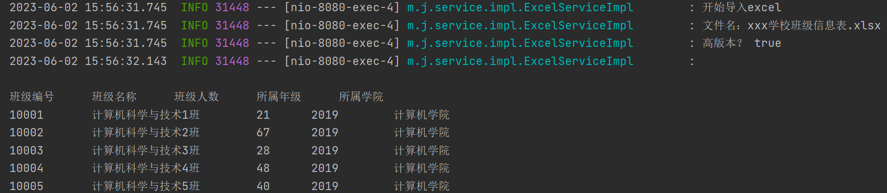


### 格式设置

#### 框线

```java
package mao;

import org.apache.poi.hssf.usermodel.HSSFCellStyle;
import org.apache.poi.ss.usermodel.*;
import org.apache.poi.xssf.usermodel.XSSFWorkbook;

import java.io.FileOutputStream;

/**
 * Project name(项目名称)：java报表_POI格式设置
 * Package(包名): mao
 * Class(类名): Test1
 * Author(作者）: mao
 * Author QQ：1296193245
 * GitHub：https://github.com/maomao124/
 * Date(创建日期)： 2023/6/2
 * Time(创建时间)： 22:12
 * Version(版本): 1.0
 * Description(描述)： 无
 */

public class Test1
{
    public static void main(String[] args)
    {
        Workbook workbook = new XSSFWorkbook();
        CellStyle cellStyle = workbook.createCellStyle();
        cellStyle.setBorderBottom(BorderStyle.DOUBLE);//底线
        cellStyle.setBorderTop(BorderStyle.DOUBLE);//顶部线
        cellStyle.setBorderLeft(BorderStyle.HAIR);//左侧线
        cellStyle.setBorderRight(BorderStyle.NONE);//右侧线
        Sheet sheet = workbook.createSheet("test");
        Row row = sheet.createRow(0);
        Cell cell = row.createCell(0);
        cell.setCellValue("hello");
        cell.setCellStyle(cellStyle);
        row = sheet.createRow(1);
        cell = row.createCell(1);
        cell.setCellValue("world");
        cell.setCellStyle(cellStyle);
        try (FileOutputStream fileOutputStream = new FileOutputStream("./out.xlsx"))
        {
            workbook.write(fileOutputStream);
            workbook.close();
        }
        catch (Exception e)
        {
            e.printStackTrace();
        }
    }
}
```


#### 合并单元格

```java
package mao;

import org.apache.poi.ss.usermodel.Cell;
import org.apache.poi.ss.usermodel.Row;
import org.apache.poi.ss.usermodel.Sheet;
import org.apache.poi.ss.usermodel.Workbook;
import org.apache.poi.ss.util.CellRangeAddress;
import org.apache.poi.xssf.usermodel.XSSFWorkbook;

import java.io.FileOutputStream;

/**
 * Project name(项目名称)：java报表_POI格式设置
 * Package(包名): mao
 * Class(类名): Test2
 * Author(作者）: mao
 * Author QQ：1296193245
 * GitHub：https://github.com/maomao124/
 * Date(创建日期)： 2023/6/3
 * Time(创建时间)： 12:31
 * Version(版本): 1.0
 * Description(描述)： 无
 */

public class Test2
{
    public static void main(String[] args)
    {
        Workbook workbook = new XSSFWorkbook();
        Sheet sheet = workbook.createSheet("test");
        //合并单元格，参数为 起始行, 结束行, 起始列, 结束列    
        sheet.addMergedRegion(new CellRangeAddress(0, 0, 0, 4));
        Row row = sheet.createRow(0);
        Cell cell = row.createCell(0);
        cell.setCellValue("test");
        cell = row.createCell(6);
        cell.setCellValue("test2");
        sheet.addMergedRegion(new CellRangeAddress(2, 6, 2, 4));
        row = sheet.createRow(2);
        cell = row.createCell(2);
        cell.setCellValue("test3");
        try (FileOutputStream fileOutputStream = new FileOutputStream("./out2.xlsx"))
        {
            workbook.write(fileOutputStream);
            workbook.close();
        }
        catch (Exception e)
        {
            e.printStackTrace();
        }
    }
}
```


#### 行高

```java
package mao;

import org.apache.poi.ss.usermodel.Cell;
import org.apache.poi.ss.usermodel.Row;
import org.apache.poi.ss.usermodel.Sheet;
import org.apache.poi.ss.usermodel.Workbook;
import org.apache.poi.ss.util.CellRangeAddress;
import org.apache.poi.xssf.usermodel.XSSFWorkbook;

import java.io.FileOutputStream;

/**
 * Project name(项目名称)：java报表_POI格式设置
 * Package(包名): mao
 * Class(类名): Test3
 * Author(作者）: mao
 * Author QQ：1296193245
 * GitHub：https://github.com/maomao124/
 * Date(创建日期)： 2023/6/3
 * Time(创建时间)： 12:49
 * Version(版本): 1.0
 * Description(描述)： 无
 */

public class Test3
{
    public static void main(String[] args)
    {
        Workbook workbook = new XSSFWorkbook();
        Sheet sheet = workbook.createSheet("test");

        Row row = sheet.createRow(0);
        row.createCell(0).setCellValue("test1");
        row.createCell(1).setCellValue("test2");
        //设置行高
        row.setHeight((short) 500);
        row = sheet.createRow(1);
        row.createCell(0).setCellValue("test3");
        row.createCell(1).setCellValue("test4");
        //设置行高
        row.setHeight((short) 200);
        row = sheet.createRow(2);
        row.createCell(0).setCellValue("test5");
        row.createCell(1).setCellValue("test6");
        //设置行高
        row.setHeight((short) 1400);
        row = sheet.createRow(3);
        row.createCell(0).setCellValue("test7");
        row.createCell(1).setCellValue("test8");


        try (FileOutputStream fileOutputStream = new FileOutputStream("./out3.xlsx"))
        {
            workbook.write(fileOutputStream);
            workbook.close();
        }
        catch (Exception e)
        {
            e.printStackTrace();
        }
    }
}
```


#### 表格的对齐方式

```java
package mao;

import org.apache.poi.hssf.usermodel.HSSFCellStyle;
import org.apache.poi.ss.usermodel.*;
import org.apache.poi.xssf.usermodel.XSSFWorkbook;

import java.io.FileOutputStream;

/**
 * Project name(项目名称)：java报表_POI格式设置
 * Package(包名): mao
 * Class(类名): Test4
 * Author(作者）: mao
 * Author QQ：1296193245
 * GitHub：https://github.com/maomao124/
 * Date(创建日期)： 2023/6/3
 * Time(创建时间)： 12:55
 * Version(版本): 1.0
 * Description(描述)： 无
 */

public class Test4
{
    public static void main(String[] args)
    {
        Workbook workbook = new XSSFWorkbook();
        Sheet sheet = workbook.createSheet("test");
        CellStyle cellStyle = workbook.createCellStyle();
        //水平居中
        cellStyle.setAlignment(HorizontalAlignment.CENTER);
        //垂直居中
        cellStyle.setVerticalAlignment(VerticalAlignment.CENTER);

        Row row = sheet.createRow(0);
        Cell cell = row.createCell(0);
        cell.setCellValue("test");
        //居中对齐
        cell.setCellStyle(cellStyle);
        cell = row.createCell(1);
        cell.setCellValue("test");
        //居中对齐
        cell.setCellStyle(cellStyle);

        cell = row.createCell(2);
        cell.setCellValue("test");
        //默认
        //cell.setCellStyle(cellStyle);

        cellStyle = workbook.createCellStyle();
        //循环填充
        cellStyle.setAlignment(HorizontalAlignment.FILL);
        //垂直居中
        cellStyle.setVerticalAlignment(VerticalAlignment.CENTER);

        cell = row.createCell(3);
        cell.setCellValue("test");
        //循环填充
        cell.setCellStyle(cellStyle);

        try (FileOutputStream fileOutputStream = new FileOutputStream("./out4.xlsx"))
        {
            workbook.write(fileOutputStream);
            workbook.close();
        }
        catch (Exception e)
        {
            e.printStackTrace();
        }
    }
}
```


#### 字体

```java
package mao;

import org.apache.poi.ss.usermodel.*;
import org.apache.poi.xssf.usermodel.XSSFWorkbook;

import java.io.FileOutputStream;

/**
 * Project name(项目名称)：java报表_POI格式设置
 * Package(包名): mao
 * Class(类名): Test5
 * Author(作者）: mao
 * Author QQ：1296193245
 * GitHub：https://github.com/maomao124/
 * Date(创建日期)： 2023/6/3
 * Time(创建时间)： 13:06
 * Version(版本): 1.0
 * Description(描述)： 无
 */

public class Test5
{
    public static void main(String[] args)
    {
        Workbook workbook = new XSSFWorkbook();
        Sheet sheet = workbook.createSheet("test");
        Font font = workbook.createFont();
        //加粗
        font.setBold(true);
        //字体名称
        font.setFontName("黑体");
        //字体颜色
        font.setColor(Font.COLOR_RED);
        //字体大小
        font.setFontHeightInPoints((short) 20);
        CellStyle cellStyle = workbook.createCellStyle();
        cellStyle.setFont(font);

        Row row = sheet.createRow(0);
        Cell cell = row.createCell(0);
        cell.setCellValue("test1");
        cell.setCellStyle(cellStyle);

        cell = row.createCell(1);
        cell.setCellValue("test2");
        cell.setCellStyle(cellStyle);

        font = workbook.createFont();
        //加粗
        font.setBold(true);
        //字体名称
        font.setFontName("宋体");
        //字体颜色
        font.setColor((short) 11);
        //字体大小
        font.setFontHeightInPoints((short) 25);
        cellStyle = workbook.createCellStyle();
        cellStyle.setFont(font);

        cell = row.createCell(2);
        cell.setCellValue("test3");
        cell.setCellStyle(cellStyle);

        cell = row.createCell(3);
        cell.setCellValue("test4");
        cell.setCellStyle(cellStyle);

        font = workbook.createFont();
        //加粗
        font.setBold(false);
        //字体名称
        font.setFontName("微软雅黑");
        //字体颜色
        font.setColor((short) 12);
        //字体大小
        font.setFontHeightInPoints((short) 12);
        cellStyle = workbook.createCellStyle();
        cellStyle.setFont(font);

        cell = row.createCell(4);
        cell.setCellValue("test5");
        cell.setCellStyle(cellStyle);

        cell = row.createCell(5);
        cell.setCellValue("test6");
        cell.setCellStyle(cellStyle);

        try (FileOutputStream fileOutputStream = new FileOutputStream("./out5.xlsx"))
        {
            workbook.write(fileOutputStream);
            workbook.close();
        }
        catch (Exception e)
        {
            e.printStackTrace();
        }
    }
}
```


### 基于模板导出数据

首先准备一个excel模板，这个模板把复杂的样式和固定的内容先准备好并且放入到项目中，然后读取到模板后向里面放入数据


准备模板1


准备模板2

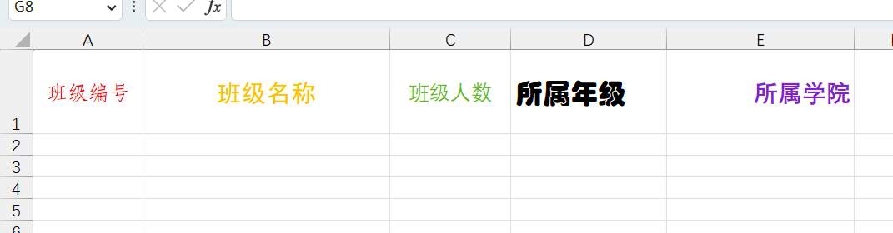


模板1：

```java
package mao;

import org.apache.poi.ss.usermodel.*;
import org.apache.poi.xssf.usermodel.XSSFWorkbook;

import java.io.FileInputStream;
import java.io.FileOutputStream;
import java.io.IOException;

/**
 * Project name(项目名称)：java报表_基于模板导出数据
 * Package(包名): mao
 * Class(类名): Test1
 * Author(作者）: mao
 * Author QQ：1296193245
 * GitHub：https://github.com/maomao124/
 * Date(创建日期)： 2023/6/4
 * Time(创建时间)： 14:04
 * Version(版本): 1.0
 * Description(描述)： 基于模板导出数据
 */

public class Test1
{
    /**
     * 得到int随机
     *
     * @param min 最小值
     * @param max 最大值
     * @return int
     */
    public static int getIntRandom(int min, int max)
    {
        if (min > max)
        {
            min = max;
        }
        return min + (int) (Math.random() * (max - min + 1));
    }

    public static void main(String[] args) throws IOException
    {
        Workbook workbook = null;
        try (FileInputStream fileInputStream = new FileInputStream("./class.xlsx"))
        {
            //创建工作簿
            workbook = new XSSFWorkbook(fileInputStream);
            //得到格式信息
            CellStyle cellStyle1 = workbook.getSheetAt(0).getRow(0).getCell(0).getCellStyle();
            CellStyle cellStyle2 = workbook.getSheetAt(0).getRow(0).getCell(1).getCellStyle();
            CellStyle cellStyle3 = workbook.getSheetAt(0).getRow(0).getCell(2).getCellStyle();
            CellStyle cellStyle4 = workbook.getSheetAt(0).getRow(0).getCell(3).getCellStyle();
            CellStyle cellStyle5 = workbook.getSheetAt(0).getRow(0).getCell(4).getCellStyle();

            Sheet sheet = workbook.getSheetAt(0);
            Row row = null;
            Cell cell = null;


            for (int i = 1; i < 20; i++)
            {
                //创建行，第i行
                row = sheet.createRow(i);
                //创建单元格
                cell = row.createCell(0);
                cell.setCellValue(10000 + i);
                cell.setCellStyle(cellStyle1);

                cell = row.createCell(1);
                cell.setCellValue("计算机科学与技术" + i + "班");
                cell.setCellStyle(cellStyle2);

                cell = row.createCell(2);
                cell.setCellValue(getIntRandom(20, 70));
                cell.setCellStyle(cellStyle3);

                cell = row.createCell(3);
                cell.setCellValue(2019);
                cell.setCellStyle(cellStyle4);

                cell = row.createCell(4);
                cell.setCellValue("计算机学院");
                cell.setCellStyle(cellStyle5);
            }
        }
        catch (Exception e)
        {
            e.printStackTrace();
        }


        //关闭
        try (FileOutputStream fileOutputStream = new FileOutputStream("class3.xlsx"))
        {
            //写入
            workbook.write(fileOutputStream);
            //关闭
            workbook.close();
        }
        catch (Exception e)
        {
            e.printStackTrace();
        }
    }
}
```


模板2


### 导出带图片的数据

POI主要提供了两个类来处理照片，这两个类是Patriarch和ClientAnchor前者负责在表中创建图片，后者负责设置图片的大小位置


```java
package mao;

import org.apache.poi.ss.usermodel.*;
import org.apache.poi.xssf.usermodel.XSSFClientAnchor;
import org.apache.poi.xssf.usermodel.XSSFWorkbook;

import javax.imageio.ImageIO;
import java.awt.image.BufferedImage;
import java.io.ByteArrayOutputStream;
import java.io.File;
import java.io.FileOutputStream;
import java.io.IOException;

/**
 * Project name(项目名称)：java报表_POI导出带图片的数据
 * Package(包名): mao
 * Class(类名): Test1
 * Author(作者）: mao
 * Author QQ：1296193245
 * GitHub：https://github.com/maomao124/
 * Date(创建日期)： 2023/6/4
 * Time(创建时间)： 14:28
 * Version(版本): 1.0
 * Description(描述)： 无
 */

public class Test1
{
    public static void main(String[] args) throws IOException
    {
        Workbook workbook = new XSSFWorkbook();
        Sheet sheet = workbook.createSheet("test");
        Row row = sheet.createRow(0);
        Cell cell = row.createCell(0);
        cell.setCellValue("图片：");
        //创建一个字节输出流
        ByteArrayOutputStream byteArrayOutputStream = new ByteArrayOutputStream();
        //读取图片
        BufferedImage bufferedImage = ImageIO.read(new File("./test.png"));
        //把读取到图像放入到输出流中
        ImageIO.write(bufferedImage, "png", byteArrayOutputStream);
        //创建一个绘图控制类，负责画图
        Drawing<?> drawingPatriarch = sheet.createDrawingPatriarch();
        //指定把图片放到哪个位置
        //dx1 - the x coordinate within the first cell.//定义了图片在第一个cell内的偏移x坐标，既左上角所在cell的偏移x坐标，一般可设0
        //dy1 - the y coordinate within the first cell.//定义了图片在第一个cell的偏移y坐标，既左上角所在cell的偏移y坐标，一般可设0
        //dx2 - the x coordinate within the second cell.//定义了图片在第二个cell的偏移x坐标，既右下角所在cell的偏移x坐标，一般可设0
        //dy2 - the y coordinate within the second cell.//定义了图片在第二个cell的偏移y坐标，既右下角所在cell的偏移y坐标，一般可设0
        //col1 - the column (0 based) of the first cell.//第一个cell所在列，既图片左上角所在列
        //row1 - the row (0 based) of the first cell.//图片左上角所在行
        //col2 - the column (0 based) of the second cell.//图片右下角所在列
        //row2 - the row (0 based) of the second cell.//图片右下角所在行
        ClientAnchor clientAnchor = new XSSFClientAnchor(0, 0, 0, 0, 1, 0, 10, 30);
        // 开始把图片写入到sheet指定的位置
        drawingPatriarch.createPicture(clientAnchor, workbook.addPicture(
                byteArrayOutputStream.toByteArray(), Workbook.PICTURE_TYPE_PNG));


        clientAnchor = new XSSFClientAnchor(0, 0, 0, 0, 11, 2, 15, 8);
        drawingPatriarch.createPicture(clientAnchor, workbook.addPicture(
                byteArrayOutputStream.toByteArray(), Workbook.PICTURE_TYPE_PNG));

        try (FileOutputStream fileOutputStream = new FileOutputStream("./test.xlsx"))
        {
            workbook.write(fileOutputStream);
            workbook.close();
        }
        catch (Exception e)
        {
            e.printStackTrace();
        }
    }
}
```


### 导出带公式的数据

关于POI支持公式详见官网： https://poi.apache.org/components/spreadsheet/eval-devguide.html 


在使用POI导出时使用setCellFormula方法来设置公式：

```java
cell.setCellFormula("公式");
```


## 百万数据导出

### 概述

Excel可以分为早期的Excel2003版本（使用POI的HSSF对象操作）和Excel2007版本（使用POI的XSSF操作），两者对百万数据的支持如下：

* Excel 2003：在POI中使用HSSF对象时，excel 2003最多只允许存储65536条数据，一般用来处理较少的数据量。这时对于百万级别数据，Excel肯定容纳不了
* Excel 2007：当POI升级到XSSF对象时，它可以直接支持excel2007以上版本，因为它采用ooxml格式。这时excel可以支持1048576条数据，单个sheet表就支持近百万条数据。但实际运行时还可能存在问题，原因是执行POI报表所产生的行对象，单元格对象，字体对象，他们都不会销毁，这就导致OOM的风险


### 解决方案分析

对于百万数据量的Excel导入导出，只讨论基于Excel2007的解决方法。在ApachePoi 官方提供了对操作大数据量的导入导出的工具和解决办法，操作Excel2007使用XSSF对象，可以分为三种模式：

*  java代码解析xml
*  dom4j一次性加载xml文件再解析
*  SAX逐行加载，逐行解析


**用户模式：**用户模式有许多封装好的方法操作简单，但创建太多的对象，非常耗内存（之前使用的方法）

**事件模式：**基于SAX方式解析XML，SAX全称Simple API for XML，它是一个接口，也是一个软件包。它是一种XML解析的替代方法，不同于DOM解析XML文档时把所有内容一次性加载到内存中的方式，它逐行扫描文档，一边扫描，一边解析。

**SXSSF对象**：是用来生成海量excel数据文件，主要原理是借助临时存储空间生成excel


导出时使用的是SXSSFWorkBook这个类，一个工作表sheet最多只能放1048576行数据， 当我们的业务数据已超过100万了，一个sheet就不够用了，必须拆分到多个工作表。

导出百万数据时有两个弊端：

1. 不能使用模板

2. 不能使用太多的样式  


### 原理分析

在实例化SXSSFWorkBook这个对象时，可以指定在内存中所产生的POI导出相关对象的数量（默认100），一旦内存中的对象的个数达到这个指定值时，就将内存中的这些对象的内容写入到磁盘中（XML的文件格式），就可以将这些对象从内存中销毁，以后只要达到这个值，就会以类似的处理方式处理，直至Excel导出完成。


### 准备数据

sql表结构：

```sql
CREATE TABLE `user` (
  `id` bigint(20) NOT NULL  COMMENT '用户ID',
  `user_name` varchar(100) DEFAULT NULL COMMENT '姓名',
  `phone` varchar(15) DEFAULT NULL COMMENT '手机号',
  `hire_date` datetime DEFAULT NULL COMMENT '入职日期',
  `address` varchar(300) DEFAULT NULL COMMENT '现在住址' 
) ENGINE=InnoDB DEFAULT CHARSET=utf8;

```


创建存储过程：

```sql
DELIMITER $$    -- 重新定义“;”分号
DROP PROCEDURE IF EXISTS test_insert $$   -- 如果有test_insert这个存储过程就删除
CREATE PROCEDURE test_insert()			  -- 创建存储过程

BEGIN
	DECLARE n int DEFAULT 1;				    -- 定义变量n=1
	SET AUTOCOMMIT=0;						    -- 取消自动提交
	
		while n <= 5000000 do					
			INSERT INTO `user` VALUES ( n, CONCAT('姓名', n), '18800000008','2023-06-04 22:59:21','中国');
			SET n=n+1;
		END while;
		COMMIT;
END $$

```


执行：

```sql
CALL test_insert();
```


需要的时间比较长


### 实现

创建spring boot 程序，pom文件依赖如下：

```xml
    <dependencies>

        <dependency>
            <groupId>org.springframework.boot</groupId>
            <artifactId>spring-boot-starter</artifactId>
        </dependency>

        <dependency>
            <groupId>org.projectlombok</groupId>
            <artifactId>lombok</artifactId>
            <optional>true</optional>
        </dependency>
        <dependency>
            <groupId>org.springframework.boot</groupId>
            <artifactId>spring-boot-starter-test</artifactId>
            <scope>test</scope>
        </dependency>

        <!--POI 操作excel 依赖-->
        <dependency>
            <groupId>org.apache.poi</groupId>
            <artifactId>poi</artifactId>
            <version>4.0.1</version>
        </dependency>

        <dependency>
            <groupId>org.apache.poi</groupId>
            <artifactId>poi-ooxml</artifactId>
            <version>4.0.1</version>
        </dependency>

        <dependency>
            <groupId>org.apache.poi</groupId>
            <artifactId>poi-ooxml-schemas</artifactId>
            <version>4.0.1</version>
        </dependency>

        <!--spring-boot mybatis-plus依赖-->
        <dependency>
            <groupId>com.baomidou</groupId>
            <artifactId>mybatis-plus-boot-starter</artifactId>
            <version>3.5.1</version>
        </dependency>

        <!--spring-boot druid连接池依赖-->
        <dependency>
            <groupId>com.alibaba</groupId>
            <artifactId>druid-spring-boot-starter</artifactId>
            <version>1.2.8</version>
        </dependency>

        <!--mysql依赖 spring-boot-->
        <dependency>
            <groupId>mysql</groupId>
            <artifactId>mysql-connector-java</artifactId>
            <scope>runtime</scope>
        </dependency>

    </dependencies>
```


实体类：

```java
package mao.java_report_poi_million_data_export.entity;

import com.baomidou.mybatisplus.annotation.TableField;
import com.baomidou.mybatisplus.annotation.TableId;
import lombok.Data;

import java.time.LocalDateTime;

/**
 * Project name(项目名称)：java_report_poi_million_data_export
 * Package(包名): mao.java_report_poi_million_data_export.entity
 * Class(类名): User
 * Author(作者）: mao
 * Author QQ：1296193245
 * GitHub：https://github.com/maomao124/
 * Date(创建日期)： 2023/6/5
 * Time(创建时间)： 13:42
 * Version(版本): 1.0
 * Description(描述)： 无
 */


@Data
public class User
{
    @TableId
    private Long id;

    @TableField(value = "user_name")
    private String userName;

    private String phone;

    private LocalDateTime hireDate;

    private String address;
}
```


mapper接口：

```java
package mao.java_report_poi_million_data_export.mapper;

import com.baomidou.mybatisplus.core.mapper.BaseMapper;
import mao.java_report_poi_million_data_export.entity.User;
import org.apache.ibatis.annotations.Mapper;

/**
 * Project name(项目名称)：java_report_poi_million_data_export
 * Package(包名): mao.java_report_poi_million_data_export.mapper
 * Interface(接口名): UserMapper
 * Author(作者）: mao
 * Author QQ：1296193245
 * GitHub：https://github.com/maomao124/
 * Date(创建日期)： 2023/6/5
 * Time(创建时间)： 13:47
 * Version(版本): 1.0
 * Description(描述)： 无
 */

@Mapper
public interface UserMapper extends BaseMapper<User>
{

}
```


配置类：

```java
package mao.java_report_poi_million_data_export.config;

import com.baomidou.mybatisplus.annotation.DbType;
import com.baomidou.mybatisplus.extension.plugins.MybatisPlusInterceptor;
import com.baomidou.mybatisplus.extension.plugins.inner.PaginationInnerInterceptor;
import org.springframework.context.annotation.Bean;
import org.springframework.context.annotation.Configuration;

/**
 * Project name(项目名称)：java_report_poi_million_data_export
 * Package(包名): mao.java_report_poi_million_data_export.config
 * Class(类名): MybatisPlusConfig
 * Author(作者）: mao
 * Author QQ：1296193245
 * GitHub：https://github.com/maomao124/
 * Date(创建日期)： 2023/6/5
 * Time(创建时间)： 14:21
 * Version(版本): 1.0
 * Description(描述)： 无
 */

@Configuration
public class MybatisPlusConfig
{
    /**
     * MybatisPlus拦截器
     *
     * @return MybatisPlusInterceptor
     */
    @Bean
    public MybatisPlusInterceptor mybatisPlusInterceptor()
    {
        MybatisPlusInterceptor interceptor = new MybatisPlusInterceptor();
        interceptor.addInnerInterceptor(new PaginationInnerInterceptor(DbType.MYSQL));
        return interceptor;
    }
}
```


```java
package mao.java_report_poi_million_data_export.service;

import com.baomidou.mybatisplus.extension.service.IService;
import mao.java_report_poi_million_data_export.entity.User;

/**
 * Project name(项目名称)：java_report_poi_million_data_export
 * Package(包名): mao.java_report_poi_million_data_export.service
 * Interface(接口名): UserService
 * Author(作者）: mao
 * Author QQ：1296193245
 * GitHub：https://github.com/maomao124/
 * Date(创建日期)： 2023/6/5
 * Time(创建时间)： 13:58
 * Version(版本): 1.0
 * Description(描述)： 无
 */

public interface UserService extends IService<User>
{
    /**
     * 导出500万数据到excel
     */
    void downLoadMillion();
}
```


```java
package mao.java_report_poi_million_data_export.service;

import com.baomidou.mybatisplus.core.metadata.IPage;
import com.baomidou.mybatisplus.extension.plugins.pagination.Page;
import com.baomidou.mybatisplus.extension.service.impl.ServiceImpl;
import lombok.extern.slf4j.Slf4j;
import mao.java_report_poi_million_data_export.entity.User;
import mao.java_report_poi_million_data_export.mapper.UserMapper;
import org.apache.poi.ss.usermodel.Cell;
import org.apache.poi.ss.usermodel.Row;
import org.apache.poi.ss.usermodel.Sheet;
import org.apache.poi.ss.usermodel.Workbook;
import org.apache.poi.xssf.streaming.SXSSFWorkbook;
import org.springframework.stereotype.Service;

import java.io.FileOutputStream;
import java.util.List;

/**
 * Project name(项目名称)：java_report_poi_million_data_export
 * Package(包名): mao.java_report_poi_million_data_export.service
 * Class(类名): UserServiceImpl
 * Author(作者）: mao
 * Author QQ：1296193245
 * GitHub：https://github.com/maomao124/
 * Date(创建日期)： 2023/6/5
 * Time(创建时间)： 14:00
 * Version(版本): 1.0
 * Description(描述)： 无
 */

@Slf4j
@Service
public class UserServiceImpl extends ServiceImpl<UserMapper, User> implements UserService
{

    @Override
    public void downLoadMillion()
    {
        log.info("开始导出百万数据");
        //创建一个空的工作薄，SXSSFWorkbook
        Workbook workbook = new SXSSFWorkbook();

        //当前页
        int page = 1;
        //页面大小
        int pageSize = 200000;
        //每一个工作页的行数
        int rowIndex = 1;
        //总数据量
        int num = 0;

        Row row = null;
        Cell cell = null;
        Sheet sheet = null;

        //遍历
        while (true)
        {
            log.info("查询第" + page + "页");
            IPage<User> userPage = new Page<>(page, pageSize);
            //查询数据库
            List<User> userList = this.page(userPage).getRecords();
            //如果查询不到就不再查询了
            if (userList == null || userList.size() == 0)
            {
                break;
            }
            //每100W个就重新创建新的sheet和标题
            if (num % 1000000 == 0)
            {
                rowIndex = 1;
                //创建工作表
                sheet = workbook.createSheet("第" + ((num / 1000000) + 1) + "个工作表");
                //列宽
                sheet.setColumnWidth(0, 8 * 256);
                sheet.setColumnWidth(1, 12 * 256);
                sheet.setColumnWidth(2, 15 * 256);
                sheet.setColumnWidth(3, 15 * 256);
                sheet.setColumnWidth(4, 30 * 256);
                //标题
                String[] titles = new String[]{"编号", "姓名", "手机号", "入职日期", "现住址"};
                Row titleRow = sheet.createRow(0);

                for (int i = 0; i < titles.length; i++)
                {
                    cell = titleRow.createCell(i);
                    cell.setCellValue(titles[i]);
                }
            }
            for (User user : userList)
            {
                row = sheet.createRow(rowIndex);
                cell = row.createCell(0);
                cell.setCellValue(user.getId());

                cell = row.createCell(1);
                cell.setCellValue(user.getUserName());

                cell = row.createCell(2);
                cell.setCellValue(user.getPhone());

                cell = row.createCell(3);
                cell.setCellValue(user.getHireDate().toString());

                cell = row.createCell(4);
                cell.setCellValue(user.getAddress());
                //行索引+1
                rowIndex++;
                //总数+1
                num++;
            }
            // 继续查询下一页
            page++;
        }

        try (FileOutputStream fileOutputStream = new FileOutputStream("./out.xlsx"))
        {
            workbook.write(fileOutputStream);
            workbook.close();
        }
        catch (Exception e)
        {
            e.printStackTrace();
        }

        log.info("导出百万数据完成");
    }
}
```


启动类：

```java
package mao.java_report_poi_million_data_export;

import lombok.extern.slf4j.Slf4j;
import mao.java_report_poi_million_data_export.entity.User;
import mao.java_report_poi_million_data_export.mapper.UserMapper;
import mao.java_report_poi_million_data_export.service.UserService;
import org.springframework.boot.SpringApplication;
import org.springframework.boot.autoconfigure.SpringBootApplication;
import org.springframework.context.ConfigurableApplicationContext;

import java.util.List;

@Slf4j
@SpringBootApplication
public class JavaReportPoiMillionDataExportApplication
{

    public static void main(String[] args)
    {
        ConfigurableApplicationContext applicationContext =
                SpringApplication.run(JavaReportPoiMillionDataExportApplication.class, args);
        UserService userService = applicationContext.getBean(UserService.class);
        userService.downLoadMillion();
    }

}
```


### 测试结果

```sh
2023-06-05 14:22:15.736  INFO 34540 --- [           main] m.j.service.UserServiceImpl              : 开始导出百万数据
2023-06-05 14:22:15.835  INFO 34540 --- [           main] m.j.service.UserServiceImpl              : 查询第1页
2023-06-05 14:22:16.068 DEBUG 34540 --- [           main] m.j.m.UserMapper.selectPage_mpCount      : ==>  Preparing: SELECT COUNT(*) AS total FROM user
2023-06-05 14:22:16.076 DEBUG 34540 --- [           main] m.j.m.UserMapper.selectPage_mpCount      : ==> Parameters: 
2023-06-05 14:22:17.469 DEBUG 34540 --- [           main] m.j.m.UserMapper.selectPage_mpCount      : <==      Total: 1
2023-06-05 14:22:17.472 DEBUG 34540 --- [           main] m.j.mapper.UserMapper.selectPage         : ==>  Preparing: SELECT id,user_name,phone,hire_date,address FROM user LIMIT ?
2023-06-05 14:22:17.472 DEBUG 34540 --- [           main] m.j.mapper.UserMapper.selectPage         : ==> Parameters: 200000(Long)
2023-06-05 14:22:18.263 DEBUG 34540 --- [           main] m.j.mapper.UserMapper.selectPage         : <==      Total: 200000
2023-06-05 14:22:19.206  INFO 34540 --- [           main] m.j.service.UserServiceImpl              : 查询第2页
2023-06-05 14:22:19.207 DEBUG 34540 --- [           main] m.j.m.UserMapper.selectPage_mpCount      : ==>  Preparing: SELECT COUNT(*) AS total FROM user
2023-06-05 14:22:19.207 DEBUG 34540 --- [           main] m.j.m.UserMapper.selectPage_mpCount      : ==> Parameters: 
2023-06-05 14:22:20.503 DEBUG 34540 --- [           main] m.j.m.UserMapper.selectPage_mpCount      : <==      Total: 1
2023-06-05 14:22:20.504 DEBUG 34540 --- [           main] m.j.mapper.UserMapper.selectPage         : ==>  Preparing: SELECT id,user_name,phone,hire_date,address FROM user LIMIT ?,?
2023-06-05 14:22:20.504 DEBUG 34540 --- [           main] m.j.mapper.UserMapper.selectPage         : ==> Parameters: 200000(Long), 200000(Long)
2023-06-05 14:22:21.321 DEBUG 34540 --- [           main] m.j.mapper.UserMapper.selectPage         : <==      Total: 200000
2023-06-05 14:22:22.147  INFO 34540 --- [           main] m.j.service.UserServiceImpl              : 查询第3页
2023-06-05 14:22:22.149 DEBUG 34540 --- [           main] m.j.m.UserMapper.selectPage_mpCount      : ==>  Preparing: SELECT COUNT(*) AS total FROM user
2023-06-05 14:22:22.149 DEBUG 34540 --- [           main] m.j.m.UserMapper.selectPage_mpCount      : ==> Parameters: 
2023-06-05 14:22:23.378 DEBUG 34540 --- [           main] m.j.m.UserMapper.selectPage_mpCount      : <==      Total: 1
2023-06-05 14:22:23.378 DEBUG 34540 --- [           main] m.j.mapper.UserMapper.selectPage         : ==>  Preparing: SELECT id,user_name,phone,hire_date,address FROM user LIMIT ?,?
2023-06-05 14:22:23.378 DEBUG 34540 --- [           main] m.j.mapper.UserMapper.selectPage         : ==> Parameters: 400000(Long), 200000(Long)
2023-06-05 14:22:24.271 DEBUG 34540 --- [           main] m.j.mapper.UserMapper.selectPage         : <==      Total: 200000
2023-06-05 14:22:25.105  INFO 34540 --- [           main] m.j.service.UserServiceImpl              : 查询第4页
2023-06-05 14:22:25.107 DEBUG 34540 --- [           main] m.j.m.UserMapper.selectPage_mpCount      : ==>  Preparing: SELECT COUNT(*) AS total FROM user
2023-06-05 14:22:25.107 DEBUG 34540 --- [           main] m.j.m.UserMapper.selectPage_mpCount      : ==> Parameters: 
2023-06-05 14:22:26.344 DEBUG 34540 --- [           main] m.j.m.UserMapper.selectPage_mpCount      : <==      Total: 1
2023-06-05 14:22:26.345 DEBUG 34540 --- [           main] m.j.mapper.UserMapper.selectPage         : ==>  Preparing: SELECT id,user_name,phone,hire_date,address FROM user LIMIT ?,?
2023-06-05 14:22:26.345 DEBUG 34540 --- [           main] m.j.mapper.UserMapper.selectPage         : ==> Parameters: 600000(Long), 200000(Long)
2023-06-05 14:22:27.365 DEBUG 34540 --- [           main] m.j.mapper.UserMapper.selectPage         : <==      Total: 200000
2023-06-05 14:22:28.232  INFO 34540 --- [           main] m.j.service.UserServiceImpl              : 查询第5页
2023-06-05 14:22:28.234 DEBUG 34540 --- [           main] m.j.m.UserMapper.selectPage_mpCount      : ==>  Preparing: SELECT COUNT(*) AS total FROM user
2023-06-05 14:22:28.234 DEBUG 34540 --- [           main] m.j.m.UserMapper.selectPage_mpCount      : ==> Parameters: 
2023-06-05 14:22:29.495 DEBUG 34540 --- [           main] m.j.m.UserMapper.selectPage_mpCount      : <==      Total: 1
2023-06-05 14:22:29.495 DEBUG 34540 --- [           main] m.j.mapper.UserMapper.selectPage         : ==>  Preparing: SELECT id,user_name,phone,hire_date,address FROM user LIMIT ?,?
2023-06-05 14:22:29.495 DEBUG 34540 --- [           main] m.j.mapper.UserMapper.selectPage         : ==> Parameters: 800000(Long), 200000(Long)
2023-06-05 14:22:30.690 DEBUG 34540 --- [           main] m.j.mapper.UserMapper.selectPage         : <==      Total: 200000
2023-06-05 14:22:31.687  INFO 34540 --- [           main] m.j.service.UserServiceImpl              : 查询第6页
2023-06-05 14:22:31.689 DEBUG 34540 --- [           main] m.j.m.UserMapper.selectPage_mpCount      : ==>  Preparing: SELECT COUNT(*) AS total FROM user
2023-06-05 14:22:31.689 DEBUG 34540 --- [           main] m.j.m.UserMapper.selectPage_mpCount      : ==> Parameters: 
2023-06-05 14:22:32.894 DEBUG 34540 --- [           main] m.j.m.UserMapper.selectPage_mpCount      : <==      Total: 1
2023-06-05 14:22:32.895 DEBUG 34540 --- [           main] m.j.mapper.UserMapper.selectPage         : ==>  Preparing: SELECT id,user_name,phone,hire_date,address FROM user LIMIT ?,?
2023-06-05 14:22:32.895 DEBUG 34540 --- [           main] m.j.mapper.UserMapper.selectPage         : ==> Parameters: 1000000(Long), 200000(Long)
2023-06-05 14:22:34.140 DEBUG 34540 --- [           main] m.j.mapper.UserMapper.selectPage         : <==      Total: 200000
2023-06-05 14:22:34.872  INFO 34540 --- [           main] m.j.service.UserServiceImpl              : 查询第7页
2023-06-05 14:22:34.873 DEBUG 34540 --- [           main] m.j.m.UserMapper.selectPage_mpCount      : ==>  Preparing: SELECT COUNT(*) AS total FROM user
2023-06-05 14:22:34.873 DEBUG 34540 --- [           main] m.j.m.UserMapper.selectPage_mpCount      : ==> Parameters: 
2023-06-05 14:22:36.150 DEBUG 34540 --- [           main] m.j.m.UserMapper.selectPage_mpCount      : <==      Total: 1
2023-06-05 14:22:36.151 DEBUG 34540 --- [           main] m.j.mapper.UserMapper.selectPage         : ==>  Preparing: SELECT id,user_name,phone,hire_date,address FROM user LIMIT ?,?
2023-06-05 14:22:36.151 DEBUG 34540 --- [           main] m.j.mapper.UserMapper.selectPage         : ==> Parameters: 1200000(Long), 200000(Long)
2023-06-05 14:22:37.615 DEBUG 34540 --- [           main] m.j.mapper.UserMapper.selectPage         : <==      Total: 200000
2023-06-05 14:22:38.296  INFO 34540 --- [           main] m.j.service.UserServiceImpl              : 查询第8页
2023-06-05 14:22:38.298 DEBUG 34540 --- [           main] m.j.m.UserMapper.selectPage_mpCount      : ==>  Preparing: SELECT COUNT(*) AS total FROM user
2023-06-05 14:22:38.298 DEBUG 34540 --- [           main] m.j.m.UserMapper.selectPage_mpCount      : ==> Parameters: 
2023-06-05 14:22:39.661 DEBUG 34540 --- [           main] m.j.m.UserMapper.selectPage_mpCount      : <==      Total: 1
2023-06-05 14:22:39.662 DEBUG 34540 --- [           main] m.j.mapper.UserMapper.selectPage         : ==>  Preparing: SELECT id,user_name,phone,hire_date,address FROM user LIMIT ?,?
2023-06-05 14:22:39.662 DEBUG 34540 --- [           main] m.j.mapper.UserMapper.selectPage         : ==> Parameters: 1400000(Long), 200000(Long)
2023-06-05 14:22:41.275 DEBUG 34540 --- [           main] m.j.mapper.UserMapper.selectPage         : <==      Total: 200000
2023-06-05 14:22:41.976  INFO 34540 --- [           main] m.j.service.UserServiceImpl              : 查询第9页
2023-06-05 14:22:41.977 DEBUG 34540 --- [           main] m.j.m.UserMapper.selectPage_mpCount      : ==>  Preparing: SELECT COUNT(*) AS total FROM user
2023-06-05 14:22:41.977 DEBUG 34540 --- [           main] m.j.m.UserMapper.selectPage_mpCount      : ==> Parameters: 
2023-06-05 14:22:43.402 DEBUG 34540 --- [           main] m.j.m.UserMapper.selectPage_mpCount      : <==      Total: 1
2023-06-05 14:22:43.402 DEBUG 34540 --- [           main] m.j.mapper.UserMapper.selectPage         : ==>  Preparing: SELECT id,user_name,phone,hire_date,address FROM user LIMIT ?,?
2023-06-05 14:22:43.403 DEBUG 34540 --- [           main] m.j.mapper.UserMapper.selectPage         : ==> Parameters: 1600000(Long), 200000(Long)
2023-06-05 14:22:45.088 DEBUG 34540 --- [           main] m.j.mapper.UserMapper.selectPage         : <==      Total: 200000
2023-06-05 14:22:45.755  INFO 34540 --- [           main] m.j.service.UserServiceImpl              : 查询第10页
2023-06-05 14:22:45.756 DEBUG 34540 --- [           main] m.j.m.UserMapper.selectPage_mpCount      : ==>  Preparing: SELECT COUNT(*) AS total FROM user
2023-06-05 14:22:45.756 DEBUG 34540 --- [           main] m.j.m.UserMapper.selectPage_mpCount      : ==> Parameters: 
2023-06-05 14:22:47.095 DEBUG 34540 --- [           main] m.j.m.UserMapper.selectPage_mpCount      : <==      Total: 1
2023-06-05 14:22:47.096 DEBUG 34540 --- [           main] m.j.mapper.UserMapper.selectPage         : ==>  Preparing: SELECT id,user_name,phone,hire_date,address FROM user LIMIT ?,?
2023-06-05 14:22:47.096 DEBUG 34540 --- [           main] m.j.mapper.UserMapper.selectPage         : ==> Parameters: 1800000(Long), 200000(Long)
2023-06-05 14:22:48.987 DEBUG 34540 --- [           main] m.j.mapper.UserMapper.selectPage         : <==      Total: 200000
2023-06-05 14:22:49.715  INFO 34540 --- [           main] m.j.service.UserServiceImpl              : 查询第11页
2023-06-05 14:22:49.716 DEBUG 34540 --- [           main] m.j.m.UserMapper.selectPage_mpCount      : ==>  Preparing: SELECT COUNT(*) AS total FROM user
2023-06-05 14:22:49.716 DEBUG 34540 --- [           main] m.j.m.UserMapper.selectPage_mpCount      : ==> Parameters: 
2023-06-05 14:22:51.059 DEBUG 34540 --- [           main] m.j.m.UserMapper.selectPage_mpCount      : <==      Total: 1
2023-06-05 14:22:51.060 DEBUG 34540 --- [           main] m.j.mapper.UserMapper.selectPage         : ==>  Preparing: SELECT id,user_name,phone,hire_date,address FROM user LIMIT ?,?
2023-06-05 14:22:51.060 DEBUG 34540 --- [           main] m.j.mapper.UserMapper.selectPage         : ==> Parameters: 2000000(Long), 200000(Long)
2023-06-05 14:22:53.149 DEBUG 34540 --- [           main] m.j.mapper.UserMapper.selectPage         : <==      Total: 200000
2023-06-05 14:22:53.847  INFO 34540 --- [           main] m.j.service.UserServiceImpl              : 查询第12页
2023-06-05 14:22:53.848 DEBUG 34540 --- [           main] m.j.m.UserMapper.selectPage_mpCount      : ==>  Preparing: SELECT COUNT(*) AS total FROM user
2023-06-05 14:22:53.848 DEBUG 34540 --- [           main] m.j.m.UserMapper.selectPage_mpCount      : ==> Parameters: 
2023-06-05 14:22:55.146 DEBUG 34540 --- [           main] m.j.m.UserMapper.selectPage_mpCount      : <==      Total: 1
2023-06-05 14:22:55.146 DEBUG 34540 --- [           main] m.j.mapper.UserMapper.selectPage         : ==>  Preparing: SELECT id,user_name,phone,hire_date,address FROM user LIMIT ?,?
2023-06-05 14:22:55.146 DEBUG 34540 --- [           main] m.j.mapper.UserMapper.selectPage         : ==> Parameters: 2200000(Long), 200000(Long)
2023-06-05 14:22:57.584 DEBUG 34540 --- [           main] m.j.mapper.UserMapper.selectPage         : <==      Total: 200000
2023-06-05 14:22:58.262  INFO 34540 --- [           main] m.j.service.UserServiceImpl              : 查询第13页
2023-06-05 14:22:58.264 DEBUG 34540 --- [           main] m.j.m.UserMapper.selectPage_mpCount      : ==>  Preparing: SELECT COUNT(*) AS total FROM user
2023-06-05 14:22:58.264 DEBUG 34540 --- [           main] m.j.m.UserMapper.selectPage_mpCount      : ==> Parameters: 
2023-06-05 14:22:59.723 DEBUG 34540 --- [           main] m.j.m.UserMapper.selectPage_mpCount      : <==      Total: 1
2023-06-05 14:22:59.724 DEBUG 34540 --- [           main] m.j.mapper.UserMapper.selectPage         : ==>  Preparing: SELECT id,user_name,phone,hire_date,address FROM user LIMIT ?,?
2023-06-05 14:22:59.725 DEBUG 34540 --- [           main] m.j.mapper.UserMapper.selectPage         : ==> Parameters: 2400000(Long), 200000(Long)
2023-06-05 14:23:02.363 DEBUG 34540 --- [           main] m.j.mapper.UserMapper.selectPage         : <==      Total: 200000
2023-06-05 14:23:03.042  INFO 34540 --- [           main] m.j.service.UserServiceImpl              : 查询第14页
2023-06-05 14:23:03.043 DEBUG 34540 --- [           main] m.j.m.UserMapper.selectPage_mpCount      : ==>  Preparing: SELECT COUNT(*) AS total FROM user
2023-06-05 14:23:03.043 DEBUG 34540 --- [           main] m.j.m.UserMapper.selectPage_mpCount      : ==> Parameters: 
2023-06-05 14:23:04.413 DEBUG 34540 --- [           main] m.j.m.UserMapper.selectPage_mpCount      : <==      Total: 1
2023-06-05 14:23:04.413 DEBUG 34540 --- [           main] m.j.mapper.UserMapper.selectPage         : ==>  Preparing: SELECT id,user_name,phone,hire_date,address FROM user LIMIT ?,?
2023-06-05 14:23:04.414 DEBUG 34540 --- [           main] m.j.mapper.UserMapper.selectPage         : ==> Parameters: 2600000(Long), 200000(Long)
2023-06-05 14:23:07.115 DEBUG 34540 --- [           main] m.j.mapper.UserMapper.selectPage         : <==      Total: 200000
2023-06-05 14:23:07.763  INFO 34540 --- [           main] m.j.service.UserServiceImpl              : 查询第15页
2023-06-05 14:23:07.764 DEBUG 34540 --- [           main] m.j.m.UserMapper.selectPage_mpCount      : ==>  Preparing: SELECT COUNT(*) AS total FROM user
2023-06-05 14:23:07.765 DEBUG 34540 --- [           main] m.j.m.UserMapper.selectPage_mpCount      : ==> Parameters: 
2023-06-05 14:23:09.075 DEBUG 34540 --- [           main] m.j.m.UserMapper.selectPage_mpCount      : <==      Total: 1
2023-06-05 14:23:09.075 DEBUG 34540 --- [           main] m.j.mapper.UserMapper.selectPage         : ==>  Preparing: SELECT id,user_name,phone,hire_date,address FROM user LIMIT ?,?
2023-06-05 14:23:09.075 DEBUG 34540 --- [           main] m.j.mapper.UserMapper.selectPage         : ==> Parameters: 2800000(Long), 200000(Long)
2023-06-05 14:23:11.684 DEBUG 34540 --- [           main] m.j.mapper.UserMapper.selectPage         : <==      Total: 200000
2023-06-05 14:23:12.347  INFO 34540 --- [           main] m.j.service.UserServiceImpl              : 查询第16页
2023-06-05 14:23:12.349 DEBUG 34540 --- [           main] m.j.m.UserMapper.selectPage_mpCount      : ==>  Preparing: SELECT COUNT(*) AS total FROM user
2023-06-05 14:23:12.349 DEBUG 34540 --- [           main] m.j.m.UserMapper.selectPage_mpCount      : ==> Parameters: 
2023-06-05 14:23:13.723 DEBUG 34540 --- [           main] m.j.m.UserMapper.selectPage_mpCount      : <==      Total: 1
2023-06-05 14:23:13.723 DEBUG 34540 --- [           main] m.j.mapper.UserMapper.selectPage         : ==>  Preparing: SELECT id,user_name,phone,hire_date,address FROM user LIMIT ?,?
2023-06-05 14:23:13.724 DEBUG 34540 --- [           main] m.j.mapper.UserMapper.selectPage         : ==> Parameters: 3000000(Long), 200000(Long)
2023-06-05 14:23:16.516 DEBUG 34540 --- [           main] m.j.mapper.UserMapper.selectPage         : <==      Total: 200000
2023-06-05 14:23:17.168  INFO 34540 --- [           main] m.j.service.UserServiceImpl              : 查询第17页
2023-06-05 14:23:17.169 DEBUG 34540 --- [           main] m.j.m.UserMapper.selectPage_mpCount      : ==>  Preparing: SELECT COUNT(*) AS total FROM user
2023-06-05 14:23:17.169 DEBUG 34540 --- [           main] m.j.m.UserMapper.selectPage_mpCount      : ==> Parameters: 
2023-06-05 14:23:18.408 DEBUG 34540 --- [           main] m.j.m.UserMapper.selectPage_mpCount      : <==      Total: 1
2023-06-05 14:23:18.408 DEBUG 34540 --- [           main] m.j.mapper.UserMapper.selectPage         : ==>  Preparing: SELECT id,user_name,phone,hire_date,address FROM user LIMIT ?,?
2023-06-05 14:23:18.408 DEBUG 34540 --- [           main] m.j.mapper.UserMapper.selectPage         : ==> Parameters: 3200000(Long), 200000(Long)
2023-06-05 14:23:21.327 DEBUG 34540 --- [           main] m.j.mapper.UserMapper.selectPage         : <==      Total: 200000
2023-06-05 14:23:21.974  INFO 34540 --- [           main] m.j.service.UserServiceImpl              : 查询第18页
2023-06-05 14:23:21.976 DEBUG 34540 --- [           main] m.j.m.UserMapper.selectPage_mpCount      : ==>  Preparing: SELECT COUNT(*) AS total FROM user
2023-06-05 14:23:21.976 DEBUG 34540 --- [           main] m.j.m.UserMapper.selectPage_mpCount      : ==> Parameters: 
2023-06-05 14:23:23.219 DEBUG 34540 --- [           main] m.j.m.UserMapper.selectPage_mpCount      : <==      Total: 1
2023-06-05 14:23:23.219 DEBUG 34540 --- [           main] m.j.mapper.UserMapper.selectPage         : ==>  Preparing: SELECT id,user_name,phone,hire_date,address FROM user LIMIT ?,?
2023-06-05 14:23:23.220 DEBUG 34540 --- [           main] m.j.mapper.UserMapper.selectPage         : ==> Parameters: 3400000(Long), 200000(Long)
2023-06-05 14:23:26.539 DEBUG 34540 --- [           main] m.j.mapper.UserMapper.selectPage         : <==      Total: 200000
2023-06-05 14:23:27.225  INFO 34540 --- [           main] m.j.service.UserServiceImpl              : 查询第19页
2023-06-05 14:23:27.226 DEBUG 34540 --- [           main] m.j.m.UserMapper.selectPage_mpCount      : ==>  Preparing: SELECT COUNT(*) AS total FROM user
2023-06-05 14:23:27.226 DEBUG 34540 --- [           main] m.j.m.UserMapper.selectPage_mpCount      : ==> Parameters: 
2023-06-05 14:23:28.588 DEBUG 34540 --- [           main] m.j.m.UserMapper.selectPage_mpCount      : <==      Total: 1
2023-06-05 14:23:28.589 DEBUG 34540 --- [           main] m.j.mapper.UserMapper.selectPage         : ==>  Preparing: SELECT id,user_name,phone,hire_date,address FROM user LIMIT ?,?
2023-06-05 14:23:28.589 DEBUG 34540 --- [           main] m.j.mapper.UserMapper.selectPage         : ==> Parameters: 3600000(Long), 200000(Long)
2023-06-05 14:23:32.023 DEBUG 34540 --- [           main] m.j.mapper.UserMapper.selectPage         : <==      Total: 200000
2023-06-05 14:23:32.699  INFO 34540 --- [           main] m.j.service.UserServiceImpl              : 查询第20页
2023-06-05 14:23:32.700 DEBUG 34540 --- [           main] m.j.m.UserMapper.selectPage_mpCount      : ==>  Preparing: SELECT COUNT(*) AS total FROM user
2023-06-05 14:23:32.700 DEBUG 34540 --- [           main] m.j.m.UserMapper.selectPage_mpCount      : ==> Parameters: 
2023-06-05 14:23:34.147 DEBUG 34540 --- [           main] m.j.m.UserMapper.selectPage_mpCount      : <==      Total: 1
2023-06-05 14:23:34.147 DEBUG 34540 --- [           main] m.j.mapper.UserMapper.selectPage         : ==>  Preparing: SELECT id,user_name,phone,hire_date,address FROM user LIMIT ?,?
2023-06-05 14:23:34.147 DEBUG 34540 --- [           main] m.j.mapper.UserMapper.selectPage         : ==> Parameters: 3800000(Long), 200000(Long)
2023-06-05 14:23:37.601 DEBUG 34540 --- [           main] m.j.mapper.UserMapper.selectPage         : <==      Total: 200000
2023-06-05 14:23:38.280  INFO 34540 --- [           main] m.j.service.UserServiceImpl              : 查询第21页
2023-06-05 14:23:38.282 DEBUG 34540 --- [           main] m.j.m.UserMapper.selectPage_mpCount      : ==>  Preparing: SELECT COUNT(*) AS total FROM user
2023-06-05 14:23:38.282 DEBUG 34540 --- [           main] m.j.m.UserMapper.selectPage_mpCount      : ==> Parameters: 
2023-06-05 14:23:39.639 DEBUG 34540 --- [           main] m.j.m.UserMapper.selectPage_mpCount      : <==      Total: 1
2023-06-05 14:23:39.640 DEBUG 34540 --- [           main] m.j.mapper.UserMapper.selectPage         : ==>  Preparing: SELECT id,user_name,phone,hire_date,address FROM user LIMIT ?,?
2023-06-05 14:23:39.640 DEBUG 34540 --- [           main] m.j.mapper.UserMapper.selectPage         : ==> Parameters: 4000000(Long), 200000(Long)
2023-06-05 14:23:42.911 DEBUG 34540 --- [           main] m.j.mapper.UserMapper.selectPage         : <==      Total: 200000
2023-06-05 14:23:43.574  INFO 34540 --- [           main] m.j.service.UserServiceImpl              : 查询第22页
2023-06-05 14:23:43.575 DEBUG 34540 --- [           main] m.j.m.UserMapper.selectPage_mpCount      : ==>  Preparing: SELECT COUNT(*) AS total FROM user
2023-06-05 14:23:43.575 DEBUG 34540 --- [           main] m.j.m.UserMapper.selectPage_mpCount      : ==> Parameters: 
2023-06-05 14:23:44.838 DEBUG 34540 --- [           main] m.j.m.UserMapper.selectPage_mpCount      : <==      Total: 1
2023-06-05 14:23:44.839 DEBUG 34540 --- [           main] m.j.mapper.UserMapper.selectPage         : ==>  Preparing: SELECT id,user_name,phone,hire_date,address FROM user LIMIT ?,?
2023-06-05 14:23:44.839 DEBUG 34540 --- [           main] m.j.mapper.UserMapper.selectPage         : ==> Parameters: 4200000(Long), 200000(Long)
2023-06-05 14:23:48.601 DEBUG 34540 --- [           main] m.j.mapper.UserMapper.selectPage         : <==      Total: 200000
2023-06-05 14:23:49.290  INFO 34540 --- [           main] m.j.service.UserServiceImpl              : 查询第23页
2023-06-05 14:23:49.291 DEBUG 34540 --- [           main] m.j.m.UserMapper.selectPage_mpCount      : ==>  Preparing: SELECT COUNT(*) AS total FROM user
2023-06-05 14:23:49.291 DEBUG 34540 --- [           main] m.j.m.UserMapper.selectPage_mpCount      : ==> Parameters: 
2023-06-05 14:23:50.668 DEBUG 34540 --- [           main] m.j.m.UserMapper.selectPage_mpCount      : <==      Total: 1
2023-06-05 14:23:50.668 DEBUG 34540 --- [           main] m.j.mapper.UserMapper.selectPage         : ==>  Preparing: SELECT id,user_name,phone,hire_date,address FROM user LIMIT ?,?
2023-06-05 14:23:50.668 DEBUG 34540 --- [           main] m.j.mapper.UserMapper.selectPage         : ==> Parameters: 4400000(Long), 200000(Long)
2023-06-05 14:23:54.569 DEBUG 34540 --- [           main] m.j.mapper.UserMapper.selectPage         : <==      Total: 200000
2023-06-05 14:23:55.221  INFO 34540 --- [           main] m.j.service.UserServiceImpl              : 查询第24页
2023-06-05 14:23:55.222 DEBUG 34540 --- [           main] m.j.m.UserMapper.selectPage_mpCount      : ==>  Preparing: SELECT COUNT(*) AS total FROM user
2023-06-05 14:23:55.222 DEBUG 34540 --- [           main] m.j.m.UserMapper.selectPage_mpCount      : ==> Parameters: 
2023-06-05 14:23:56.426 DEBUG 34540 --- [           main] m.j.m.UserMapper.selectPage_mpCount      : <==      Total: 1
2023-06-05 14:23:56.427 DEBUG 34540 --- [           main] m.j.mapper.UserMapper.selectPage         : ==>  Preparing: SELECT id,user_name,phone,hire_date,address FROM user LIMIT ?,?
2023-06-05 14:23:56.427 DEBUG 34540 --- [           main] m.j.mapper.UserMapper.selectPage         : ==> Parameters: 4600000(Long), 200000(Long)
2023-06-05 14:24:00.319 DEBUG 34540 --- [           main] m.j.mapper.UserMapper.selectPage         : <==      Total: 200000
2023-06-05 14:24:00.984  INFO 34540 --- [           main] m.j.service.UserServiceImpl              : 查询第25页
2023-06-05 14:24:00.985 DEBUG 34540 --- [           main] m.j.m.UserMapper.selectPage_mpCount      : ==>  Preparing: SELECT COUNT(*) AS total FROM user
2023-06-05 14:24:00.985 DEBUG 34540 --- [           main] m.j.m.UserMapper.selectPage_mpCount      : ==> Parameters: 
2023-06-05 14:24:02.236 DEBUG 34540 --- [           main] m.j.m.UserMapper.selectPage_mpCount      : <==      Total: 1
2023-06-05 14:24:02.236 DEBUG 34540 --- [           main] m.j.mapper.UserMapper.selectPage         : ==>  Preparing: SELECT id,user_name,phone,hire_date,address FROM user LIMIT ?,?
2023-06-05 14:24:02.236 DEBUG 34540 --- [           main] m.j.mapper.UserMapper.selectPage         : ==> Parameters: 4800000(Long), 200000(Long)
2023-06-05 14:24:05.595 DEBUG 34540 --- [           main] m.j.mapper.UserMapper.selectPage         : <==      Total: 200000
2023-06-05 14:24:06.256  INFO 34540 --- [           main] m.j.service.UserServiceImpl              : 查询第26页
2023-06-05 14:24:06.257 DEBUG 34540 --- [           main] m.j.m.UserMapper.selectPage_mpCount      : ==>  Preparing: SELECT COUNT(*) AS total FROM user
2023-06-05 14:24:06.257 DEBUG 34540 --- [           main] m.j.m.UserMapper.selectPage_mpCount      : ==> Parameters: 
2023-06-05 14:24:07.647 DEBUG 34540 --- [           main] m.j.m.UserMapper.selectPage_mpCount      : <==      Total: 1
2023-06-05 14:24:16.242  INFO 34540 --- [           main] m.j.service.UserServiceImpl              : 导出百万数据完成
```


从14:22:15.736 到14:24:16.242，耗时大约两分钟，120秒，文件大小为115M

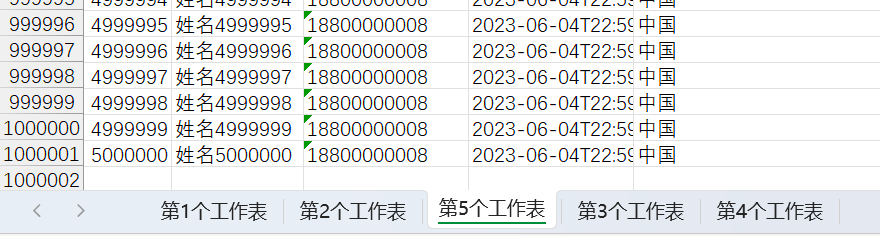


## 百万数据导入

### 概述

使用POI基于事件模式解析案例提供的Excel文件


### 问题说明

**用户模式：**使用用户模式加载并读取Excel时，是通过一次性的将所有数据加载到内存中再去解析每个单元格内容。当Excel数据量较大时，由于不同的运行环境可能会造成内存不足甚至OOM异常。


```java
package mao;

import org.apache.poi.xssf.usermodel.XSSFSheet;
import org.apache.poi.xssf.usermodel.XSSFWorkbook;

import java.io.IOException;

/**
 * Project name(项目名称)：java报表_poi百万数据导入
 * Package(包名): mao
 * Class(类名): Test1
 * Author(作者）: mao
 * Author QQ：1296193245
 * GitHub：https://github.com/maomao124/
 * Date(创建日期)： 2023/6/5
 * Time(创建时间)： 23:54
 * Version(版本): 1.0
 * Description(描述)： 用户模式导入
 */

public class Test1
{
    public static void main(String[] args) throws IOException
    {
        XSSFWorkbook workbook = new XSSFWorkbook("./out.xlsx");
        XSSFSheet sheet = workbook.getSheetAt(0);
    }
}
```


会直接报内存溢出的错误：

```sh
Exception in thread "main" java.lang.OutOfMemoryError: Java heap space
	at java.util.Arrays.copyOf(Arrays.java:3181)
	at java.util.ArrayList.grow(ArrayList.java:267)
	at java.util.ArrayList.ensureExplicitCapacity(ArrayList.java:241)
	at java.util.ArrayList.ensureCapacityInternal(ArrayList.java:233)
	at java.util.ArrayList.add(ArrayList.java:464)
	at org.apache.xmlbeans.impl.store.Xobj.find_all_element_users(Xobj.java:2098)
	at org.openxmlformats.schemas.spreadsheetml.x2006.main.impl.CTSheetDataImpl.getRowArray(Unknown Source)
	at org.apache.poi.xssf.usermodel.XSSFSheet.initRows(XSSFSheet.java:269)
	at org.apache.poi.xssf.usermodel.XSSFSheet.read(XSSFSheet.java:233)
	at org.apache.poi.xssf.usermodel.XSSFSheet.onDocumentRead(XSSFSheet.java:220)
	at org.apache.poi.xssf.usermodel.XSSFWorkbook.parseSheet(XSSFWorkbook.java:452)
	at org.apache.poi.xssf.usermodel.XSSFWorkbook.onDocumentRead(XSSFWorkbook.java:417)
	at org.apache.poi.ooxml.POIXMLDocument.load(POIXMLDocument.java:184)
	at org.apache.poi.xssf.usermodel.XSSFWorkbook.<init>(XSSFWorkbook.java:286)
	at org.apache.poi.xssf.usermodel.XSSFWorkbook.<init>(XSSFWorkbook.java:340)
	at mao.Test1.main(Test1.java:25)
```


### 解决方案分析

可以使用事件模式

**事件模式：**它逐行扫描文档，一边扫描一边解析。由于应用程序只是在读取数据时检查数据，因此不需要将数据存储在内存中，这对于大型文档的解析是个巨大优势。


### 步骤分析

1. 设置POI的事件模式

   * 根据Excel获取文件流
   * 根据文件流创建OPCPackage  用来组合读取到的xml 组合出来的数据占用的空间更小
   * 创建XSSFReader对象

2. Sax解析

   * 自定义Sheet处理器
   * 创建Sax的XmlReader对象
   * 设置Sheet的事件处理器
   * 逐行读取

   

   

### 实现

SheetHandler

```java
package mao.handler;

import mao.entity.User;
import org.apache.poi.xssf.eventusermodel.XSSFSheetXMLHandler;
import org.apache.poi.xssf.usermodel.XSSFComment;

import java.time.LocalDateTime;

/**
 * Project name(项目名称)：java报表_poi百万数据导入
 * Package(包名): mao.handler
 * Class(类名): SheetHandler
 * Author(作者）: mao
 * Author QQ：1296193245
 * GitHub：https://github.com/maomao124/
 * Date(创建日期)： 2023/6/6
 * Time(创建时间)： 0:08
 * Version(版本): 1.0
 * Description(描述)： 无
 */

public class SheetHandler implements XSSFSheetXMLHandler.SheetContentsHandler
{

    private long rowIndex = 1;

    /**
     * 用户对象，线程安全
     */
    private User user = null;

    /**
     * 开始行
     *
     * @param i 行号
     */
    @Override
    public void startRow(int i)
    {
        if (i == 0)
        {
            user = null;
        }
        else
        {
            user = new User();
        }
    }

    /**
     * 结束行
     *
     * @param i 行号
     */
    @Override
    public void endRow(int i)
    {
        if (i != 0)
        {
            //打印user
            //todo：
            System.out.println("第" + rowIndex + "行 " + user);
            rowIndex++;
        }
    }

    /**
     * 单元格
     *
     * @param s           String ,单元格名称,例如 A  B  C
     * @param s1          String ， 单元格的值
     * @param xssfComment xssf评论
     */
    @Override
    public void cell(String s, String s1, XSSFComment xssfComment)
    {
        if (user != null)
        {
            String letter = s.substring(0, 1);
            switch (letter)
            {
                case "A":
                {
                    user.setId(Long.parseLong(s1));
                    break;
                }
                case "B":
                {
                    user.setUserName(s1);
                    break;
                }
                case "C":
                {
                    user.setPhone(s1);
                    break;
                }
                case "D":
                {
                    user.setHireDate(LocalDateTime.parse(s1));
                    break;
                }
                case "E":
                {
                    user.setAddress(s1);
                    break;
                }
            }
        }
    }
}
```


```java
package mao;

import mao.handler.SheetHandler;
import org.apache.poi.openxml4j.exceptions.InvalidFormatException;
import org.apache.poi.openxml4j.exceptions.OpenXML4JException;
import org.apache.poi.openxml4j.opc.OPCPackage;
import org.apache.poi.openxml4j.opc.PackageAccess;
import org.apache.poi.xssf.eventusermodel.XSSFReader;
import org.apache.poi.xssf.eventusermodel.XSSFSheetXMLHandler;
import org.apache.poi.xssf.model.SharedStringsTable;
import org.apache.poi.xssf.model.StylesTable;
import org.xml.sax.InputSource;
import org.xml.sax.SAXException;
import org.xml.sax.XMLReader;
import org.xml.sax.helpers.XMLReaderFactory;

import java.io.IOException;
import java.io.InputStream;

/**
 * Project name(项目名称)：java报表_poi百万数据导入
 * Package(包名): mao
 * Class(类名): Test2
 * Author(作者）: mao
 * Author QQ：1296193245
 * GitHub：https://github.com/maomao124/
 * Date(创建日期)： 2023/6/6
 * Time(创建时间)： 0:06
 * Version(版本): 1.0
 * Description(描述)： 无
 */

public class Test2
{
    public static void main(String[] args) throws OpenXML4JException, IOException, SAXException
    {
        //开始时间
        long start = System.currentTimeMillis();
        //根据Excel获取OPCPackage对象
        OPCPackage opcPackage = OPCPackage.open("./out.xlsx", PackageAccess.READ);
        //创建XSSFReader对象
        XSSFReader xssfReader = new XSSFReader(opcPackage);
        //获取SharedStringsTable对象
        SharedStringsTable sharedStringsTable = xssfReader.getSharedStringsTable();
        //获取StylesTable对象
        StylesTable stylesTable = xssfReader.getStylesTable();
        //创建XMLReader
        XMLReader xmlReader = XMLReaderFactory.createXMLReader();
        xmlReader.setContentHandler(new XSSFSheetXMLHandler(stylesTable, sharedStringsTable, new SheetHandler(), false));
        XSSFReader.SheetIterator sheets = (XSSFReader.SheetIterator) xssfReader.getSheetsData();
        while (sheets.hasNext())
        {
            //读取数据
            InputStream inputStream = sheets.next();
            InputSource sheetSource = new InputSource(inputStream);
            try
            {
                //解析
                xmlReader.parse(sheetSource);
            }
            finally
            {
                inputStream.close();
            }
        }
        //关闭
        opcPackage.close();
        long end = System.currentTimeMillis();
        //打印语句加了悲观锁，会影响性能
        System.out.println("耗时：" + (end - start) + "毫秒");
    }
}
```


### 测试结果


# csv文件

## 概述

CSV文件：Comma-Separated Values，中文叫逗号分隔值或者字符分割值，其文件以纯文本的形式存储表格数据。该文件是一个字符序列，可以由任意数目的记录组成，记录间以某种换行符分割。每条记录由字段组成，字段间的分隔符是其他字符或者字符串。所有的记录都有完全相同的字段序列，相当于一个结构化表的纯文本形式。用文本文件、excel或者类似与文本文件的编辑器都可以打开CSV文件。


## opencsv

我们可以使用opencsv类库来导出csv文件


依赖如下：

```xml
        <!--opencsv 依赖-->
        <dependency>
            <groupId>com.opencsv</groupId>
            <artifactId>opencsv</artifactId>
            <version>5.7.1</version>
        </dependency>
```


## API

写入到csv文件会用到CSVWriter对象，创建此对象常见API如下

```java
 /**
    * Constructs CSVWriter using a comma for the separator.
    *
    * @param writer The writer to an underlying CSV source.
    */
   public CSVWriter(Writer writer) {
      this(writer, DEFAULT_SEPARATOR, DEFAULT_QUOTE_CHARACTER, DEFAULT_ESCAPE_CHARACTER, DEFAULT_LINE_END);
   }

   /**
    * Constructs CSVWriter with supplied separator, quote char, escape char and line ending.
    *
    * @param writer     The writer to an underlying CSV source.
    * @param separator  The delimiter to use for separating entries
    * @param quotechar  The character to use for quoted elements
    * @param escapechar The character to use for escaping quotechars or escapechars
    * @param lineEnd    The line feed terminator to use
    */
   public CSVWriter(Writer writer, char separator, char quotechar, char escapechar, String lineEnd) {
      super(writer, lineEnd);
      this.escapechar = escapechar;
      this.quotechar = quotechar;
      this.separator = separator;
   }
```


* writer：CSV source
* separator：用于分隔条目的分隔符
* quotechar：用于带引号元素的字符
* escapechar：用于转义引号或转义字符的字符
* lineEnd：要使用的换行终止符


使用CSVWriter对象写入数据常用的方法如下：


读取csv文件会用到CSVReader对象，创建此对象常见API如下：

```java
/**
 * Constructs CSVReader using defaults for all parameters.
 *
 * @param reader The reader to an underlying CSV source.
 */
public CSVReader(Reader reader) {
    this(reader, DEFAULT_SKIP_LINES,
            new CSVParser(ICSVParser.DEFAULT_SEPARATOR,
                    ICSVParser.DEFAULT_QUOTE_CHARACTER,
                    ICSVParser.DEFAULT_ESCAPE_CHARACTER,
                    ICSVParser.DEFAULT_STRICT_QUOTES,
                    ICSVParser.DEFAULT_IGNORE_LEADING_WHITESPACE,
                    ICSVParser.DEFAULT_IGNORE_QUOTATIONS,
                    ICSVParser.DEFAULT_NULL_FIELD_INDICATOR,
                    Locale.getDefault()),
            DEFAULT_KEEP_CR,
            DEFAULT_VERIFY_READER,
            DEFAULT_MULTILINE_LIMIT,
            Locale.getDefault(),
            new LineValidatorAggregator(),
            new RowValidatorAggregator(),
            null);
}

/**
 * Constructs CSVReader with supplied CSVParser.
 * <p>This constructor sets all necessary parameters for CSVReader, and
 * intentionally has package access so only the builder can use it.</p>
 *
 * @param reader                  The reader to an underlying CSV source
 * @param line                    The number of lines to skip before reading
 * @param icsvParser              The parser to use to parse input
 * @param keepCR                  True to keep carriage returns in data read, false otherwise
 * @param verifyReader            True to verify reader before each read, false otherwise
 * @param multilineLimit          Allow the user to define the limit to the number of lines in a multiline record. Less than one means no limit.
 * @param errorLocale             Set the locale for error messages. If null, the default locale is used.
 * @param lineValidatorAggregator contains all the custom defined line validators.
 * @param rowValidatorAggregator  contains all the custom defined row validators.
 * @param rowProcessor            Custom row processor to run on all columns on a csv record.
 */
CSVReader(Reader reader, int line, ICSVParser icsvParser, boolean keepCR, boolean verifyReader, int multilineLimit,
          Locale errorLocale, LineValidatorAggregator lineValidatorAggregator, RowValidatorAggregator rowValidatorAggregator,
          RowProcessor rowProcessor) {
    this.br =
            (reader instanceof BufferedReader ?
                    (BufferedReader) reader :
                    new BufferedReader(reader));
    this.lineReader = new LineReader(br, keepCR);
    this.skipLines = line;
    this.parser = icsvParser;
    this.keepCR = keepCR;
    this.verifyReader = verifyReader;
    this.multilineLimit = multilineLimit;
    this.errorLocale = ObjectUtils.defaultIfNull(errorLocale, Locale.getDefault());
    this.lineValidatorAggregator = lineValidatorAggregator;
    this.rowValidatorAggregator = rowValidatorAggregator;
    this.rowProcessor = rowProcessor;
}
```


read方法：


## 导出CSV文件

```java
package mao;

import com.opencsv.CSVReader;
import com.opencsv.CSVWriter;

import java.io.FileOutputStream;
import java.io.OutputStreamWriter;
import java.util.Random;

/**
 * Project name(项目名称)：java报表_opencsv导出CSV文件
 * Package(包名): mao
 * Class(类名): Test1
 * Author(作者）: mao
 * Author QQ：1296193245
 * GitHub：https://github.com/maomao124/
 * Date(创建日期)： 2023/6/6
 * Time(创建时间)： 14:14
 * Version(版本): 1.0
 * Description(描述)： 无
 */

public class Test1
{
    /**
     * 得到int随机
     *
     * @param min 最小值
     * @param max 最大值
     * @return int
     */
    public static int getIntRandom(int min, int max)
    {
        if (min > max)
        {
            min = max;
        }
        return min + (int) (Math.random() * (max - min + 1));
    }

    public static void main(String[] args)
    {
        try (FileOutputStream fileOutputStream = new FileOutputStream("./out.csv");
             OutputStreamWriter outputStreamWriter = new OutputStreamWriter(fileOutputStream))
        {
            //创建
            CSVWriter csvWriter = new CSVWriter(outputStreamWriter);
            csvWriter.writeNext(new String[]{"编号", "姓名", "年龄", "地址"});

            //写入
            for (int i = 1; i <= 500; i++)
            {
                csvWriter.writeNext(new String[]{String.valueOf(10000 + i), "姓名" + i,
                        String.valueOf(getIntRandom(15, 30)), "中国"});
            }
            csvWriter.flush();
            csvWriter.close();
        }
        catch (Exception e)
        {
            e.printStackTrace();
        }
    }
}
```


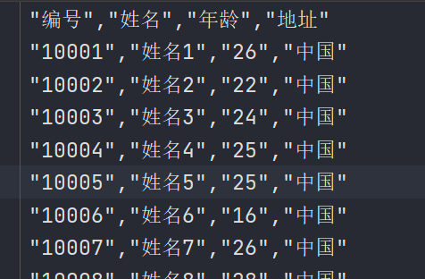

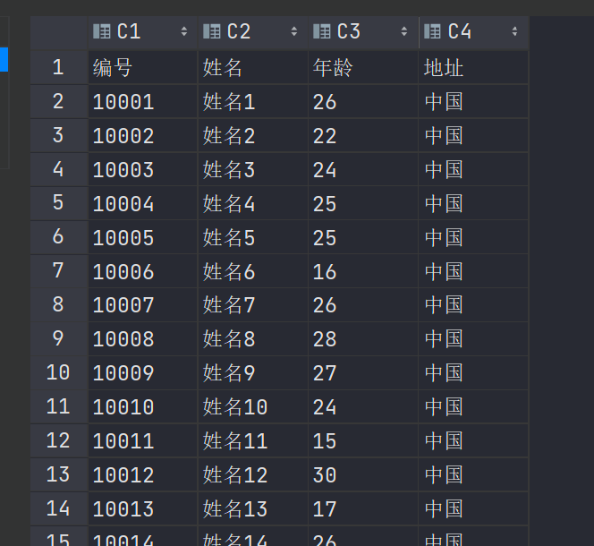


## 读取CSV文件

```java
package mao;

import com.opencsv.CSVReader;
import com.opencsv.CSVWriter;

import java.io.BufferedReader;
import java.io.FileInputStream;
import java.io.InputStreamReader;
import java.io.OutputStreamWriter;
import java.nio.charset.StandardCharsets;

/**
 * Project name(项目名称)：java报表_opencsv导入CSV文件
 * Package(包名): mao
 * Class(类名): Test1
 * Author(作者）: mao
 * Author QQ：1296193245
 * GitHub：https://github.com/maomao124/
 * Date(创建日期)： 2023/6/6
 * Time(创建时间)： 14:44
 * Version(版本): 1.0
 * Description(描述)： 无
 */

public class Test1
{
    public static void main(String[] args)
    {
        try (FileInputStream fileInputStream = new FileInputStream("./out.csv");
             InputStreamReader inputStreamReader = new InputStreamReader(fileInputStream, StandardCharsets.UTF_8))
        {
            CSVReader csvReader = new CSVReader(inputStreamReader);
            //标题
            final String[] title = csvReader.readNext();
            for (String s : title)
            {
                System.out.print(s + "\t\t");
            }
            System.out.println();

            //读取内容
            while (true)
            {
                String[] readNext = csvReader.readNext();
                if (readNext == null)
                {
                    break;
                }
                //读取行数据
                for (String s : readNext)
                {
                    System.out.print(s + "\t\t");
                }
                System.out.println();
            }
            csvReader.close();
        }
        catch (Exception e)
        {
            e.printStackTrace();
        }
    }
}
```


# word

## 概述

Microsoft Office Word是微软公司的一个文字处理器应用程序。

它最初是由Richard Brodie为了运行DOS的IBM计算机而在1983年编写的。随后的版本可运行于Apple Macintosh (1984年)、SCO UNIX和Microsoft Windows (1989年)，并成为了Microsoft Office的一部分。

Word给用户提供了用于创建专业而优雅的文档工具，帮助用户节省时间，并得到优雅美观的结果。

一直以来，Microsoft Office Word 都是最流行的文字处理程序。

作为 Office 套件的核心程序， Word 提供了许多易于使用的文档创建工具，同时也提供了丰富的功能集供创建复杂的文档使用。哪怕只使用 Word 应用一点文本格式化操作或图片处理，简单的文档变得比只使用纯文本更具吸引力。


## POI操作Word的API介绍

poi操作word正文：

 XWPFDocument代表一个docx文档，其可以用来读docx文档，也可以用来写docx文档 

构造方法如下：

```java
public XWPFDocument(OPCPackage pkg) throws IOException {
        super(pkg);

        //build a tree of POIXMLDocumentParts, this document being the root
        load(XWPFFactory.getInstance());
    }

    public XWPFDocument(InputStream is) throws IOException {
        super(PackageHelper.open(is));

        //build a tree of POIXMLDocumentParts, this workbook being the root
        load(XWPFFactory.getInstance());
    }

    public XWPFDocument() {
        super(newPackage());
        onDocumentCreate();
    }
```


一个文档包含多个段落，一个段落包含多个Runs文本，一个Runs包含多个Run，Run是文档的最小单元

获取所有段落：

```java
List<XWPFParagraph> paragraphs = word.getParagraphs();
```


获取一个段落中的所有片段Runs：

```java
List<XWPFRun> xwpfRuns = xwpfParagraph.getRuns();
```


获取一个Runs中的一个Run：

```java
XWPFRun run = xwpfRuns.get(index);
```


poi操作word中的表格：

一个文档包含多个表格，一个表格包含多行，一行包含多列单元格

获取所有表格：

```java
List<XWPFTable> xwpfTables = doc.getTables();
```


获取一个表格中的所有行：

```java
List<XWPFTableRow> xwpfTableRows = xwpfTable.getRows();
```


获取一行中的所有列：

```java
List<XWPFTableCell> xwpfTableCells = xwpfTableRow.getTableCells();
```


获取一格里的内容：

```java
List<XWPFParagraph> paragraphs = xwpfTableCell.getParagraphs();
```


## POI导出word

导出文字：

```java
package mao;

import org.apache.poi.xwpf.usermodel.XWPFDocument;
import org.apache.poi.xwpf.usermodel.XWPFParagraph;
import org.apache.poi.xwpf.usermodel.XWPFRun;

import java.io.FileOutputStream;

/**
 * Project name(项目名称)：java报表_POI导出word
 * Package(包名): mao
 * Class(类名): Test1
 * Author(作者）: mao
 * Author QQ：1296193245
 * GitHub：https://github.com/maomao124/
 * Date(创建日期)： 2023/6/6
 * Time(创建时间)： 20:53
 * Version(版本): 1.0
 * Description(描述)： 无
 */

public class Test1
{
    public static void main(String[] args)
    {
        XWPFDocument xwpfDocument = new XWPFDocument();
        //创建一个段落
        XWPFParagraph paragraph = xwpfDocument.createParagraph();
        //创建一个片段
        XWPFRun run = paragraph.createRun();
        //设置颜色
        run.setColor("00ff00");
        //大小
        run.setFontSize(18);
        //加粗
        run.setBold(true);
        //文本
        run.setText("Microsoft Office Word是微软公司的一个文字处理器应用程序。");
        //创建一个片段
        run = paragraph.createRun();
        //设置颜色
        run.setColor("0000ff");
        //大小
        run.setFontSize(12);
        //加粗
        run.setBold(false);
        //文本
        run.setText("它最初是由Richard Brodie为了运行DOS的IBM计算机而在1983年编写的。" +
                "随后的版本可运行于Apple Macintosh (1984年)、" +
                "SCO UNIX和Microsoft Windows (1989年)，并成为了Microsoft Office的一部分。" +
                "Word给用户提供了用于创建专业而优雅的文档工具，帮助用户节省时间，并得到优雅美观的结果。");

        //创建一个段落
        paragraph = xwpfDocument.createParagraph();
        //创建一个片段
        run = paragraph.createRun();
        //设置颜色
        run.setColor("ff0000");
        //大小
        run.setFontSize(15);
        //加粗
        run.setBold(true);
        //字体
        run.setFontFamily("宋体");
        //文本
        run.setText("一直以来，Microsoft Office Word 都是最流行的文字处理程序。");
        //创建一个片段
        run = paragraph.createRun();
        //设置颜色
        run.setColor("00ffcc");
        //大小
        run.setFontSize(15);
        //加粗
        run.setBold(true);
        //字体
        run.setFontFamily("黑体");
        //文本
        run.setText("作为 Office 套件的核心程序， Word 提供了许多易于使用的文档创建工具，" +
                "同时也提供了丰富的功能集供创建复杂的文档使用。哪怕只使用 Word 应用一点文本格式化操作或图片处理，" +
                "简单的文档变得比只使用纯文本更具吸引力。\n" +
                "\n");

        

        try (FileOutputStream fileOutputStream = new FileOutputStream("./out.docx"))
        {
            xwpfDocument.write(fileOutputStream);
            xwpfDocument.close();
        }
        catch (Exception e)
        {
            e.printStackTrace();
        }
    }
}

```


导出表格：

```java
package mao;

import org.apache.poi.xwpf.usermodel.XWPFDocument;
import org.apache.poi.xwpf.usermodel.XWPFTable;
import org.apache.poi.xwpf.usermodel.XWPFTableCell;
import org.apache.poi.xwpf.usermodel.XWPFTableRow;

import java.io.FileOutputStream;

/**
 * Project name(项目名称)：java报表_POI导出word
 * Package(包名): mao
 * Class(类名): Test2
 * Author(作者）: mao
 * Author QQ：1296193245
 * GitHub：https://github.com/maomao124/
 * Date(创建日期)： 2023/6/6
 * Time(创建时间)： 21:14
 * Version(版本): 1.0
 * Description(描述)： 无
 */

public class Test2
{

    /**
     * 得到int随机
     *
     * @param min 最小值
     * @param max 最大值
     * @return int
     */
    public static int getIntRandom(int min, int max)
    {
        if (min > max)
        {
            min = max;
        }
        return min + (int) (Math.random() * (max - min + 1));
    }

    public static void main(String[] args)
    {
        XWPFDocument xwpfDocument = new XWPFDocument();

        createTable(xwpfDocument);

        xwpfDocument.createParagraph().createRun().setText("");

        createTable(xwpfDocument);

        try (FileOutputStream fileOutputStream = new FileOutputStream("./out2.docx"))
        {
            xwpfDocument.write(fileOutputStream);
            xwpfDocument.close();
        }
        catch (Exception e)
        {
            e.printStackTrace();
        }
    }

    /**
     * 创建表格
     *
     * @param xwpfDocument xwpf文档
     */
    private static void createTable(XWPFDocument xwpfDocument)
    {
        //创建表格
        XWPFTable table = xwpfDocument.createTable(11, 4);
        table.setWidth(5000);
        //创建行
        XWPFTableRow row = table.getRow(0);
        //创建单元格
        XWPFTableCell cell = row.getCell(0);
        //文本
        cell.setText("编号");
        //创建单元格
        cell = row.getCell(1);
        //文本
        cell.setText("姓名");
        //创建单元格
        cell = row.getCell(2);
        //文本
        cell.setText("年龄");
        //创建单元格
        cell = row.getCell(3);
        //文本
        cell.setText("地址");

        for (int i = 1; i < 11; i++)
        {
            //创建行
            row = table.getRow(i);
            //创建单元格
            cell = row.getCell(0);
            //宽度
            //cell.setWidth("12");
            //文本
            cell.setText(String.valueOf(10000 + i));
            //创建单元格
            cell = row.getCell(1);
            //文本
            cell.setText("姓名" + i);
            //创建单元格
            cell = row.getCell(2);
            //文本
            cell.setText(String.valueOf(getIntRandom(15, 30)));
            //创建单元格
            cell = row.getCell(3);
            //文本
            cell.setText("中国");
        }
    }
}
```


## POI导入word

使用之前生成的文件导入


读取文本：

```java
package mao;

import org.apache.poi.xwpf.usermodel.XWPFDocument;
import org.apache.poi.xwpf.usermodel.XWPFParagraph;
import org.apache.poi.xwpf.usermodel.XWPFRun;

import java.io.FileInputStream;
import java.util.List;

/**
 * Project name(项目名称)：java报表_POI导入word
 * Package(包名): mao
 * Class(类名): Test1
 * Author(作者）: mao
 * Author QQ：1296193245
 * GitHub：https://github.com/maomao124/
 * Date(创建日期)： 2023/6/6
 * Time(创建时间)： 21:43
 * Version(版本): 1.0
 * Description(描述)： 无
 */

public class Test1
{
    public static void main(String[] args)
    {
        try (FileInputStream fileInputStream = new FileInputStream("./out.docx"))
        {
            XWPFDocument xwpfDocument = new XWPFDocument(fileInputStream);

            //读取所有段落
            List<XWPFParagraph> paragraphs = xwpfDocument.getParagraphs();
            for (XWPFParagraph paragraph : paragraphs)
            {
                System.out.println("---------段落开始-----------");

                //得到所有端
                List<XWPFRun> runs = paragraph.getRuns();
                System.out.println("句子数量：" + runs.size());
                for (XWPFRun run : runs)
                {
                    System.out.print(run);
                }

                System.out.println();
                System.out.println("---------段落结束-----------");
            }
        }
        catch (Exception e)
        {
            e.printStackTrace();
        }

    }
}
```


结果：

```sh
---------段落开始-----------
句子数量：2
Microsoft Office Word是微软公司的一个文字处理器应用程序。它最初是由Richard Brodie为了运行DOS的IBM计算机而在1983年编写的。随后的版本可运行于Apple Macintosh (1984年)、SCO UNIX和Microsoft Windows (1989年)，并成为了Microsoft Office的一部分。Word给用户提供了用于创建专业而优雅的文档工具，帮助用户节省时间，并得到优雅美观的结果。
---------段落结束-----------
---------段落开始-----------
句子数量：2
一直以来，Microsoft Office Word 都是最流行的文字处理程序。作为 Office 套件的核心程序， Word 提供了许多易于使用的文档创建工具，同时也提供了丰富的功能集供创建复杂的文档使用。哪怕只使用 Word 应用一点文本格式化操作或图片处理，简单的文档变得比只使用纯文本更具吸引力。


---------段落结束-----------
```


读取表格：

```java
package mao;

import org.apache.poi.xwpf.usermodel.*;

import java.io.FileInputStream;
import java.util.List;

/**
 * Project name(项目名称)：java报表_POI导入word
 * Package(包名): mao
 * Class(类名): Test2
 * Author(作者）: mao
 * Author QQ：1296193245
 * GitHub：https://github.com/maomao124/
 * Date(创建日期)： 2023/6/6
 * Time(创建时间)： 22:00
 * Version(版本): 1.0
 * Description(描述)： 无
 */

public class Test2
{
    public static void main(String[] args)
    {
        try (FileInputStream fileInputStream = new FileInputStream("./out2.docx"))
        {
            XWPFDocument xwpfDocument = new XWPFDocument(fileInputStream);

            //得到所有表格
            List<XWPFTable> tables = xwpfDocument.getTables();
            System.out.println("表格数量：" + tables.size());

            int tableIndex = 1;
            //遍历表格
            for (XWPFTable table : tables)
            {
                System.out.println("第" + tableIndex + "张表格");
                tableIndex++;
                //得到行数据
                List<XWPFTableRow> rows = table.getRows();
                //遍历行
                for (XWPFTableRow row : rows)
                {
                    //得到单元格
                    List<XWPFTableCell> cells = row.getTableCells();
                    //遍历单元格
                    for (XWPFTableCell cell : cells)
                    {
                        System.out.print(cell.getText() + "\t\t");
                    }
                    System.out.println();
                }
                System.out.println("\n\n");
            }
        }
        catch (Exception e)
        {
            e.printStackTrace();
        }
    }
}
```


```sh
表格数量：2
第1张表格
编号		姓名		年龄		地址		
10001		姓名1		18		中国		
10002		姓名2		30		中国		
10003		姓名3		23		中国		
10004		姓名4		29		中国		
10005		姓名5		22		中国		
10006		姓名6		27		中国		
10007		姓名7		23		中国		
10008		姓名8		28		中国		
10009		姓名9		15		中国		
10010		姓名10		29		中国		


第2张表格
编号		姓名		年龄		地址		
10001		姓名1		20		中国		
10002		姓名2		20		中国		
10003		姓名3		15		中国		
10004		姓名4		22		中国		
10005		姓名5		26		中国		
10006		姓名6		27		中国		
10007		姓名7		24		中国		
10008		姓名8		28		中国		
10009		姓名9		27		中国		
10010		姓名10		28		中国		

```


# easyPOI

## 概述

以上在导出导出excel、导出csv、word时代码有点过于繁琐，好消息是近两年在开发市场上流行一种简化POI开发的类库：easyPOI。从名称上就能发现就是为了简化开发。

Excel的快速导入导出、Excel模板导出、Word模板导出，可以仅仅5行代码就可以完成Excel的导入导出，修改导出格式简单粗暴，快速有效


Easypoi的目标不是替代poi,而是让一个不懂导入导出的快速使用poi完成Excel和word的各种操作,而不是看很多api才可以完成这样工作


## 依赖

```xml
<dependency>
    <groupId>cn.afterturn</groupId>
    <artifactId>easypoi-base</artifactId>
    <version>4.4.0</version>
</dependency>
<dependency>
    <groupId>cn.afterturn</groupId>
    <artifactId>easypoi-web</artifactId>
    <version>4.4.0</version>
</dependency>
<dependency>
    <groupId>cn.afterturn</groupId>
    <artifactId>easypoi-annotation</artifactId>
    <version>4.4.0</version>
</dependency>
```


spring boot 依赖：

```xml
<dependency>
    <groupId>cn.afterturn</groupId>
    <artifactId>easypoi-spring-boot-starter</artifactId>
    <version>4.4.0</version>
</dependency>
```


## 注解方式导出

主要用到的注解是@Excel注解，注解的属性说明如下：

|      属性      |   类型   |       类型       |                             说明                             |
| :------------: | :------: | :--------------: | :----------------------------------------------------------: |
|      name      |  String  |       null       |                             列名                             |
|   needMerge    | boolean  |      fasle       |                        纵向合并单元格                        |
|    orderNum    |  String  |       "0"        |                     列的排序,支持name_id                     |
|    replace     | String[] |        {}        |            值得替换  导出是{a_id,b_id} 导入反过来            |
|    savePath    |  String  |     "upload"     |                       导入文件保存路径                       |
|      type      |   int    |        1         |   导出类型 1 是文本 2 是图片,3 是函数,10 是数字 默认是文本   |
|     width      |  double  |        10        |                             列宽                             |
|     height     |  double  |        10        | 列高,后期打算统一使用@ExcelTarget的height,这个会被废弃,注意  |
|  isStatistics  | boolean  |      fasle       | 自动统计数据,在追加一行统计,把所有数据都和输出这个处理会吞没异常,请注意这一点 |
|  isHyperlink   | boolean  |      false       |              超链接,如果是需要实现接口返回对象               |
| isImportField  | boolean  |       true       | 校验字段,看看这个字段是不是导入的Excel中有,如果没有说明是错误的Excel,读取失败,支持name_id |
|  exportFormat  |  String  |        ""        |    导出的时间格式,以这个是否为空来判断是否需要格式化日期     |
|  importFormat  |  String  |        ""        |    导入的时间格式,以这个是否为空来判断是否需要格式化日期     |
|     format     |  String  |        ""        |    时间格式,相当于同时设置了exportFormat 和 importFormat     |
| databaseFormat |  String  | "yyyyMMddHHmmss" | 导出时间设置,如果字段是Date类型则不需要设置 数据库如果是string类型,这个需要设置这个数据库格式,用以转换时间格式输出 |
|   numFormat    |  String  |        ""        |      数字格式化,参数是Pattern,使用的对象是DecimalFormat      |
|   imageType    |   int    |        1         | 导出类型 1 从file读取 2 是从数据库中读取 默认是文件 同样导入也是一样的 |
|     suffix     |  String  |        ""        |                   文字后缀,如% 90 变成90%                    |
|     isWrap     | boolean  |       true       |                      是否换行 即支持\n                       |
|   mergeRely    |  int[]   |        {}        | 合并单元格依赖关系,比如第二列合并是基于第一列 则{1}就可以了  |
| mergeVertical  | boolean  |      fasle       |                   纵向合并内容相同的单元格                   |


创建spring boot程序，依赖如下：

```xml
<dependencies>
        <dependency>
            <groupId>org.springframework.boot</groupId>
            <artifactId>spring-boot-starter</artifactId>
        </dependency>

        <dependency>
            <groupId>org.projectlombok</groupId>
            <artifactId>lombok</artifactId>
            <optional>true</optional>
        </dependency>

        <dependency>
            <groupId>org.springframework.boot</groupId>
            <artifactId>spring-boot-starter-test</artifactId>
            <scope>test</scope>
        </dependency>

        <!--easypoi spring boot 依赖 需要web环境-->
        <!--<dependency>
            <groupId>cn.afterturn</groupId>
            <artifactId>easypoi-spring-boot-starter</artifactId>
            <version>4.4.0</version>
        </dependency>-->


        <!--easypoi 依赖-->
        <dependency>
            <groupId>cn.afterturn</groupId>
            <artifactId>easypoi-base</artifactId>
            <version>4.4.0</version>
        </dependency>
        <dependency>
            <groupId>cn.afterturn</groupId>
            <artifactId>easypoi-web</artifactId>
            <version>4.4.0</version>
        </dependency>
        <dependency>
            <groupId>cn.afterturn</groupId>
            <artifactId>easypoi-annotation</artifactId>
            <version>4.4.0</version>
        </dependency>

        <!--spring-boot mybatis-plus依赖-->
        <dependency>
            <groupId>com.baomidou</groupId>
            <artifactId>mybatis-plus-boot-starter</artifactId>
            <version>3.5.1</version>
        </dependency>

        <!--spring-boot druid连接池依赖-->
        <dependency>
            <groupId>com.alibaba</groupId>
            <artifactId>druid-spring-boot-starter</artifactId>
            <version>1.2.8</version>
        </dependency>

        <!--mysql依赖 spring-boot-->
        <dependency>
            <groupId>mysql</groupId>
            <artifactId>mysql-connector-java</artifactId>
            <scope>runtime</scope>
        </dependency>

    </dependencies>
```


用户实体类：

```java
package mao.java_report_easypoi_import_and_export_excel.entity;

import cn.afterturn.easypoi.excel.annotation.Excel;
import com.baomidou.mybatisplus.annotation.TableField;
import com.baomidou.mybatisplus.annotation.TableId;
import lombok.Data;

import java.time.LocalDateTime;

/**
 * Project name(项目名称)：java_report_poi_million_data_export
 * Package(包名): mao.java_report_poi_million_data_export.entity
 * Class(类名): User
 * Author(作者）: mao
 * Author QQ：1296193245
 * GitHub：https://github.com/maomao124/
 * Date(创建日期)： 2023/6/5
 * Time(创建时间)： 13:42
 * Version(版本): 1.0
 * Description(描述)： 无
 */


@Data
public class User
{
    @TableId
    @Excel(name = "用户编号", orderNum = "0", width = 9, type = 10)
    private Long id;

    @TableField(value = "user_name")
    @Excel(name = "名字", orderNum = "1", width = 20, type = 1)
    private String userName;

    @Excel(name = "手机号", orderNum = "2", width = 15, type = 10)
    private String phone;

    @Excel(name = "入职日期", format = "yyyy-MM-dd", orderNum = "3", width = 15)
    private LocalDateTime hireDate;

    @Excel(name = "家庭住址", orderNum = "4", width = 30, type = 1)
    private String address;
}
```


```java
package mao.java_report_easypoi_import_and_export_excel.service;

import com.baomidou.mybatisplus.extension.service.IService;
import mao.java_report_easypoi_import_and_export_excel.entity.User;

/**
 * Project name(项目名称)：java_report_easypoi_import_and_export_excel
 * Package(包名): mao.java_report_easypoi_import_and_export_excel.service
 * Interface(接口名): UserService
 * Author(作者）: mao
 * Author QQ：1296193245
 * GitHub：https://github.com/maomao124/
 * Date(创建日期)： 2023/6/6
 * Time(创建时间)： 22:30
 * Version(版本): 1.0
 * Description(描述)： 无
 */

public interface UserService extends IService<User>
{
    /**
     * 下载excel
     */
    void download();
}
```


```java
package mao.java_report_easypoi_import_and_export_excel.service.impl;

import cn.afterturn.easypoi.excel.ExcelExportUtil;
import cn.afterturn.easypoi.excel.entity.ExportParams;
import cn.afterturn.easypoi.excel.entity.enmus.ExcelType;
import com.baomidou.mybatisplus.core.metadata.IPage;
import com.baomidou.mybatisplus.extension.plugins.pagination.Page;
import com.baomidou.mybatisplus.extension.service.impl.ServiceImpl;
import lombok.extern.slf4j.Slf4j;
import mao.java_report_easypoi_import_and_export_excel.entity.User;
import mao.java_report_easypoi_import_and_export_excel.mapper.UserMapper;
import mao.java_report_easypoi_import_and_export_excel.service.UserService;
import org.apache.poi.ss.usermodel.Workbook;
import org.springframework.stereotype.Service;

import java.io.FileOutputStream;
import java.util.List;

/**
 * Project name(项目名称)：java_report_easypoi_import_and_export_excel
 * Package(包名): mao.java_report_easypoi_import_and_export_excel.service.impl
 * Class(类名): UserServiceImpl
 * Author(作者）: mao
 * Author QQ：1296193245
 * GitHub：https://github.com/maomao124/
 * Date(创建日期)： 2023/6/6
 * Time(创建时间)： 22:30
 * Version(版本): 1.0
 * Description(描述)： 无
 */

@Slf4j
@Service
public class UserServiceImpl extends ServiceImpl<UserMapper, User> implements UserService
{

    @Override
    public void download()
    {
        log.info("开始导出");
        //只导出前5万条
        IPage<User> page = new Page<>(0, 50000);
        List<User> userList = this.page(page).getRecords();
        //指定导出的格式是高版本的格式
        ExportParams exportParams = new ExportParams("员工信息", "数据", ExcelType.XSSF);
        //直接使用EasyPOI提供的方法
        Workbook workbook = ExcelExportUtil.exportExcel(exportParams, User.class, userList);
        try (FileOutputStream fileOutputStream = new FileOutputStream("./out.xlsx"))
        {
            workbook.write(fileOutputStream);
            workbook.close();
            log.info("导出完成");
        }
        catch (Exception e)
        {
            e.printStackTrace();
        }
    }
}
```


启动类：

```java
package mao.java_report_easypoi_import_and_export_excel;

import mao.java_report_easypoi_import_and_export_excel.service.UserService;
import org.springframework.boot.SpringApplication;
import org.springframework.boot.autoconfigure.SpringBootApplication;
import org.springframework.context.ConfigurableApplicationContext;

@SpringBootApplication
public class JavaReportEasypoiImportAndExportExcelApplication
{

    public static void main(String[] args)
    {
        ConfigurableApplicationContext context = SpringApplication.run(JavaReportEasypoiImportAndExportExcelApplication.class, args);
        UserService userService = context.getBean(UserService.class);
        userService.download();
    }

}
```


运行：

```sh
  .   ____          _            __ _ _
 /\\ / ___'_ __ _ _(_)_ __  __ _ \ \ \ \
( ( )\___ | '_ | '_| | '_ \/ _` | \ \ \ \
 \\/  ___)| |_)| | | | | || (_| |  ) ) ) )
  '  |____| .__|_| |_|_| |_\__, | / / / /
 =========|_|==============|___/=/_/_/_/
 :: Spring Boot ::                (v2.7.1)

          _____                    _____                   _______
         /\    \                  /\    \                 /::\    \
        /::\____\                /::\    \               /::::\    \
       /::::|   |               /::::\    \             /::::::\    \
      /:::::|   |              /::::::\    \           /::::::::\    \
     /::::::|   |             /:::/\:::\    \         /:::/~~\:::\    \
    /:::/|::|   |            /:::/__\:::\    \       /:::/    \:::\    \
   /:::/ |::|   |           /::::\   \:::\    \     /:::/    / \:::\    \
  /:::/  |::|___|______    /::::::\   \:::\    \   /:::/____/   \:::\____\
 /:::/   |::::::::\    \  /:::/\:::\   \:::\    \ |:::|    |     |:::|    |
/:::/    |:::::::::\____\/:::/  \:::\   \:::\____\|:::|____|     |:::|    |
\::/    / ~~~~~/:::/    /\::/    \:::\  /:::/    / \:::\    \   /:::/    /
 \/____/      /:::/    /  \/____/ \:::\/:::/    /   \:::\    \ /:::/    /
             /:::/    /            \::::::/    /     \:::\    /:::/    /
            /:::/    /              \::::/    /       \:::\__/:::/    /
           /:::/    /               /:::/    /         \::::::::/    /
          /:::/    /               /:::/    /           \::::::/    /
         /:::/    /               /:::/    /             \::::/    /
        /:::/    /               /:::/    /               \::/____/
        \::/    /                \::/    /                 ~~
         \/____/                  \/____/
 :: Github (https://github.com/maomao124) ::

2023-06-06 22:46:27.380  INFO 8368 --- [           main] rtEasypoiImportAndExportExcelApplication : Starting JavaReportEasypoiImportAndExportExcelApplication using Java 1.8.0_332 on mao with PID 8368 (D:\程序\大四下期\java_report_easypoi_import_and_export_excel\target\classes started by mao in D:\程序\大四下期\java_report_easypoi_import_and_export_excel)
2023-06-06 22:46:27.381 DEBUG 8368 --- [           main] rtEasypoiImportAndExportExcelApplication : Running with Spring Boot v2.7.1, Spring v5.3.21
2023-06-06 22:46:27.381  INFO 8368 --- [           main] rtEasypoiImportAndExportExcelApplication : No active profile set, falling back to 1 default profile: "default"
2023-06-06 22:46:27.714  INFO 8368 --- [           main] c.a.d.s.b.a.DruidDataSourceAutoConfigure : Init DruidDataSource
2023-06-06 22:46:27.758  INFO 8368 --- [           main] com.alibaba.druid.pool.DruidDataSource   : {dataSource-1} inited
 _ _   |_  _ _|_. ___ _ |    _ 
| | |\/|_)(_| | |_\  |_)||_|_\ 
     /               |         
                        3.5.1 
2023-06-06 22:46:28.241  INFO 8368 --- [           main] rtEasypoiImportAndExportExcelApplication : Started JavaReportEasypoiImportAndExportExcelApplication in 1.035 seconds (JVM running for 1.474)
2023-06-06 22:46:28.248  INFO 8368 --- [           main] m.j.service.impl.UserServiceImpl         : 开始导出
2023-06-06 22:46:28.441 DEBUG 8368 --- [           main] m.j.m.UserMapper.selectPage_mpCount      : ==>  Preparing: SELECT COUNT(*) AS total FROM user
2023-06-06 22:46:28.450 DEBUG 8368 --- [           main] m.j.m.UserMapper.selectPage_mpCount      : ==> Parameters: 
2023-06-06 22:46:30.405 DEBUG 8368 --- [           main] m.j.m.UserMapper.selectPage_mpCount      : <==      Total: 1
2023-06-06 22:46:30.408 DEBUG 8368 --- [           main] m.j.mapper.UserMapper.selectPage         : ==>  Preparing: SELECT id,user_name,phone,hire_date,address FROM user LIMIT ?
2023-06-06 22:46:30.408 DEBUG 8368 --- [           main] m.j.mapper.UserMapper.selectPage         : ==> Parameters: 50000(Long)
2023-06-06 22:46:30.624 DEBUG 8368 --- [           main] m.j.mapper.UserMapper.selectPage         : <==      Total: 50000
2023-06-06 22:46:33.272  INFO 8368 --- [           main] m.j.service.impl.UserServiceImpl         : 导出完成
2023-06-06 22:46:33.274  INFO 8368 --- [ionShutdownHook] com.alibaba.druid.pool.DruidDataSource   : {dataSource-1} closing ...
2023-06-06 22:46:33.276  INFO 8368 --- [ionShutdownHook] com.alibaba.druid.pool.DruidDataSource   : {dataSource-1} closed
```


## 注解方式导入

Excel导入时需要的参数类ImportParams常用设置说明

1. 读取指定的sheet 比如要读取上传得第二个sheet 那么需要把startSheetIndex = 1 就可以了

2. 读取几个sheet  比如读取前2个sheet,那么 sheetNum=2 就可以了
3. 读取第二个到第五个sheet 设置 startSheetIndex = 1 然后sheetNum = 4
4. 读取全部的sheet sheetNum  设置大点就可以了
5. 保存Excel 设置 needVerfiy = true,默认保存的路径为upload/excelUpload/Test/yyyyMMddHHmss 保存名称上传时间五位随机数 如果自定义路径 修改下saveUrl 就可以了,同时saveUrl也是图片上传时候的保存的路径
6. 判断一个Excel是不是合法的Excel  importFields 设置下值,就是表示表头必须至少包含的字段,如果缺一个就是不合法的excel,不导入
7. 图片的导入

有图片的导出就有图片的导入,导入的配置和导出是一样的,但是需要设置保存路径 1.设置保存路径saveUrl 默认为"upload/excelUpload" 可以手动修改 ImportParams 修改下就可以了


```java
package mao.java_report_easypoi_import_and_export_excel.service;

import com.baomidou.mybatisplus.extension.service.IService;
import mao.java_report_easypoi_import_and_export_excel.entity.User;

/**
 * Project name(项目名称)：java_report_easypoi_import_and_export_excel
 * Package(包名): mao.java_report_easypoi_import_and_export_excel.service
 * Interface(接口名): UserService
 * Author(作者）: mao
 * Author QQ：1296193245
 * GitHub：https://github.com/maomao124/
 * Date(创建日期)： 2023/6/6
 * Time(创建时间)： 22:30
 * Version(版本): 1.0
 * Description(描述)： 无
 */

public interface UserService extends IService<User>
{
    /**
     * 下载excel
     */
    void download();

    /**
     * 导入excel
     */
    void importExcel();
}
```


```java
package mao.java_report_easypoi_import_and_export_excel.service.impl;

import cn.afterturn.easypoi.excel.ExcelExportUtil;
import cn.afterturn.easypoi.excel.ExcelImportUtil;
import cn.afterturn.easypoi.excel.entity.ExportParams;
import cn.afterturn.easypoi.excel.entity.ImportParams;
import cn.afterturn.easypoi.excel.entity.enmus.ExcelType;
import com.baomidou.mybatisplus.core.metadata.IPage;
import com.baomidou.mybatisplus.extension.plugins.pagination.Page;
import com.baomidou.mybatisplus.extension.service.impl.ServiceImpl;
import lombok.extern.slf4j.Slf4j;
import mao.java_report_easypoi_import_and_export_excel.entity.User;
import mao.java_report_easypoi_import_and_export_excel.mapper.UserMapper;
import mao.java_report_easypoi_import_and_export_excel.service.UserService;
import org.apache.poi.ss.usermodel.Workbook;
import org.springframework.stereotype.Service;

import java.io.FileInputStream;
import java.io.FileOutputStream;
import java.util.List;
import java.util.function.Consumer;

/**
 * Project name(项目名称)：java_report_easypoi_import_and_export_excel
 * Package(包名): mao.java_report_easypoi_import_and_export_excel.service.impl
 * Class(类名): UserServiceImpl
 * Author(作者）: mao
 * Author QQ：1296193245
 * GitHub：https://github.com/maomao124/
 * Date(创建日期)： 2023/6/6
 * Time(创建时间)： 22:30
 * Version(版本): 1.0
 * Description(描述)： 无
 */

@Slf4j
@Service
public class UserServiceImpl extends ServiceImpl<UserMapper, User> implements UserService
{

    @Override
    public void download()
    {
        log.info("开始导出");
        //只导出前5万条
        IPage<User> page = new Page<>(0, 50000);
        List<User> userList = this.page(page).getRecords();
        //指定导出的格式是高版本的格式
        ExportParams exportParams = new ExportParams("员工信息", "数据", ExcelType.XSSF);
        //直接使用EasyPOI提供的方法
        Workbook workbook = ExcelExportUtil.exportExcel(exportParams, User.class, userList);
        try (FileOutputStream fileOutputStream = new FileOutputStream("./out.xlsx"))
        {
            workbook.write(fileOutputStream);
            workbook.close();
            log.info("导出完成");
        }
        catch (Exception e)
        {
            e.printStackTrace();
        }
    }

    @Override
    public void importExcel()
    {
        log.info("开始导入excel");
        try (FileInputStream fileInputStream = new FileInputStream("./out.xlsx"))
        {
            ImportParams importParams = new ImportParams();
            //有多少行的标题
            importParams.setTitleRows(1);
            //有多少行的头
            importParams.setHeadRows(1);
            //导入
            List<User> userList = ExcelImportUtil.importExcel(fileInputStream, User.class, importParams);
            //打印
            userList.forEach(user -> log.info(user.toString()));
            log.info("导入完成");
        }
        catch (Exception e)
        {
            e.printStackTrace();
        }
    }
}
```


启动类：

```java
package mao.java_report_easypoi_import_and_export_excel;

import mao.java_report_easypoi_import_and_export_excel.service.UserService;
import org.springframework.boot.SpringApplication;
import org.springframework.boot.autoconfigure.SpringBootApplication;
import org.springframework.context.ConfigurableApplicationContext;

@SpringBootApplication
public class JavaReportEasypoiImportAndExportExcelApplication
{

    public static void main(String[] args)
    {
        ConfigurableApplicationContext context = SpringApplication.run(JavaReportEasypoiImportAndExportExcelApplication.class, args);
        UserService userService = context.getBean(UserService.class);
        userService.download();
        userService.importExcel();
    }

}
```


## 模板方式导出数据

模板是处理复杂Excel的简单方法，复杂的Excel样式，可以用Excel直接编辑，完美的避开了代码编写样式的雷区，同时指令的支持

模板方式采用的写法是{{}}代表表达式，然后根据表达式里面的数据取值，easypoi不会改变excel原有的样式


模板如下：


```java
package mao.java_report_easypoi_import_and_export_excel.service;

import com.baomidou.mybatisplus.extension.service.IService;
import mao.java_report_easypoi_import_and_export_excel.entity.User;

/**
 * Project name(项目名称)：java_report_easypoi_import_and_export_excel
 * Package(包名): mao.java_report_easypoi_import_and_export_excel.service
 * Interface(接口名): UserService
 * Author(作者）: mao
 * Author QQ：1296193245
 * GitHub：https://github.com/maomao124/
 * Date(创建日期)： 2023/6/6
 * Time(创建时间)： 22:30
 * Version(版本): 1.0
 * Description(描述)： 无
 */

public interface UserService extends IService<User>
{
    /**
     * 下载excel
     */
    void download();

    /**
     * 导入excel
     */
    void importExcel();

    /**
     * 通过模板导出excel
     */
    void downLoadWithTemplate();
}
```


```java
package mao.java_report_easypoi_import_and_export_excel.service.impl;

import cn.afterturn.easypoi.excel.ExcelExportUtil;
import cn.afterturn.easypoi.excel.ExcelImportUtil;
import cn.afterturn.easypoi.excel.entity.ExportParams;
import cn.afterturn.easypoi.excel.entity.ImportParams;
import cn.afterturn.easypoi.excel.entity.TemplateExportParams;
import cn.afterturn.easypoi.excel.entity.enmus.ExcelType;
import cn.hutool.core.bean.BeanUtil;
import com.baomidou.mybatisplus.core.metadata.IPage;
import com.baomidou.mybatisplus.extension.plugins.pagination.Page;
import com.baomidou.mybatisplus.extension.service.impl.ServiceImpl;
import lombok.extern.slf4j.Slf4j;
import mao.java_report_easypoi_import_and_export_excel.entity.User;
import mao.java_report_easypoi_import_and_export_excel.mapper.UserMapper;
import mao.java_report_easypoi_import_and_export_excel.service.UserService;
import org.apache.poi.ss.usermodel.Workbook;
import org.springframework.beans.BeanUtils;
import org.springframework.stereotype.Service;

import java.io.FileInputStream;
import java.io.FileOutputStream;
import java.util.List;
import java.util.Map;
import java.util.function.Consumer;

/**
 * Project name(项目名称)：java_report_easypoi_import_and_export_excel
 * Package(包名): mao.java_report_easypoi_import_and_export_excel.service.impl
 * Class(类名): UserServiceImpl
 * Author(作者）: mao
 * Author QQ：1296193245
 * GitHub：https://github.com/maomao124/
 * Date(创建日期)： 2023/6/6
 * Time(创建时间)： 22:30
 * Version(版本): 1.0
 * Description(描述)： 无
 */

@Slf4j
@Service
public class UserServiceImpl extends ServiceImpl<UserMapper, User> implements UserService
{

    @Override
    public void download()
    {
        log.info("开始导出");
        //只导出前5万条
        IPage<User> page = new Page<>(0, 50000);
        List<User> userList = this.page(page).getRecords();
        //指定导出的格式是高版本的格式
        ExportParams exportParams = new ExportParams("员工信息", "数据", ExcelType.XSSF);
        //直接使用EasyPOI提供的方法
        Workbook workbook = ExcelExportUtil.exportExcel(exportParams, User.class, userList);
        try (FileOutputStream fileOutputStream = new FileOutputStream("./out.xlsx"))
        {
            workbook.write(fileOutputStream);
            workbook.close();
            log.info("导出完成");
        }
        catch (Exception e)
        {
            e.printStackTrace();
        }
    }

    @Override
    public void importExcel()
    {
        log.info("开始导入excel");
        try (FileInputStream fileInputStream = new FileInputStream("./out.xlsx"))
        {
            ImportParams importParams = new ImportParams();
            //有多少行的标题
            importParams.setTitleRows(1);
            //有多少行的头
            importParams.setHeadRows(1);
            //导入
            List<User> userList = ExcelImportUtil.importExcel(fileInputStream, User.class, importParams);
            //打印
            userList.forEach(user -> log.info(user.toString()));
            log.info("导入完成");
        }
        catch (Exception e)
        {
            e.printStackTrace();
        }
    }


    @Override
    public void downLoadWithTemplate()
    {
        log.info("开始导出");

        try (FileOutputStream fileOutputStream = new FileOutputStream("./out3.xlsx"))
        {
            TemplateExportParams params = new TemplateExportParams("./template.xlsx", true);

            User user = this.getById(1);
            //hutools工具类
            Map<String, Object> map = BeanUtil.beanToMap(user);
            //转换
            Workbook workbook = ExcelExportUtil.exportExcel(params, map);
            workbook.write(fileOutputStream);
            workbook.close();
            log.info("导出完成");
        }
        catch (Exception e)
        {
            e.printStackTrace();
        }
    }
}
```


```java
package mao.java_report_easypoi_import_and_export_excel;

import mao.java_report_easypoi_import_and_export_excel.service.UserService;
import org.springframework.boot.SpringApplication;
import org.springframework.boot.autoconfigure.SpringBootApplication;
import org.springframework.context.ConfigurableApplicationContext;

@SpringBootApplication
public class JavaReportEasypoiImportAndExportExcelApplication
{

    public static void main(String[] args)
    {
        ConfigurableApplicationContext context = SpringApplication.run(JavaReportEasypoiImportAndExportExcelApplication.class, args);
        UserService userService = context.getBean(UserService.class);
        userService.download();
        userService.importExcel();
        userService.downLoadWithTemplate();
    }

}
```


效果：


## 导出CSV

csv的导出基本上和excel的导出一致，大体参数也是一致的

CsvExportParams 的参数描述如下：

|    属性    |   类型   | 默认值 |               功能               |
| :--------: | :------: | :----: | :------------------------------: |
|  encoding  |  String  |  UTF8  |             文件编码             |
| spiltMark  |  String  |   ,    |              分隔符              |
|  textMark  |  String  |   “    | 字符串识别,可以去掉,需要前后一致 |
| titleRows  |   int    |   0    |           表格头,忽略            |
|  headRows  |   int    |   1    |               标题               |
| exclusions | String[] |   0    |            忽略的字段            |


```java
package mao.java_report_easypoi_export_csv.service;

import com.baomidou.mybatisplus.extension.service.IService;
import mao.java_report_easypoi_export_csv.entity.User;

/**
 * Project name(项目名称)：java_report_easypoi_export_csv
 * Package(包名): mao.java_report_easypoi_export_csv.service
 * Interface(接口名): UserService
 * Author(作者）: mao
 * Author QQ：1296193245
 * GitHub：https://github.com/maomao124/
 * Date(创建日期)： 2023/6/7
 * Time(创建时间)： 14:32
 * Version(版本): 1.0
 * Description(描述)： 无
 */

public interface UserService extends IService<User>
{
    /**
     * 下载csv
     */
    void downloadCSV();
}
```


```java
package mao.java_report_easypoi_export_csv.service.impl;

import cn.afterturn.easypoi.csv.CsvExportUtil;
import cn.afterturn.easypoi.csv.entity.CsvExportParams;
import com.baomidou.mybatisplus.extension.plugins.pagination.Page;
import com.baomidou.mybatisplus.extension.service.impl.ServiceImpl;
import lombok.extern.slf4j.Slf4j;
import mao.java_report_easypoi_export_csv.entity.User;
import mao.java_report_easypoi_export_csv.mapper.UserMapper;
import mao.java_report_easypoi_export_csv.service.UserService;
import org.springframework.stereotype.Service;

import java.io.FileOutputStream;
import java.util.List;

/**
 * Project name(项目名称)：java_report_easypoi_export_csv
 * Package(包名): mao.java_report_easypoi_export_csv.service.impl
 * Class(类名): UserServiceImpl
 * Author(作者）: mao
 * Author QQ：1296193245
 * GitHub：https://github.com/maomao124/
 * Date(创建日期)： 2023/6/7
 * Time(创建时间)： 14:32
 * Version(版本): 1.0
 * Description(描述)： 无
 */

@Slf4j
@Service
public class UserServiceImpl extends ServiceImpl<UserMapper, User> implements UserService
{

    @Override
    public void downloadCSV()
    {
        log.info("开始导出csv文件");
        try (FileOutputStream fileOutputStream = new FileOutputStream("./out4.csv"))
        {
            //查询
            List<User> userList = this.page(new Page<>(0, 10000)).getRecords();
            CsvExportParams params = new CsvExportParams();
            params.setEncoding(CsvExportParams.UTF8);
            //表头
            //params.setExclusions(new String[]{"编号", "姓名", "手机号", "入职日期", "地址"});
            CsvExportUtil.exportCsv(params, User.class, userList, fileOutputStream);
            log.info("csv文件导出完成");
        }
        catch (Exception e)
        {
            e.printStackTrace();
        }
    }
}
```


```java
package mao.java_report_easypoi_export_csv;

import mao.java_report_easypoi_export_csv.service.UserService;
import org.springframework.boot.SpringApplication;
import org.springframework.boot.autoconfigure.SpringBootApplication;
import org.springframework.context.ConfigurableApplicationContext;

@SpringBootApplication
public class JavaReportEasypoiExportCsvApplication
{

    public static void main(String[] args)
    {
        ConfigurableApplicationContext applicationContext =
                SpringApplication.run(JavaReportEasypoiExportCsvApplication.class, args);
        UserService userService = applicationContext.getBean(UserService.class);
        userService.downloadCSV();
    }

}
```


效果：


如果需要导出几百万数据时不可能全部加载到一个List中的，所以easyPOI的方式导出csv是支持不了太大的数据量的，如果导出几百万条数据还是得选择OpenCSV方式导出


## 导出word

使用easyPOI方式导出word文档，Word模板和Excel模板用法基本一致，支持的标签也是一致的，仅仅支持07版本的word也是只能生成后缀是docx的文档，poi对doc支持不好所以easyPOI中就没有支持doc


EasyPoi支持的指令以及作用：

```properties
三元运算 {{test ? obj:obj2}}
n: 表示 这个cell是数值类型 {{n:}}
le: 代表长度{{le:()}} 在if/else 运用{{le:() > 8 ? obj1 : obj2}}
fd: 格式化时间 {{fd:(obj;yyyy-MM-dd)}}
fn: 格式化数字 {{fn:(obj;###.00)}}
fe: 遍历数据,创建row
!fe: 遍历数据不创建row
$fe: 下移插入,把当前行,下面的行全部下移.size()行,然后插入
#fe: 横向遍历
v_fe: 横向遍历值
!if: 删除当前列 {{!if:(test)}}
单引号表示常量值 ‘’ 比如’1’ 那么输出的就是 1
&NULL& 空格
&INDEX& 表示循环中的序号,自动添加
]] 换行符 多行遍历导出
sum： 统计数据
```


准备一个模板：

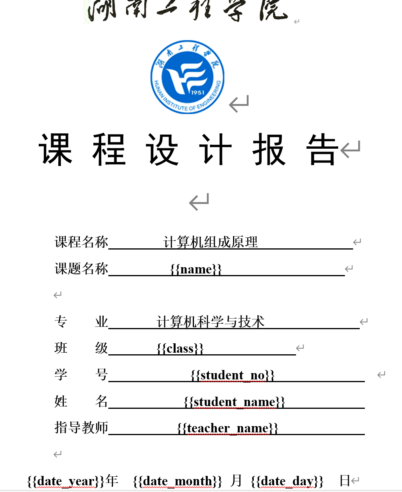


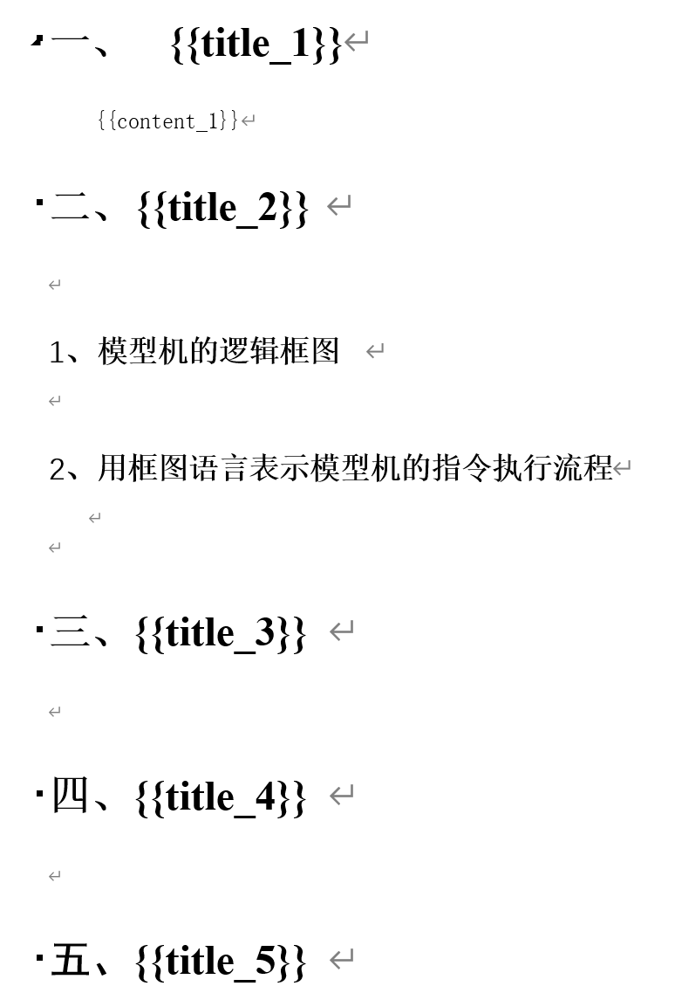


编写代码：

```java
package mao;

import cn.afterturn.easypoi.word.WordExportUtil;
import org.apache.poi.xwpf.usermodel.XWPFDocument;

import java.io.FileOutputStream;
import java.time.LocalDate;
import java.util.HashMap;
import java.util.Map;

/**
 * Project name(项目名称)：java报表_EasyPOI导出word
 * Package(包名): mao
 * Class(类名): Test1
 * Author(作者）: mao
 * Author QQ：1296193245
 * GitHub：https://github.com/maomao124/
 * Date(创建日期)： 2023/6/7
 * Time(创建时间)： 15:15
 * Version(版本): 1.0
 * Description(描述)： 无
 */

public class Test1
{
    public static void main(String[] args) throws Exception
    {
        //数据
        Map<String, Object> params = new HashMap<>();
        params.put("name", "复杂模型计算机的设计");
        params.put("class", "计算机科学与技术1班");
        params.put("student_no", "123454678945");
        params.put("student_name", "mao");
        params.put("teacher_name", "张三");
        params.put("date_year", LocalDate.now().getYear());
        params.put("date_month", LocalDate.now().getMonthValue());
        params.put("date_day", LocalDate.now().getDayOfMonth());
        params.put("title_1", "课题的主要功能");
        params.put("content_1", "本课题是.........");
        params.put("title_2", "总体设计方案");
        params.put("title_3", "数据格式和寻址方式的设计");
        params.put("title_4", "指令和微程序的设计");
        params.put("title_5", "线路连接图");
        params.put("title_6", "微程序流程及说明");
        params.put("title_7", "课程设计的收获及体会");
        params.put("content_7", "计算机的教学是让学生学习电脑的使用方法，了解电脑对于我们学习和工作的重要性，" +
                "以及利用不同的软件达到我们初始的目的。这其实也让我们通过不同的教学方式，不同的教学思维让学生对于电脑学习的兴趣，" +
                "尤其是使用电脑并不仅仅只是来查资料或者是打游戏，还有其他很多很多的东西可以学习，" +
                "我们要正确引导学生对于计算机的学习，让他们明白更多的学习方法以及计算机知识。\n" +
                "\n" +
                "　　计算机能够做的东西有很多，我们要用到的地方也很多，在这样的情况下，给同学们上好课，" +
                "引起他们的兴趣，第一堂课很重要。第一次讲述计算机相关的内容，应该提前备好课，将文字和图片有机的结合到一起，" +
                "将学习的内容尽可能的让其生动起来，勾起学生对计算机学习的兴趣。因为书本的上面的知识到底和计算机上面的画面不一样，" +
                "学生对于动静结合的画面更加感兴趣一点，同时对于这样的知识也更加容易吸收一点，因此在之后的学习上也更加的期待。");
        params.put("title_8", "参考资料");
        params.put("content_8", "暂时无参考资料");

        params.put("score", "100");

        //写入
        XWPFDocument xwpfDocument = WordExportUtil.exportWord07("./template.docx", params);
        FileOutputStream fileOutputStream = new FileOutputStream("out.docx");
        xwpfDocument.write(fileOutputStream);
        xwpfDocument.close();
        xwpfDocument.close();

    }
}
```


运行：

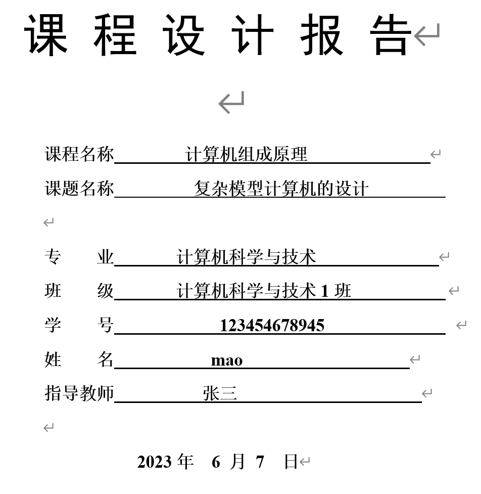


准备一个表格模板：

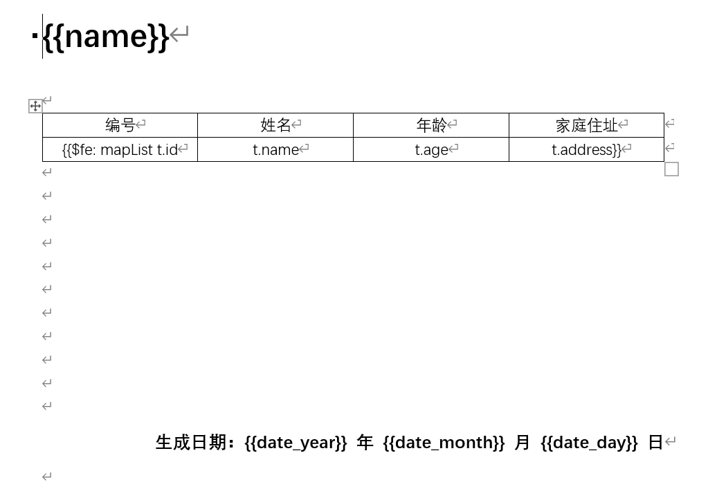


代码：

```java
package mao;

import cn.afterturn.easypoi.word.WordExportUtil;
import org.apache.poi.xwpf.usermodel.XWPFDocument;

import java.io.FileOutputStream;
import java.time.LocalDate;
import java.util.ArrayList;
import java.util.HashMap;
import java.util.List;
import java.util.Map;

/**
 * Project name(项目名称)：java报表_EasyPOI导出word
 * Package(包名): mao
 * Class(类名): Test2
 * Author(作者）: mao
 * Author QQ：1296193245
 * GitHub：https://github.com/maomao124/
 * Date(创建日期)： 2023/6/7
 * Time(创建时间)： 16:14
 * Version(版本): 1.0
 * Description(描述)： 无
 */

public class Test2
{
    /**
     * 得到int随机
     *
     * @param min 最小值
     * @param max 最大值
     * @return int
     */
    public static int getIntRandom(int min, int max)
    {
        if (min > max)
        {
            min = max;
        }
        return min + (int) (Math.random() * (max - min + 1));
    }

    public static void main(String[] args) throws Exception
    {
        //数据
        Map<String, Object> params = new HashMap<>();
        params.put("name", "员工信息表");

        //下面是表格中需要的数据
        List<Map<String, Object>> mapList = new ArrayList<>();
        Map<String, Object> map = null;
        for (int i = 1; i <= 180; i++)
        {
            map = new HashMap<>();
            map.put("id", i);
            map.put("name", "姓名" + i);
            map.put("age", getIntRandom(15, 30));
            map.put("address", "中国");
            mapList.add(map);
        }
        //把组建好的表格需要的数据放到大map中
        params.put("mapList", mapList);

        params.put("date_year", LocalDate.now().getYear());
        params.put("date_month", LocalDate.now().getMonthValue());
        params.put("date_day", LocalDate.now().getDayOfMonth());

        //写入
        XWPFDocument xwpfDocument = WordExportUtil.exportWord07("./template2.docx", params);
        FileOutputStream fileOutputStream = new FileOutputStream("out2.docx");
        xwpfDocument.write(fileOutputStream);
        xwpfDocument.close();
        xwpfDocument.close();

    }
}
```


效果：

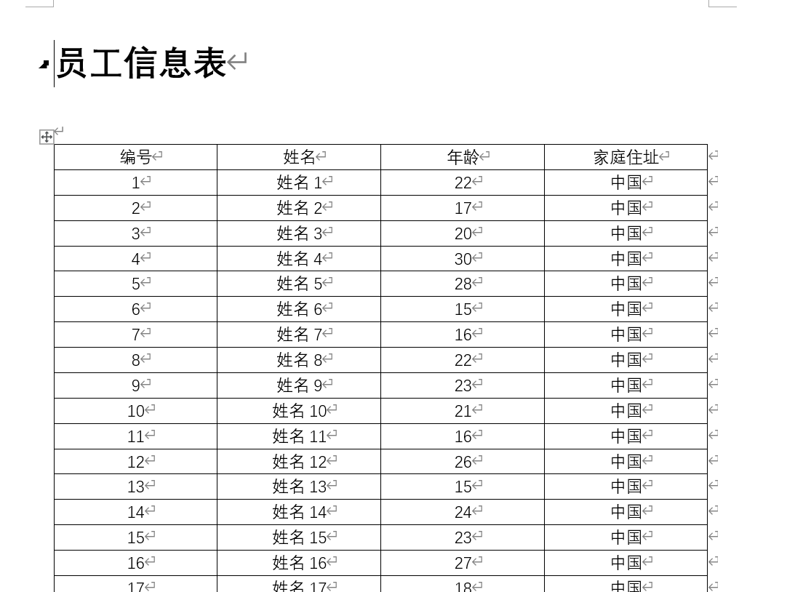


# PDF

## 概述

PDF（Portable Document Format的简称，意为“便携式文件格式”）是由Adobe Systems在1993年用于文件交换所发展出的文件格式。

PDF格式的文档的使用有如下好处：

* 跨平台：PDF文件格式与操作系统平台无关，也就是说，PDF文件不管是在Windows，Unix还是在苹果公司的Mac OS操作系统中都是通用的。不受平台的限制。越来越多的电子图书、产品说明、公司文告、网络资料、电子邮件开始使用PDF格式文件。
* 安全性高，不易修改：PDF是一种通用文件格式，不管创建源文档时使用的是哪些应用程序和平台，它均可以保留任何源文档的字体、图像、图形和版面设置。已成为世界上安全可靠地分发和交换电子文档及电子表单的实际标准
* 阅读性能高，阅读舒适性好
* 相比Word格式的文档，PDF文件格式更为正式：而WORD文档在跨平台使用方面不如PDF方便，而且WORD文档是可以进行编辑修改的，在安全性和可靠性上不如PDF，而且往往很难反映出用其它编辑软件排版的版面信息，使用上有一定的局限性


## Word转PDF

### 概述

把Word转成PDF目前最简单的方式就是调用office的方法，本质上就是打开Word后另存为成pdf

可以使用 **jacob**来实现，Word中的原样式也不会丢失。


### 环境准备

最基本的环境：

1. 本机上安装了2007以上的office软件  

2. dk1.6以上的版本


第一步：从github上下载资料

https://github.com/freemansoft/jacob-project/releases


或者直接下載：https://github.com/freemansoft/jacob-project/releases/download/Root_B-1_20/jacob-1.20.zip


下载解压后的目录结构如下：


```sh
PS D:\程序\大四下期\java报表_Word转PDF\jacob-1.20> ls


    目录: D:\程序\大四下期\java报表_Word转PDF\jacob-1.20


Mode                 LastWriteTime         Length Name
----                 -------------         ------ ----
d-----         2020/9/24     23:21                docs
------         2020/9/25      6:16         226816 jacob-1.20-x64.dll
------         2020/9/25      6:16         189440 jacob-1.20-x86.dll
------         2020/9/25      6:15          49913 jacob.jar
------         2020/9/24     23:21          26440 LICENSE.TXT


PS D:\程序\大四下期\java报表_Word转PDF\jacob-1.20>
```


把下载的资料中的jar放入到本地仓库

这个jar从中央仓库中没有找到，需要我们自己打到本地仓库中

进入到jar所在的目录执行以下命令：

```sh
mvn install:install-file -DgroupId="com.jacob" -DartifactId="jacob" -Dversion=1.20 -Dfile=".\jacob.jar" -Dpackaging=jar
```


添加依赖：

```xml
<dependency>
    <groupId>com.jacob</groupId>
    <artifactId>jacob</artifactId>
    <version>1.20</version>
</dependency>
```


或者下载源码，然后将源码拷贝到项目里：

https://github.com/freemansoft/jacob-project/releases/download/Root_B-1_20/jacob-1.20_src.zip


将动态链接库放入jre的bin目录，放项目根目录也可以：


### 实现

使用之前生成的两个docx文件测试

```java
package mao;

import com.jacob.activeX.ActiveXComponent;
import com.jacob.com.Dispatch;

import java.awt.*;
import java.io.File;

/**
 * Project name(项目名称)：java报表_Word转PDF
 * Package(包名): mao
 * Class(类名): Test1
 * Author(作者）: mao
 * Author QQ：1296193245
 * GitHub：https://github.com/maomao124/
 * Date(创建日期)： 2023/6/7
 * Time(创建时间)： 17:47
 * Version(版本): 1.0
 * Description(描述)： 无
 */

public class Test1
{
    public static void main(String[] args)
    {
        docxToPdf("./out.docx");
        docxToPdf("./out2.docx");
    }


    /**
     * 将docx文件转换成pdf文件
     *
     * @param docxFileName docx文件名
     */
    public static void docxToPdf(String docxFileName, String pdfFileName)
    {
        if (docxFileName == null)
        {
            throw new IllegalArgumentException("请输入正确的文件名");
        }
        if (!docxFileName.endsWith(".docx"))
        {
            throw new IllegalArgumentException("文件的后缀名不正确");
        }
        if (pdfFileName == null)
        {
            pdfFileName = docxFileName.substring(0, docxFileName.length() - 4) + "pdf";
            System.out.println(pdfFileName);
        }
        else
        {
            if (!pdfFileName.endsWith(".pdf"))
            {
                throw new IllegalArgumentException("文件的后缀名不正确");
            }
        }

        //注意：这里调用了动态链接库，工作路径已经不是查询当前路径了，使用相对路径可能会出现找不到的问题
        ActiveXComponent app = null;
        try
        {
            //调用window中的程序
            app = new ActiveXComponent("Word.Application");
            //调用的时候不显示窗口
            app.setProperty("Visible", false);
            //获得所有打开的文档
            Dispatch docs = app.getProperty("Documents").toDispatch();
            Dispatch doc = Dispatch.call(docs, "Open", new File(docxFileName).getAbsolutePath()).toDispatch();
            System.out.println(docxFileName + " ---> " + pdfFileName);
            System.out.println("输出路径：" + new File(pdfFileName).getAbsolutePath());
            //另存为，将文档保存为pdf，其中Word保存为pdf的格式宏的值是17
            Dispatch.call(doc, "SaveAs", new File(pdfFileName).getAbsolutePath(), 17);
            Dispatch.call(doc, "Close");
        }
        catch (Exception e)
        {
            Toolkit.getDefaultToolkit().beep();
            e.printStackTrace();
        }
        finally
        {
            //关闭office
            if (app != null)
            {
                app.invoke("Quit", 0);
            }
        }
    }

    /**
     * 将docx文件转换成pdf文件
     *
     * @param docxFileName docx文件名
     */
    public static void docxToPdf(String docxFileName)
    {
        docxToPdf(docxFileName, null);
    }
}
```


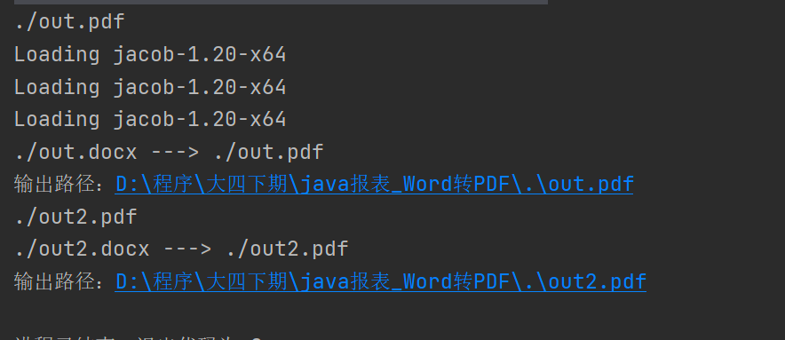


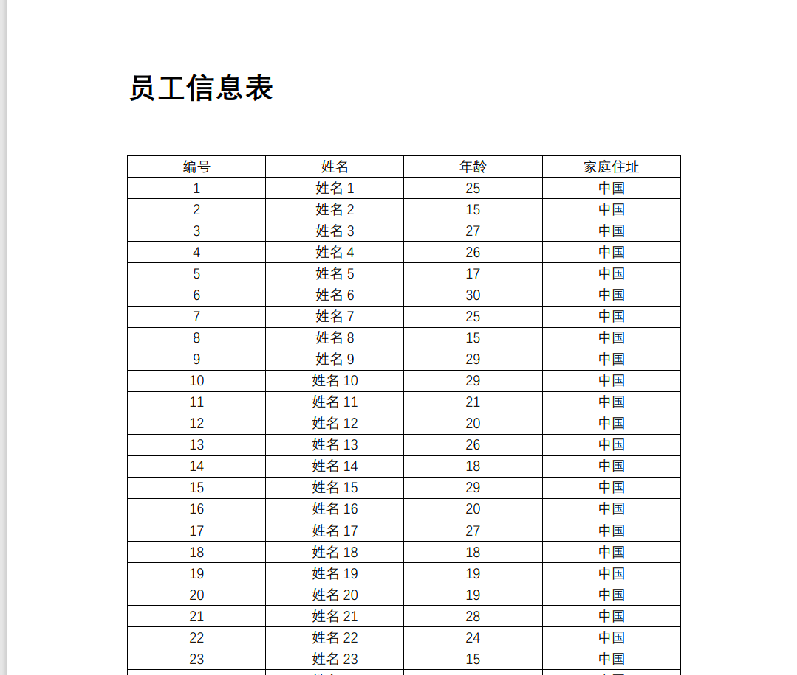


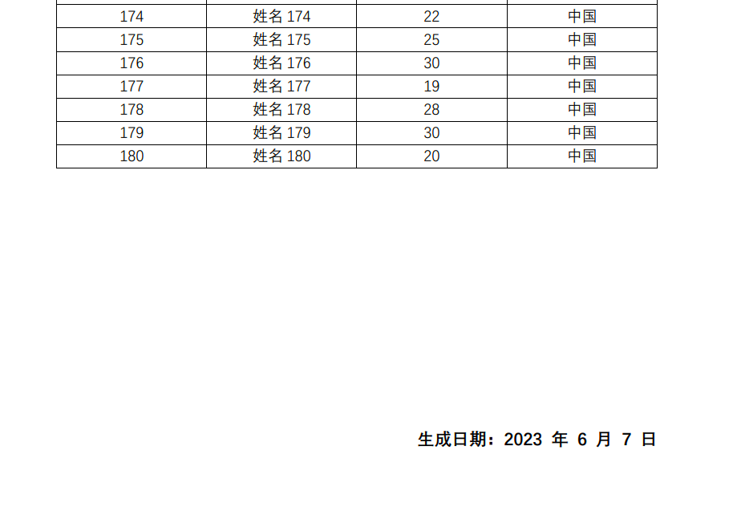


控制台输入文件名或者转换当前路径下的所有docx文件

```java
package mao;

import java.io.File;
import java.util.ArrayList;
import java.util.List;
import java.util.Scanner;

/**
 * Project name(项目名称)：java报表_Word转PDF
 * Package(包名): mao
 * Class(类名): Test2
 * Author(作者）: mao
 * Author QQ：1296193245
 * GitHub：https://github.com/maomao124/
 * Date(创建日期)： 2023/6/7
 * Time(创建时间)： 20:56
 * Version(版本): 1.0
 * Description(描述)： 无
 */

public class Test2
{
    public static void main(String[] args)
    {
        System.out.println("提示：输入“-1”转换当前路径下的所有docx文件");
        System.out.print("请输入docx文件名：");
        Scanner input = new Scanner(System.in);
        String fileName = input.nextLine();
        if (!fileName.equals("-1"))
        {
            Test1.docxToPdf(fileName);
        }
        else
        {
            //转换当前路径下的所有docx文件
            List<String> fileList = new ArrayList<>();
            File[] files = new File("./").listFiles();
            if (files == null || files.length == 0)
            {
                return;
            }
            System.out.println("---");
            for (File file : files)
            {
                if (file.getName().endsWith(".docx"))
                {
                    System.out.println("即将转换的文件：" + file.getName());
                    fileList.add(file.getName());
                }
            }
            System.out.println("---");
            for (String docxFile : fileList)
            {
                Test1.docxToPdf(docxFile);
            }
        }
    }
}
```


项目地址：https://github.com/maomao124/java_report_Word_to_PDF.git/


## iText导出PDF

### 概述

iText是著名的开放项目，是用于生成PDF文档的一个java类库。通过iText不仅可以生成PDF或rtf的文档，而且可以将XML、Html文件转化为PDF文件。  代码编写太复杂


